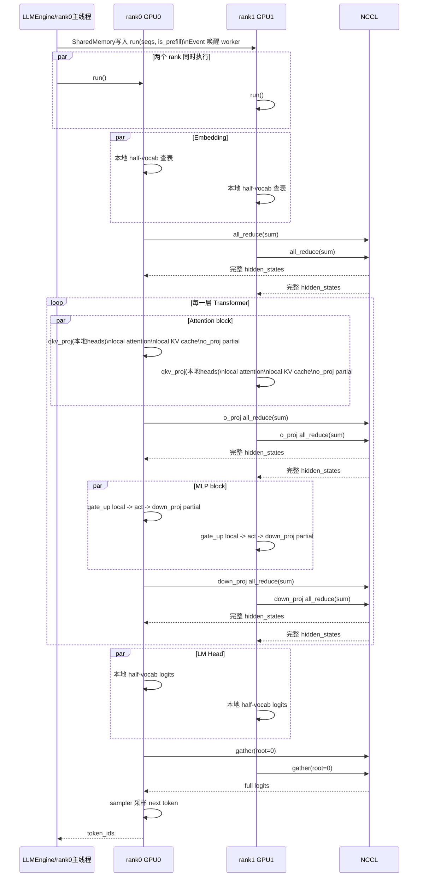
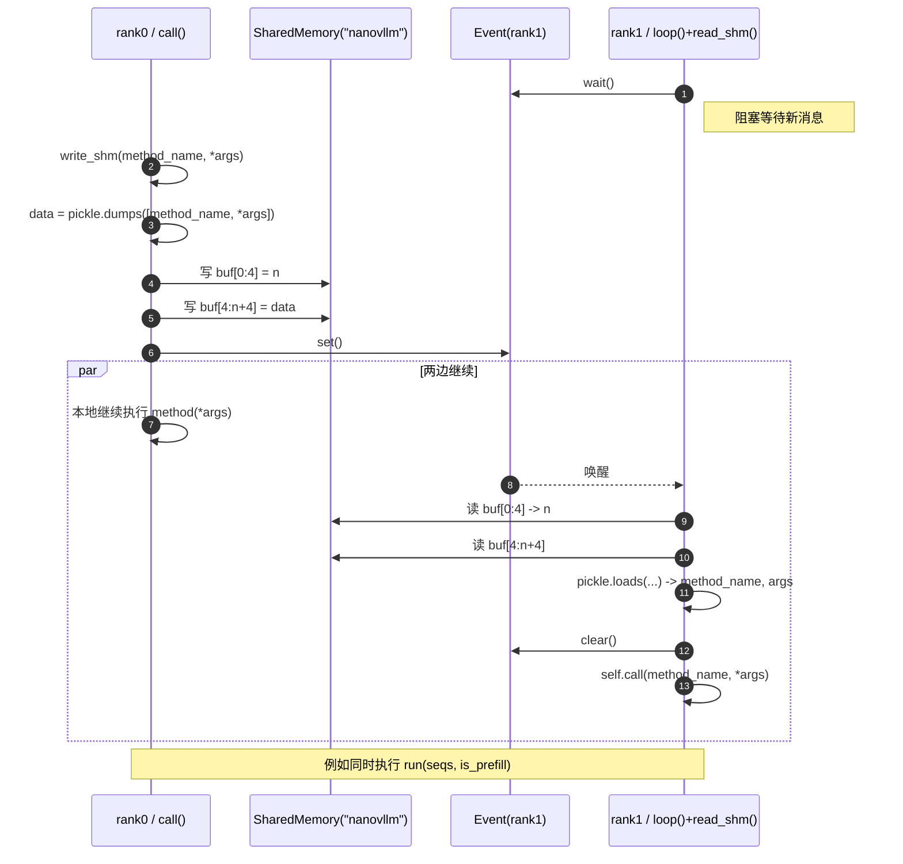

# Parallel processing in example.py
_Exported on 3/11/2026 at 16:26:01 GMT+8 from Cursor (2.5.26)_

---

**User**

@example.py:20 并行2体现在哪里？
具体是哪里并行？embedding，lmhead，还有哪里？
计算的逻辑是怎么样的。给出时序图。先计算rank1吗，怎么完成数据合并。怎么执行数据通信。

---

**Cursor**

我先沿着 `tensor_parallel_size=2` 的初始化和前向链路往下看，确认张量并行具体落在了哪些层、每一层用的是哪种通信，再给你整理成时序图。

我已经定位到主要并行点了：这里不是“按层分给不同 rank 顺序执行”，而是两个 rank 同时跑同一层的不同权重分片，然后在关键位置做 `all_reduce` / `gather`。我再补一下进程拉起和调度链路，把“是不是先算 rank1”“谁负责采样/合并”一起串起来。

接下来我补一块权重装载逻辑，因为“并行 2”除了前向通信，还体现在模型加载时每个 rank 只拿自己那份权重分片。

`example.py:20` 里的 `tensor_parallel_size=2`，在这个项目里表示 **2 路张量并行**，不是“rank0 算前半模型、rank1 算后半模型”的流水线并行。实际是两个进程、两张 GPU：`rank0 -> cuda:0`，`rank1 -> cuda:1`，每个 rank 持有同一层的不同权重分片，并在前向时同时计算，再在少数位置做通信。实现入口在 `nanovllm/engine/llm_engine.py`、`nanovllm/engine/model_runner.py`，并行层定义在 `nanovllm/models/qwen3.py`，通信原语在 `nanovllm/layers/linear.py` 和 `nanovllm/layers/embed_head.py`。

## 并行落点
| 模块 | 并行方式 | 每个 rank 做什么 | 怎么合并 |
|---|---|---|---|
| `embed_tokens` | vocab parallel | 只保存一半词表的 embedding 行 | `all_reduce(sum)`，每个 rank 都拿到完整 hidden states |
| `qkv_proj` | column parallel | 只算自己那一半 Q/K/V heads | 不立即合并，后续 attention 继续本地算 |
| `attention` | head parallel | 只对本地 heads 做 attention，本地写 KV cache | 不通信 |
| `o_proj` | row parallel | 用本地 head 输出算一份 partial output | `all_reduce(sum)` 还原完整 hidden states |
| `mlp.gate_up_proj` | column parallel | 只算一半中间维度 | 不立即合并 |
| `mlp.down_proj` | row parallel | 用本地中间维算 partial output | `all_reduce(sum)` |
| `lm_head` | vocab parallel | 只算自己那一半 vocab logits | `gather` 到 `rank0`，再 `cat` 成完整 logits |
| `RMSNorm / RoPE / residual` | replicated | 两边都完整执行 | 不通信 |
| `Sampler` | 单卡 | 只有 `rank0` 采样 | 不需要广播 full logits 回 `rank1` |

所以并行不止在 `embedding` 和 `lm_head`，还在 **attention 的 `qkv_proj/o_proj`** 和 **MLP 的 `gate_up/down_proj`** 上。`KV cache` 也是按本地 KV heads 分片存的。

## 计算逻辑
可以把它看成下面三类：

```text
Embedding:   h = sum_r emb_r(token)           # 只有拥有该 token 的 rank 非零
RowParallel: y = sum_r (x_r W_r^T)            # 各 rank 算同一输出的部分和
LM Head:     logits = cat_r(h W_r^T, dim=-1) # 各 rank 负责不同 vocab slice
```

关键区别是：

- `all_reduce(sum)` 用在“大家算的是同一个输出的不同贡献”。
- `gather + cat` 用在“大家算的是不同 vocab 区间，应该拼接而不是求和”。

## 时序图


Prefill 和 decode 的张量并行形态是一样的，区别主要在 attention 内核和 prefill 时 `lm_head` 只取每条序列最后一个位置的 hidden state 去出 logits。

## 直接回答你问的几个点
`先计算 rank1 吗？` 不是。正常一步推理里没有“先 rank1 后 rank0”的设计。`rank0` 先把 `run(seqs, is_prefill)` 这个命令写到共享内存并唤醒 worker，然后 `rank0` 自己也立刻执行 `run`。两个 rank 基本同时前向，谁先被操作系统调度到并不重要；到了 `all_reduce` / `gather` 这种 collective，两个 rank 都必须参加，通信点会把它们同步住。只有初始化阶段因为 worker 进程先被 `spawn`，`rank1` 可能更早进入 warmup，但那不是正式前向的先后依赖。

`怎么完成数据合并？` Embedding、`o_proj`、`down_proj` 用的是“求和合并”，所以是 `all_reduce`；`lm_head` 用的是“按 vocab 维拼接合并”，所以是 `gather` 到 `rank0` 后 `torch.cat`。这也是为什么 full logits 只存在于 `rank0`，采样也只在 `rank0` 做。

`怎么执行数据通信？` 这里有两层通信。第一层是控制面通信：`rank0` 用 `SharedMemory + Event` 把“跑 `run` / `exit`”这种命令发给其他 rank。第二层才是模型张量通信：所有真正的 hidden states / logits 合并都走 `torch.distributed` 的 NCCL collective，也就是 `all_reduce`、`gather`、`barrier`。这个仓库里没有用 `all_gather` 或 `reduce_scatter`。

如果你想继续往下看，我可以下一条把 **Qwen3-0.6B 在 `tp=2` 时每个关键张量的具体 shape** 也按层展开写出来。

---

**User**

self.warmup_model() 会执行rank0和rank1的推理吗

---

**Cursor**

我看了 `ModelRunner.__init__` 里的实际调用顺序，`warmup_model()` 确实发生在所有 rank 的初始化阶段；我把“是不是两个 rank 都会真正跑前向”和“顺序是不是固定”拆开说明。会，`self.warmup_model()` 会让 **`rank0` 和 `rank1` 都执行一次真正的模型前向**。

依据就在 `ModelRunner.__init__`：

```16:47:nanovllm/engine/model_runner.py
class ModelRunner:

    def __init__(self, config: Config, rank: int, event: Event | list[Event]):
        ...
        dist.init_process_group("nccl", "tcp://localhost:2333", world_size=self.world_size, rank=rank)
        ...
        self.model = Qwen3ForCausalLM(hf_config)
        load_model(self.model, config.model)
        self.sampler = Sampler()
        self.warmup_model()
        self.allocate_kv_cache()
        ...
```

而 `warmup_model()` 里不是空跑，它直接调了 `self.run(seqs, True)`：

```90:97:nanovllm/engine/model_runner.py
def warmup_model(self):
    torch.cuda.empty_cache()
    torch.cuda.reset_peak_memory_stats()
    ...
    seqs = [Sequence([0] * max_model_len) for _ in range(num_seqs)]
    self.run(seqs, True)
    torch.cuda.empty_cache()
```

`self.run(...)` 又会走到真正的模型前向：

```217:223:nanovllm/engine/model_runner.py
def run(self, seqs: list[Sequence], is_prefill: bool) -> list[int]:
    input_ids, positions = self.prepare_prefill(seqs) if is_prefill else self.prepare_decode(seqs)
    temperatures = self.prepare_sample(seqs) if self.rank == 0 else None
    logits = self.run_model(input_ids, positions, is_prefill)
    token_ids = self.sampler(logits, temperatures).tolist() if self.rank == 0 else None
    reset_context()
    return token_ids
```

所以结论是：

- `rank0` 会 warmup。
- `rank1` 也会 warmup。
- 两边都会进入模型前向、attention、MLP，以及里面的 `all_reduce` / `gather` 等通信点。
- 区别只是最后采样 `Sampler` 只有 `rank0` 执行，`rank1` 的 `token_ids` 是 `None`。

还有一个容易误解的点：

不是 `rank0` 在初始化时“命令” `rank1` 去 warmup。  
这里每个进程各自构造自己的 `ModelRunner`，各自调用自己的 `warmup_model()`。只是因为它们已经加入了同一个 NCCL process group，所以 warmup 前向里的 collective 通信会把它们配合起来。

`rank1` 是否一定比 `rank0` 先开始 warmup？不一定代码级保证，只是因为 `rank1` 是先 `spawn` 出来的，现实里它常常更早启动。但真正到前向里的通信点时，两边必须都到场，谁也不能单独跑完整个 warmup。

如果你愿意，我下一条可以继续把 **warmup 从 `LLMEngine.__init__` 到 `rank1.loop()` 的完整初始化时序图** 画出来。

---

**User**

是不是在warmup_model将会执行rank0和rank1推理。推理结束之后才会各自执行 allocate_kv_cache在各自的gpu卡上分配内存。

---

**Cursor**

是，但要分成两层理解。

从**每个 rank 自己的执行顺序**看，答案是 `是`。`LLMEngine` 会启动 `rank1` 子进程，同时主进程自己创建 `rank0` 的 `ModelRunner`，所以两个 rank 都会走一遍相同的初始化链路：

```23:30:nanovllm/engine/llm_engine.py
ctx = mp.get_context("spawn")  # 创建进程上下文
for i in range(1, config.tensor_parallel_size):  # 创建其他进程
    event = ctx.Event()  # 创建同步事件
    process = ctx.Process(target=ModelRunner, args=(config, i, event))  # 创建进程
    process.start()  # 启动进程
    self.ps.append(process)  # 添加进程
    self.events.append(event)  # 添加同步事件
self.model_runner = ModelRunner(config, 0, self.events)  # 创建 ModelRunner 0级
```

而 `ModelRunner` 内部的顺序是固定的：先 `warmup_model()`，再 `allocate_kv_cache()`。

```31:38:nanovllm/engine/model_runner.py
self.model = Qwen3ForCausalLM(hf_config) # 创建模型结构，固定写死 qwen3 模型，注意此时不加载权重
load_model(self.model, config.model) # 加载模型权重
self.sampler = Sampler() # 创建采样器
self.warmup_model() # 预热模型，计算峰值 kv cache 大小。先计算非0的所有rank，然后计算 rank0
self.allocate_kv_cache() # 分配 kv cache
if not self.enforce_eager: # 如果不启用 eager 模式
    self.capture_cudagraph() # 捕获 cudagraph
```

`warmup_model()` 不是空操作，而是真的跑一次 `prefill` 前向，所以 `rank0` 和 `rank1` 都会参与这次 warmup 推理：

```90:97:nanovllm/engine/model_runner.py
def warmup_model(self):
    torch.cuda.empty_cache()
    torch.cuda.reset_peak_memory_stats()
    max_num_batched_tokens, max_model_len = self.config.max_num_batched_tokens, self.config.max_model_len
    num_seqs = min(max_num_batched_tokens // max_model_len, self.config.max_num_seqs)
    seqs = [Sequence([0] * max_model_len) for _ in range(num_seqs)]
    self.run(seqs, True)
    torch.cuda.empty_cache()
```

然后才会在**各自的 GPU** 上分配各自的 KV cache：

```99:117:nanovllm/engine/model_runner.py
def allocate_kv_cache(self):
    ...
    num_kv_heads = hf_config.num_key_value_heads // self.world_size  # 每个 rank / 每张卡存在多少个 KV heads
    head_dim = getattr(hf_config, "head_dim", hf_config.hidden_size // hf_config.num_attention_heads)  # 每个 head 的维度
    ...
    config.num_kvcache_blocks = int(total * config.gpu_memory_utilization - used - peak + current) // block_bytes
    assert config.num_kvcache_blocks > 0  # 确保可以分配至少 1 个 kv block
    self.kv_cache = torch.empty(2, hf_config.num_hidden_layers, config.num_kvcache_blocks, self.block_size, num_kv_heads, head_dim)
```

不过再精确一点说：

- 从**单个 rank 的本地顺序**看：一定是“这个 rank 的 warmup 结束后，才执行这个 rank 的 `allocate_kv_cache()`”。
- 从**全局严格同步**看：代码里**没有**在 `warmup_model()` 和 `allocate_kv_cache()` 之间加一个显式 `dist.barrier()`，所以不是“两个 rank 都完全结束 warmup 后，再统一同时进入 allocate”这种硬同步。

也就是说，更准确的表述是：

1. `rank0` 和 `rank1` 都会执行 warmup 推理。
2. 每个 rank 在**自己**的 warmup 返回后，就进入**自己**的 `allocate_kv_cache()`。
3. 因为 warmup 里有 `all_reduce/gather`，两边大部分前向过程会同步推进。
4. 但 warmup 末尾 `rank0` 还会做 `cat + sampler`，`rank1` 没有这一步，所以 `rank1` 理论上可能会比 `rank0` 略早进入 `allocate_kv_cache()`。

所以你这句话如果改得最严谨，可以写成：

`warmup_model()` 会让 `rank0` 和 `rank1` 都执行一次 warmup 前向；之后每个 rank 分别在自己的 GPU 上执行 `allocate_kv_cache()` 分配本地 KV cache 分片，但两者之间没有单独的全局 barrier。

如果你想，我可以继续把“**warmup 这一步里 rank0/rank1 具体在哪些层发生通信，什么时候 all_reduce，什么时候 gather**”再画成一个更细的时序图。

---

**User**

dist.barrier()  这个就是在等待所有进程初始化成功 吗@nanovllm/engine/model_runner.py:43 

---

**Cursor**

可以理解成“等所有 rank 都走到这里”，但**更准确地说它不是在检查‘初始化成功’**，而是在做**同步屏障**。

这段代码的真实作用是：

```40:47:nanovllm/engine/model_runner.py
if self.world_size > 1: # 如果模型并行数大于 1
    if rank == 0:  # 主线程负责创建共享内存
        self.shm = SharedMemory(name="nanovllm", create=True, size=2**20) # 创建共享内存
        dist.barrier()  # 同步
    else:  # 其他进程负责等待共享内存创建完成
        dist.barrier()
        self.shm = SharedMemory(name="nanovllm") # 创建共享内存
        self.loop()
```

所以这里的 `dist.barrier()` 主要是在保证这件事：

- `rank0` 先把共享内存 `nanovllm` 创建出来。
- `rank1` 等所有 rank 都到达 barrier 之后，再去 `SharedMemory(name="nanovllm")` 连接这块共享内存。
- 避免 `rank1` 过早执行，结果共享内存还没被 `rank0` 创建出来。

你说“等待所有进程初始化成功”，**有一半对**，但要注意：

- `barrier` 只保证“所有进程都到达这个同步点”。
- 它**不会主动检查**每个进程是不是“初始化成功”。
- 如果某个 rank 在前面的 `load_model`、`warmup_model`、`allocate_kv_cache` 等步骤里报错了，其他 rank 通常会卡在 `barrier`，而不是得到一个布尔意义上的“初始化失败”。

结合这份代码的位置来看，它还有一个隐含含义：

- 因为 `barrier` 写在 `warmup_model()`、`allocate_kv_cache()`、`capture_cudagraph()` 后面，
- 所以一个 rank 能走到这里，说明它**至少已经完成了前面的初始化流程**。
- 但 `barrier` 本身不是“验收初始化成功”的 API，只是“大家在这里会合一下”。

简单一句话总结：

**这里的 `dist.barrier()` 更像“等大家都到齐，再继续”，在本代码里主要用于保证共享内存创建/连接的顺序，不是专门的初始化成功检查。**

如果你愿意，我可以顺手把 `ModelRunner.__init__` 这段初始化流程画成一个更清晰的启动时序图。

---

**User**

@nanovllm/engine/model_runner.py:45-47 源码详解。当执行完dist.barrier之后，会发生什么，执行什么

---

**Cursor**

这里要分成两个视角看：`@nanovllm/engine/model_runner.py:45-47` 这一段是 **`rank > 0` 的 worker 进程分支**，所以当 `dist.barrier()` 返回后，接下来执行的是这个 worker 自己的下一行 Python 代码，不会跳去别的地方。

相关代码是：

```40:47:nanovllm/engine/model_runner.py
if self.world_size > 1: # 如果模型并行数大于 1
    if rank == 0:  # 主线程负责创建共享内存
        self.shm = SharedMemory(name="nanovllm", create=True, size=2**20) # 创建共享内存
        dist.barrier()  # 同步
    else:  # 其他进程负责等待共享内存创建完成
        dist.barrier()
        self.shm = SharedMemory(name="nanovllm") # 创建共享内存
        self.loop()
```

## `dist.barrier()` 返回后会发生什么
对 `rank1` 这种 worker 来说，顺序就是：

1. `dist.barrier()` 解除阻塞。
2. 继续执行下一行：`self.shm = SharedMemory(name="nanovllm")`
3. 再继续下一行：`self.loop()`
4. 进入常驻循环，等待 `rank0` 发命令
5. 收到命令后执行 `run(...)` 或 `exit()`

也就是说，`barrier` 返回本身**不做额外逻辑**，它只是一个“放行点”。一旦所有 rank 都到齐，当前进程就从 barrier 调用处返回，然后按顺序继续跑后面的 Python 代码。

## 第 46 行：连接共享内存
这一行不是新建，而是**连接**到 `rank0` 先前创建好的共享内存块：

```45:46:nanovllm/engine/model_runner.py
dist.barrier()
self.shm = SharedMemory(name="nanovllm") # 创建共享内存
```

这里更准确的说法应该是“打开/附着共享内存”，不是重新创建。

含义是：

- `rank0` 已经执行过：
  `SharedMemory(name="nanovllm", create=True, size=2**20)`
- `rank1` 在 barrier 之后执行：
  `SharedMemory(name="nanovllm")`

所以 `rank1` 拿到的是**同一块共享内存**的句柄，之后它就可以从里面读 `rank0` 写入的命令和参数。

## 第 47 行：进入 `self.loop()`
这一行是 worker 进程真正“开始干活”的地方：

```60:65:nanovllm/engine/model_runner.py
def loop(self):
    while True:
        method_name, args = self.read_shm()
        self.call(method_name, *args)
        if method_name == "exit":
            break
```

进入 `loop()` 之后，`rank1` 会一直待在这个循环里，不会再继续往下执行 `__init__` 之后的外层逻辑，直到收到 `exit`。

也就是说：

- `rank0` 是控制者，负责调度。
- `rank1` 是常驻 worker，进入 `loop()` 后就在等命令。

## `loop()` 里第一步又会做什么
`loop()` 调的是 `read_shm()`，这里会先阻塞在事件上：

```67:73:nanovllm/engine/model_runner.py
def read_shm(self):
    assert self.world_size > 1 and self.rank > 0
    self.event.wait()  # 阻塞等待
    n = int.from_bytes(self.shm.buf[0:4], "little")
    method_name, *args = pickle.loads(self.shm.buf[4:n+4])
    self.event.clear()
    return method_name, args
```

所以 barrier 之后的真实运行态是：

- `rank1` 连接共享内存
- `rank1` 进入 `loop()`
- `rank1` 卡在 `self.event.wait()`
- 等 `rank0` 发命令唤醒它

## `rank0` 什么时候发命令
是在后面 `rank0` 调 `call()` 的时候：

```84:88:nanovllm/engine/model_runner.py
def call(self, method_name, *args):
    if self.world_size > 1 and self.rank == 0:
        self.write_shm(method_name, *args)
    method = getattr(self, method_name, None)
    return method(*args)
```

`write_shm()` 会把命令写进共享内存，并 `event.set()` 唤醒 worker：

```75:82:nanovllm/engine/model_runner.py
def write_shm(self, method_name, *args):
    assert self.world_size > 1 and self.rank == 0
    data = pickle.dumps([method_name, *args])
    n = len(data)
    self.shm.buf[0:4] = n.to_bytes(4, "little")
    self.shm.buf[4:n+4] = data
    for event in self.event:
        event.set()  # 广播唤醒所有 worker
```

所以完整链路是：

1. `rank1` barrier 返回
2. `rank1` 连接 `nanovllm` 共享内存
3. `rank1` 进入 `loop()`
4. `rank1` 阻塞等待 `event.wait()`
5. `rank0` 后续调用 `call("run", seqs, is_prefill)` 或 `call("exit")`
6. `rank0` 把命令写到共享内存并 `set event`
7. `rank1` 被唤醒，读出命令
8. `rank1` 执行同名方法，比如 `run(...)`

## 一个容易忽略的点
`self.loop()` 是在 `__init__` 里面直接调用的，所以对 worker 进程来说：

- `ModelRunner(...)` 构造函数**不会很快返回**
- 它会一直卡在 `loop()` 里当“服务进程”
- 直到收到 `exit`，`loop()` 才 break，然后这个进程才真正往后结束

也就是说，这个设计不是“创建一个对象后再另外启动线程监听”，而是：

**worker 进程在构造 `ModelRunner` 时，初始化完成后立刻进入消息循环。**

## 一句话总结
`dist.barrier()` 执行完以后，`rank1` 会立刻继续执行第 46、47 行：先连接 `rank0` 创建好的共享内存，再进入 `self.loop()` 常驻等待命令；之后真正的推理 `run(...)` 不是在 barrier 后立刻自动发生的，而是等 `rank0` 后续通过共享内存发指令来触发。

如果你想，我可以把这几行再画成一个更细的“`rank0`/`rank1`/共享内存/Event` 启动时序图”。

---

**User**

共享内存里面存放的是什么

---

**Cursor**

我确认一下共享内存的序列化格式和参数类型，再直接告诉你里面具体放了什么、没放什么。

共享内存里放的不是模型权重、hidden states、KV cache，也不是 NCCL 通信张量。  
这里放的是 **`rank0` 发给其他 rank 的控制消息/任务描述**，本质上是一段 `pickle` 序列化后的 Python 对象。

看写入和读取逻辑就很清楚：

```75:82:nanovllm/engine/model_runner.py
def write_shm(self, method_name, *args):
    assert self.world_size > 1 and self.rank == 0  # 只有 rank 0 可以写共享内存，rank 0 写，其他 rank 读
    data = pickle.dumps([method_name, *args])  # 序列化
    n = len(data)  # 消息长度
    self.shm.buf[0:4] = n.to_bytes(4, "little")  # 消息长度写到共享内存的前 4 个字节。小端序，int 占 4 个字节，[4: n+4] 真正的消息内容
    self.shm.buf[4:n+4] = data  # 真正的消息内容序列化
    for event in self.event:
        event.set()  # 广播唤醒所有 worker
```

```67:73:nanovllm/engine/model_runner.py
def read_shm(self):
    assert self.world_size > 1 and self.rank > 0  # 只允许非 0 进程读取共享内存，rank 0 发命令，其他 rank 负责寿命令
    self.event.wait()  # 阻塞等待，直到 rank 0 调用了 event.set()，有新消息了通知，不是执行完成通知
    n = int.from_bytes(self.shm.buf[0:4], "little")  # 共享内存的前 4 个字节专门存消息长度。小端序，int 占 4 个字节，[4: n+4] 真正的消息内容
    method_name, *args = pickle.loads(self.shm.buf[4:n+4])  # 真正内容反序列化，
    self.event.clear()  # 已经读到了，不是执行完了
    return method_name, args
```

所以共享内存里的布局是：

1. 前 `4` 个字节：消息长度 `n`
2. 后面的 `[4:n+4]`：`pickle.dumps([method_name, *args])` 的结果

## 里面通常会放什么
最常见就是两类消息：

- 推理：`["run", seqs, is_prefill]`
- 退出：`["exit"]`

也就是说，worker rank 从共享内存里读到的是：

- 要调用哪个方法，比如 `run` / `exit`
- 这个方法的参数是什么

然后它再本地执行：

```84:88:nanovllm/engine/model_runner.py
def call(self, method_name, *args):
    if self.world_size > 1 and self.rank == 0:  # 只有 rank 0 可以写共享内存
        self.write_shm(method_name, *args)  # 写共享内存
    method = getattr(self, method_name, None)  # 获取方法, run / exit，run 和 exit 都是 ModelRunner 的实例方法
    return method(*args)  # run(seqs, is_prefill) / exit()
```

## `seqs` 里存的是什么
`seqs` 是 `Sequence` 对象列表，但它没有把所有内容都原样塞进共享内存，而是做了精简序列化：

```74:83:nanovllm/engine/sequence.py
def __getstate__(self):
    return (self.num_tokens, self.num_prompt_tokens, self.num_cached_tokens, self.block_table,
            self.token_ids if self.num_completion_tokens == 0 else self.last_token)

def __setstate__(self, state):
    self.num_tokens, self.num_prompt_tokens, self.num_cached_tokens, self.block_table = state[:-1]
    if self.num_completion_tokens == 0:
        self.token_ids = state[-1]
    else:
        self.last_token = state[-1]
```

也就是共享内存中的 `seqs` 主要带这些轻量信息：

- 序列长度
- prompt 长度
- 已缓存 token 数
- `block_table`
- prefill 时可能带整段 `token_ids`
- decode 时通常只带 `last_token`

## 不在共享内存里的东西
这些都不放在这块共享内存里：

- 模型权重
- embedding 输出
- attention 的 Q/K/V
- hidden states
- logits
- KV cache 本体

这些真正的大张量都在各自 GPU 上，本 rank 自己算；跨卡合并走的是 `torch.distributed` / NCCL，比如 `all_reduce`、`gather`，不是这块共享内存。

## 这块共享内存更像什么
它更像一个“单槽消息邮箱”：

- `rank0` 写入一条命令
- `event.set()` 唤醒 worker
- worker 读出命令后执行
- 下一次再写会覆盖这块 buffer 的内容

所以一句话总结：

**共享内存里存的是 rank0 发给其他 rank 的方法名和参数，也就是控制面消息；真正的模型计算数据不在这里，而在 GPU 上并通过 NCCL 通信。**

如果你想，我可以下一条继续画一个“`call -> write_shm -> event.set -> read_shm -> worker.run`”的细粒度时序图。

---

**User**

是不是存放的是推理要用的一些输入。然后经过多卡并行处理，返回模型整体输出。输入包括seqs和is_prefill

---

**Cursor**

可以**这样理解一半**，但要改正两点。

1. **共享内存里存的是“推理任务参数/控制消息”**，不是最终喂给模型的 GPU 张量。
2. **模型整体输出不是通过共享内存返回的**，而是多卡通过 `torch.distributed` 的通信原语直接协同算出来，最后只有 `rank0` 拿到完整 logits 并采样。

看这段就很直接：

```75:82:nanovllm/engine/model_runner.py
def write_shm(self, method_name, *args):
    ...
    data = pickle.dumps([method_name, *args])  # 序列化
    n = len(data)
    self.shm.buf[0:4] = n.to_bytes(4, "little")
    self.shm.buf[4:n+4] = data
    for event in self.event:
        event.set()
```

所以共享内存里放的是一条消息：

- `method_name`
- `args`

在推理场景里，这条消息通常就是：

- `["run", seqs, is_prefill]`

也就是你说的这两个输入：

- `seqs`
- `is_prefill`

但更准确地说，`seqs` 不是已经整理好的模型张量输入，它是**序列对象列表**。  
真正给模型用的 `input_ids`、`positions`、`cu_seqlens`、`slot_mapping` 等，是每个 rank 收到 `seqs` 后，**各自在本地**通过 `prepare_prefill()` / `prepare_decode()` 现算出来的。

也就是这个流程：

1. `rank0` 调 `call("run", seqs, is_prefill)`
2. `rank0` 把 `["run", seqs, is_prefill]` 写进共享内存
3. `rank1` 被唤醒，读出这条消息
4. `rank0` 和 `rank1` 都执行各自的 `run(seqs, is_prefill)`
5. 每个 rank 本地构造 `input_ids/positions/...`
6. 每个 rank 只算自己那份权重分片
7. 需要合并的地方走 `all_reduce` / `gather`
8. 最后 `rank0` 得到完整 logits 并采样出 token

关键点在第 7、8 步：

- `embedding`、`o_proj`、`down_proj` 用 `all_reduce`
- `lm_head` 用 `gather` 到 `rank0`
- `rank0` 再执行 `sampler`
- `rank1` 不会把“最终输出”写回共享内存

所以更准确的一句话是：

**共享内存存的是推理命令和轻量输入参数（例如 `seqs`、`is_prefill`），用于让其他 rank 跑同一个任务；真正的模型输出合并不走共享内存，而走 NCCL 分布式通信，最终由 `rank0` 拿到结果。**

如果你愿意，我下一条可以把 `seqs -> input_ids/positions -> 多卡前向 -> logits -> token_ids` 这条链再画成一张完整时序图。

---

**User**

@nanovllm/engine/model_runner.py:55 这里理解对吗 @nanovllm/engine/model_runner.py:50 

---

**Cursor**

我先看一下你当前这几行的最新上下文，确认这条注释和实际控制流是不是完全一致。

我再补看一下 `loop()` 和 `read_shm()`，这样能把“唤醒后到底执行什么”说准确一点。

基本对，尤其在你当前 `tp=2` 的场景下，`self.loop()` 确实就是 `rank1` 初始化完成后进入常驻等待循环。

更严谨一点，你这句注释里有两个地方可以微调：

- `rank1` 只在 `tp=2` 时成立；泛化来说这里是“所有 `rank > 0` 的 worker rank”。
- “继续执行” 这个说法不够精确。它不是继续往下跑推理主流程，而是先进入一个阻塞等待的 worker loop，等 `rank0` 发命令。

相关控制流就在这里：

```68:80:nanovllm/engine/model_runner.py
def loop(self):
    while True:
        method_name, args = self.read_shm()
        self.call(method_name, *args)
        if method_name == "exit":
            break

def read_shm(self):
    assert self.world_size > 1 and self.rank > 0  # 只允许非 0 进程读取共享内存，rank 0 发命令，其他 rank 负责寿命令
    self.event.wait()  # 阻塞等待，直到 rank 0 调用了 event.set()，有新消息了通知，不是执行完成通知
    n = int.from_bytes(self.shm.buf[0:4], "little")  # 共享内存的前 4 个字节专门存消息长度。小端序，int 占 4 个字节，[4: n+4] 真正的消息内容
    method_name, *args = pickle.loads(self.shm.buf[4:n+4])  # 真正内容反序列化，
    self.event.clear()  # 已经读到了，不是执行完了
    return method_name, args
```

所以更准确的理解是：

- `dist.barrier()` 返回后，worker 连接共享内存。
- 然后执行 `self.loop()`。
- 进入 `loop()` 后，先卡在 `self.event.wait()`，并不会立刻开始下一次推理。
- 只有当 `rank0` 调 `call("run", ...)` 或 `call("exit")`，写入共享内存并 `event.set()` 后，worker 才会被唤醒。
- 收到 `run` 就执行一次 `run(...)`。
- 收到 `exit` 就 break，退出循环。

如果你想把这句注释改得更准确，可以写成：

```python
# 非0 rank 初始化完成后进入 worker 循环，阻塞等待 rank0 通过共享内存/Event 下发 run/exit 指令；收到 exit 后退出
```

如果只考虑你现在 `tensor_parallel_size=2` 的情况，也可以写成：

```python
# rank1 初始化完成后进入 worker 循环，等待 rank0 下发 run/exit 指令；收到 exit 后退出
```

---

**User**

@nanovllm/engine/model_runner.py:50 2**20 表示什么

---

**Cursor**

`2**20` 是 Python 的幂运算，表示 `2` 的 `20` 次方，也就是：

```python
2**20 = 1,048,576
```

这里单位是 **字节**，所以这行代码的含义是：

```python
self.shm = SharedMemory(name="nanovllm", create=True, size=2**20)
```

等价于：

- 创建一块名为 `nanovllm` 的共享内存
- 大小是 `1,048,576 bytes`
- 也就是 **1 MiB**

注意这里更准确是 `1 MiB`，不是十进制的 `1 MB`。

## 在这里它表示什么
表示这块共享内存 buffer 的**总容量上限**。  
后面 `rank0` 会把 `pickle.dumps([method_name, *args])` 得到的字节串写进去，所以要求：

```text
4字节长度头 + 序列化后的消息内容 <= 2**20
```

也就是这块共享内存最多只能装下大约 1 MiB 的控制消息。

## 为什么不是模型数据大小
这个 `2**20` 不是：

- 模型权重大小
- KV cache 大小
- 输入 token 张量大小
- 显存大小

它只是给 **共享内存消息通道** 预留的一个固定 buffer 大小。

## 为什么通常够用
因为这里传的是轻量控制消息，比如：

- `"run"`
- `seqs`
- `is_prefill`

而不是把 GPU 上的大张量塞进去。  
所以正常推理时 1 MiB 往往够用，但如果你一次要传非常多 `Sequence` 对象，理论上也可能装不下。

一句话说：

**`2**20` 表示共享内存大小为 1 MiB，用来存 rank0 发给其他 rank 的序列化控制消息。**

---

**User**

@\home\lebhoryi\share\Software\abc_install.sh:6-7 怎么找到 Lynanc_hw3_10118 这个编号

---

**Cursor**

我先看一下脚本前后文，确认它是在选目录还是在解析编号，再直接解释这两行怎么拿到 `10118`。

不是“单独去查出 `10118`”，而是**靠目录名模式匹配出来的**。

`abc_install.sh` 里的这行：

```bash
abc_dir=`ls -d /apu_share/auto_build/abc_version/Lynabc_hw3_*-2026-* 2>/dev/null | sort -r | head -n 1`
```

执行逻辑是：

1. Shell 先展开通配符 `/apu_share/auto_build/abc_version/Lynabc_hw3_*-2026-*`
2. 它会匹配所有名字长这样 的目录：
   `Lynabc_hw3_<某个内容>-2026-<某个内容>`
3. 这里 `10118` 就是前面这个 `*` 匹配到的那一段
4. `ls -d` 只列出目录名本身，不展开目录内容
5. `sort -r` 倒序排序
6. `head -n 1` 取第一条
7. 最后把这条完整路径赋值给 `abc_dir`

比如如果实际目录名是：

```bash
/apu_share/auto_build/abc_version/Lynabc_hw3_10118-2026-03-10
```

那么：

- `10118` 不是另外算出来的
- 它只是这个目录名中 `Lynabc_hw3_` 和 `-2026-` 中间的那段内容
- 第 7 行 `echo $abc_dir` 打印的是**完整路径**，不是单独的编号

如果你想把编号单独提出来，可以这样写：

```bash
abc_num=$(basename "$abc_dir" | sed -E 's/^Lynabc_hw3_([0-9]+)-2026-.*/\1/')
echo "$abc_num"
```

这样才会输出：

```bash
10118
```

另外你问题里写的是 `Lynanc_hw3_10118`，但脚本里实际匹配的是 `Lynabc_hw3_...`，这里看起来像是个笔误。

---

**User**

只能找到9999 找不到10118

---

**Cursor**

我先确认一下实际目录名长什么样，顺便判断是不是字符串排序把 `9999` 排到 `10118` 前面了。

目录匹配工具超时了，我改用一个很小的 Python 列目录，直接看是不是“按字符串倒序”导致 `9999` 压过了 `10118`。

我确认到了：`10118` 目录确实存在，问题就是 `sort -r` 做的是字符串倒序，不是按版本/数字大小排序。再帮你给出一行可替换写法。

是排序方式的问题，不是找不到。

我刚确认过，目录 **确实存在**：

- `/apu_share/auto_build/abc_version/Lynabc_hw3_10118-2026-03-10`

你现在这句：

```bash
ls -d /apu_share/auto_build/abc_version/Lynabc_hw3_*-2026-* 2>/dev/null | sort -r | head -n 1
```

里的 `sort -r` 是**按字符串倒序**排，不是按编号数值排。  
所以会出现这种情况：

- `Lynabc_hw3_9999-...`
- `Lynabc_hw3_10118-...`

按字符串比较时，前面先比到的是 `9` 和 `1`，所以 `9999` 会被认为“更大”，排在前面。

## 正确写法
如果你想按“版本号/数字”排序，改成：

```bash
abc_dir=$(ls -d /apu_share/auto_build/abc_version/Lynabc_hw3_*-2026-* 2>/dev/null | sort -V -r | head -n 1)
echo "$abc_dir"
```

这里的 `sort -V` 会把数字按数值理解，所以结果会优先选到：

- `Lynabc_hw3_10118-2026-03-10`

## 结论
你现在“只能找到 `9999`”的原因是：

- 通配符其实已经匹配到了 `10118`
- 但后面的 `sort -r` 把 `9999` 排到了最前面

如果你愿意，我可以顺手把这段脚本改成一个**更稳妥**的版本，连空格引用和错误处理一起整理好。

---

**User**

给出read_shm 和 write_shm 的时序图

---

**Cursor**

我先读一下 `read_shm` / `write_shm` 的当前实现位置，给你画一张和源码一致的时序图。

下面按 `tp=2` 画一条最典型的 `call("run", seqs, is_prefill)` 链路。`read_shm` / `write_shm` 的核心就是：`rank0` 把命令写入共享内存，再用 `Event` 唤醒 `rank1` 去读。

## 时序图



## 共享内存里实际长什么样

```text
[0:4]      -> 消息长度 n（4 字节，小端）
[4:n+4]    -> pickle.dumps([method_name, *args]) 的字节串
```

如果这次下发的是推理任务，那里面通常就是：

```python
["run", seqs, is_prefill]
```

如果是退出，就是：

```python
["exit"]
```

## 对应源码

```75:90:nanovllm/engine/model_runner.py
def read_shm(self):
    assert self.world_size > 1 and self.rank > 0  # 只允许非 0 进程读取共享内存，rank 0 发命令，其他 rank 负责寿命令
    self.event.wait()  # 阻塞等待，直到 rank 0 调用了 event.set()，有新消息了通知，不是执行完成通知
    n = int.from_bytes(self.shm.buf[0:4], "little")  # 共享内存的前 4 个字节专门存消息长度。小端序，int 占 4 个字节，[4: n+4] 真正的消息内容
    method_name, *args = pickle.loads(self.shm.buf[4:n+4])  # 真正内容反序列化，
    self.event.clear()  # 已经读到了，不是执行完了
    return method_name, args

def write_shm(self, method_name, *args):
    assert self.world_size > 1 and self.rank == 0  # 只有 rank 0 可以写共享内存，rank 0 写，其他 rank 读
    data = pickle.dumps([method_name, *args])  # 序列化
    n = len(data)  # 消息长度
    self.shm.buf[0:4] = n.to_bytes(4, "little")  # 消息长度写到共享内存的前 4 个字节。小端序，int 占 4 个字节，[4: n+4] 真正的消息内容
    self.shm.buf[4:n+4] = data  # 真正的消息内容序列化
    for event in self.event:
        event.set()  # 广播唤醒所有 worker
```

## 关键点

- `event.set()` 的含义是“有新消息了”，不是“推理完成了”。
- `event.clear()` 的含义是“这个 worker 已经读到消息了”，也不是“执行完成了”。
- `rank0` 写完共享内存之后，不会等 `rank1` 读完才继续；它会直接在本地执行同一个 `method(*args)`。
- `tp>2` 时，`rank0` 会对每个 worker 的 `Event` 都 `set()` 一次；所有 worker 都从同一块共享内存里读到同一条命令。

如果你要，我可以接着再给你画一张更完整的 `call -> write_shm -> run -> NCCL all_reduce/gather -> sampler` 总时序图。

---

**User**

@nanovllm/engine/model_runner.py:80 这个是什么意思

---

**Cursor**

这一行的意思是：**把当前 worker 的 `Event` 标志位重新置回 `False`**。

在 `multiprocessing.Event` 里：

- `event.set()`：把标志位置成 `True`，`wait()` 就会被唤醒
- `event.clear()`：把标志位清回 `False`
- `event.wait()`：如果标志位是 `False` 就阻塞；如果是 `True` 就立刻返回

放到 `read_shm()` 这段里看：

```75:80:nanovllm/engine/model_runner.py
def read_shm(self):
    assert self.world_size > 1 and self.rank > 0
    self.event.wait()  # 等 rank0 通知“有新消息”
    n = int.from_bytes(self.shm.buf[0:4], "little")
    method_name, *args = pickle.loads(self.shm.buf[4:n+4])
    self.event.clear()  # 已经读到这条消息了，把事件复位
    return method_name, args
```

它的作用是：

1. `rank0` 写完共享内存后执行 `event.set()`
2. `rank1` 的 `wait()` 被唤醒
3. `rank1` 把共享内存里的命令读出来
4. `rank1` 执行 `event.clear()`，把这次“有消息”的标志清掉
5. 下一轮再进 `read_shm()` 时，`wait()` 会重新阻塞，直到 `rank0` 再次 `set()`

如果**不 `clear()`**，那下一次 `self.event.wait()` 很可能会**直接通过**，因为事件还保持着 `True`，worker 就可能重复读旧消息或在错误时机继续往下走。

最重要的一点是：

**`clear()` 表示“我已经收到消息了”**，  
**不表示“我已经把 `run()` 执行完了”。**

这个文件里也专门写了这层含义：`已經讀到了，不是执行完了`。  
如果要表达“执行完成”，通常需要另一套同步机制，比如额外的 `Event`、`barrier`、队列回执等。

---

**User**

qwen 2.5 0.5B logsoftmax 和 softmax 为什么有两种

---

**Cursor**

我先查一下这个仓库里 `softmax` / `log_softmax` 的具体出现位置，避免把通用概念和你现在看的实现混在一起。

不是 Qwen 2.5 0.5B “有两套输出”，而是 **同一份 logits 可以有两种常见后处理方式**：

- `softmax`：把 logits 变成概率分布
- `log_softmax`：把 logits 变成对数概率分布

两者本质上对应同一件事，只是表示形式不同：

```text
softmax(x_i) = exp(x_i) / sum_j exp(x_j)
log_softmax(x_i) = x_i - log(sum_j exp(x_j))
```

也就是：

```text
log_softmax(x) = log(softmax(x))
```

## 为什么要有两种
原因主要是用途不同。

### `softmax` 用在“采样”
如果你要按概率采样下一个 token，就需要真正的概率值，比如 0.7、0.2、0.1。  
你这个仓库里显式用到的是这个：

```10:15:nanovllm/layers/sampler.py
@torch.compile
def forward(self, logits: torch.Tensor, temperatures: torch.Tensor):
    logits = logits.float().div_(temperatures.unsqueeze(dim=1))
    probs = torch.softmax(logits, dim=-1)  # 概率分布，采样
    sample_tokens = probs.div_(torch.empty_like(probs).exponential_(1).clamp_min_(1e-10)).argmax(dim=-1)
    return sample_tokens
```

这里就是把 logits 先变成概率 `probs`，然后做采样。

### `log_softmax` 用在“算分 / 算 loss / 累加概率”
如果你要：

- 算训练 loss
- 算某个 token 的 logprob
- 算整句的总分
- 做 beam search / rerank

通常更适合用 `log_softmax`，因为：

- 很多小概率直接相乘会数值下溢
- 对数空间里是“连乘变连加”，更稳定

比如一句话概率：

```text
P(sentence) = P(t1) * P(t2) * P(t3) * ...
```

在实现里通常不会直接乘这些概率，而是算：

```text
log P(sentence) = log P(t1) + log P(t2) + log P(t3) + ...
```

所以做打分时常见 `log_softmax`。

## 为什么框架里经常直接提供 `log_softmax`
因为它不是简单先 `softmax` 再 `log`。  
库里一般会做成一个融合且数值稳定的实现，底层会用 `logsumexp` 技巧，避免溢出/下溢。

所以这两者虽然数学上相关，但工程上：

- `softmax` 适合拿来采样
- `log_softmax` 适合拿来算分

## 对 Qwen 来说到底输出什么
Qwen 2.5 0.5B 模型头输出的本质还是 **logits**。  
`softmax` 或 `log_softmax` 不是模型“多出两种头”，而是你对 logits 的后处理选择。

也就是说流程是：

```text
hidden_states -> lm_head -> logits
```

后面你可以根据用途选：

- 生成采样：`softmax(logits)`
- 取 token logprob / 训练 loss：`log_softmax(logits)`

## 结合你现在这个仓库
你当前这个仓库里：

- 明确写出来的是 `sampler.py` 里的 `softmax`
- 没有显式写 `log_softmax`
- 如果你在别的地方看到 `log_softmax`，大概率是为了：
  - 计算 loss
  - 输出 logprobs
  - 做打分/评估

另外 `attention.py` 里的 `softmax_scale` 不是另一种 softmax，它只是 **attention 在做 softmax 前的缩放系数**，不是 `log_softmax`。

如果你愿意，我可以继续把 **Qwen 推理里 `logits -> softmax -> sample`** 和 **训练里 `logits -> log_softmax -> cross entropy`** 这两条链各画一张小图。

---

**User**

@nanovllm/engine/sequence.py:1-84 源码详解

---

**Cursor**

我补查一下 `num_cached_tokens` 和 `block_table` 在外部是怎么被维护的，这样能把 `Sequence` 这个类在整个引擎里的职责讲完整。

`Sequence` 不是模型里的“张量序列”，而是**引擎侧一条请求的状态对象**。  
它主要做 3 件事：

- 保存这条请求当前有哪些 token
- 记录它在 KV cache 里占了哪些 block
- 在 `rank0` 和 worker rank 之间做“瘦身版”序列化传输

先看它的主体字段：

```14:29:nanovllm/engine/sequence.py
class Sequence:
    block_size = 256
    counter = count()

    def __init__(self, token_ids: list[int], sampling_params = SamplingParams()):
        self.seq_id = next(Sequence.counter)
        self.status = SequenceStatus.WAITING
        self.token_ids = copy(token_ids)
        self.last_token = token_ids[-1]
        self.num_tokens = len(self.token_ids)
        self.num_prompt_tokens = len(token_ids)
        self.num_cached_tokens = 0
        self.block_table = []
        self.temperature = sampling_params.temperature
        self.max_tokens = sampling_params.max_tokens
        self.ignore_eos = sampling_params.ignore_eos
```

## 整体定位
`Sequence` 表示“一条生成请求”的运行时状态。`LLMEngine.add_request()` 创建它，`Scheduler` 管它的排队和状态切换，`BlockManager` 给它分配 KV cache block，`ModelRunner` 读取它来构造本轮推理输入。

## 字段逐个解释
- `seq_id`
  这条请求的唯一编号，由 `count()` 递增生成。主进程里每新建一条请求就加一。
- `status`
  当前状态，只有 3 种：`WAITING`、`RUNNING`、`FINISHED`。
- `token_ids`
  当前这条序列的完整 token 列表。初始化时就是 prompt，后面 decode 时会不断 append 新 token。
- `last_token`
  当前最后一个 token。decode 一步推理只需要这个字段，所以单独缓存出来。
- `num_tokens`
  当前总 token 数，等价于 `len(token_ids)`，但直接存一个整数更方便。
- `num_prompt_tokens`
  prompt 长度。后续就可以用它把 prompt 和 completion 切开。
- `num_cached_tokens`
  已经命中或已经写入 KV cache 的 token 数。prefill 时会根据它只处理“尚未缓存”的后缀部分。
- `block_table`
  逻辑 block 到物理 KV cache block 的映射表。比如 `[5, 12, 7]` 表示第 0/1/2 个逻辑块分别落在物理块 5/12/7。
- `temperature`、`max_tokens`、`ignore_eos`
  从 `SamplingParams` 里拷过来的采样参数。

## 状态枚举很简单
`SequenceStatus` 只有三态：

- `WAITING`：刚入队，或者被抢占后重新回到等待队列
- `RUNNING`：当前被调度执行
- `FINISHED`：生成完成，等待回收

这个类本身不负责复杂状态机，状态切换主要在 `Scheduler` 里做。

## 让 `Sequence` 看起来像一个“轻量 list”
这几个方法/属性都是为“像 token 序列一样用”服务的：

- `__len__()` 返回 `num_tokens`
- `__getitem__()` 支持 `seq[i]` 或切片访问
- `prompt_token_ids` 返回 prompt 部分
- `completion_token_ids` 返回生成部分
- `num_completion_tokens = num_tokens - num_prompt_tokens`

这让外部代码可以很自然地写：

- `len(seq)`
- `seq.last_token`
- `seq[seq.num_cached_tokens:]`

## block 相关属性
这几个属性和 KV cache 分块紧密相关：

```53:67:nanovllm/engine/sequence.py
@property
def num_cached_blocks(self):
    return self.num_cached_tokens // self.block_size

@property
def num_blocks(self):
    return (self.num_tokens + self.block_size - 1) // self.block_size

@property
def last_block_num_tokens(self):
    return self.num_tokens - (self.num_blocks - 1) * self.block_size

def block(self, i):
    assert 0 <= i < self.num_blocks
    return self.token_ids[i*self.block_size: (i+1)*self.block_size]
```

含义分别是：

- `num_cached_blocks`
  已经缓存好的“完整 block”数量。这里用整除，说明只有完整 block 才算稳定缓存单元。
- `num_blocks`
  当前总共需要多少个 block，等价于对 `num_tokens / block_size` 向上取整。
- `last_block_num_tokens`
  最后一个 block 里实际有多少 token。
- `block(i)`
  取第 `i` 个逻辑 block 的 token 切片。

举个例子，假设 `block_size = 256`，当前序列长度是 `600`：

- `num_blocks = 3`
- 第 0 块：`0~255`
- 第 1 块：`256~511`
- 第 2 块：`512~599`
- `last_block_num_tokens = 88`

## `append_token()` 很朴素，但很关键
```69:72:nanovllm/engine/sequence.py
def append_token(self, token_id: int):
    self.token_ids.append(token_id)
    self.last_token = token_id
    self.num_tokens += 1
```

每次采样出一个新 token 后，主进程会调用它把序列状态往前推进一步。  
注意它**不会**更新 `num_cached_tokens` 和 `block_table`，因为那两件事不属于“生成结果更新”，而属于 KV cache 管理，交给外部的 `BlockManager` 和调度流程维护。

## `num_cached_tokens` 和 `block_table` 是谁维护的
`Sequence` 只是“存”，真正修改它们的是 `BlockManager`：

```59:91:nanovllm/engine/block_manager.py
def allocate(self, seq: Sequence):
    assert not seq.block_table
    h = -1
    cache_miss = False
    for i in range(seq.num_blocks):
        token_ids = seq.block(i)
        h = self.compute_hash(token_ids, h) if len(token_ids) == self.block_size else -1
        block_id = self.hash_to_block_id.get(h, -1)
        if block_id == -1 or self.blocks[block_id].token_ids != token_ids:
            cache_miss = True
        if cache_miss:
            block_id = self.free_block_ids[0]
            block = self._allocate_block(block_id)
        else:
            seq.num_cached_tokens += self.block_size
            if block_id in self.used_block_ids:
                block = self.blocks[block_id]
                block.ref_count += 1
            else:
                block = self._allocate_block(block_id)
        if h != -1:
            block.update(h, token_ids)
            self.hash_to_block_id[h] = block_id
        seq.block_table.append(block_id)

def deallocate(self, seq: Sequence):
    for block_id in reversed(seq.block_table):
        block = self.blocks[block_id]
        block.ref_count -= 1
        if block.ref_count == 0:
            self._deallocate_block(block_id)
    seq.num_cached_tokens = 0
    seq.block_table.clear()
```

这里能看出两点：

- `block_table` 是分配 KV block 时填进去的
- `num_cached_tokens` 是 prefix cache 命中时累加的

所以 `Sequence` 只是“承载状态”，真正的资源分配逻辑不在这个文件里。

## 这份源码最有意思的部分：`__getstate__` / `__setstate__`
这是给多进程通信用的自定义 pickle 逻辑：

```74:83:nanovllm/engine/sequence.py
def __getstate__(self):
    return (self.num_tokens, self.num_prompt_tokens, self.num_cached_tokens, self.block_table,
            self.token_ids if self.num_completion_tokens == 0 else self.last_token)

def __setstate__(self, state):
    self.num_tokens, self.num_prompt_tokens, self.num_cached_tokens, self.block_table = state[:-1]
    if self.num_completion_tokens == 0:
        self.token_ids = state[-1]
    else:
        self.last_token = state[-1]
```

这段的设计目的非常明确：**减少 `rank0 -> worker` 的 IPC 数据量**。

### 为什么 prefill 发 `token_ids`
当 `num_completion_tokens == 0` 时，说明这条请求还处在 prompt/prefill 阶段。  
worker 需要完整 prompt token 来构造：

- `input_ids`
- `positions`
- `cu_seqlens`
- 还没缓存的后缀部分

所以这里必须把 `token_ids` 整体传过去。

### 为什么 decode 只发 `last_token`
一旦已经开始生成，worker 做 decode 一步前向时通常只需要：

- `last_token`
- `num_tokens`
- `block_table`
- `num_cached_tokens`

它不再需要整段 `token_ids`。  
所以这里就只传最后一个 token，能显著减小共享内存消息体积。

## 这意味着 worker 侧拿到的是“瘦身版 Sequence”
这是这个文件里最容易忽略，但最重要的设计点。

反序列化后的 `Sequence`，并不是一个“完整恢复”的对象：

- decode 场景下，worker 侧可能**没有** `token_ids`
- prefill 场景下，worker 侧可能**没有** `last_token`
- `seq_id`、`status`、`temperature`、`max_tokens`、`ignore_eos` 也都没恢复

这不是 bug，而是故意的。因为 worker 只需要跑 `prepare_prefill()` / `prepare_decode()` 和模型前向，不需要完整的调度信息和采样参数。

换句话说：

**rank0 上的 `Sequence` 是完整状态对象，worker 上反序列化出来的是“只保留本轮推理所需字段的瘦身对象”。**

## 和整个推理链路的关系
把这个类放回全局流程里看，会更清晰：

1. `LLMEngine.add_request()` 创建 `Sequence`
2. `Scheduler` 把它放进 `waiting/running`
3. `BlockManager.allocate()` 填 `block_table`、更新 `num_cached_tokens`
4. `rank0` 把 `seqs` 通过共享内存发给 worker
5. `Sequence.__getstate__` 决定序列化内容
6. worker 侧 `__setstate__` 恢复出“够用”的对象
7. `ModelRunner.prepare_prefill()` 或 `prepare_decode()` 从这些字段构造 GPU 输入
8. 采样后 `append_token()` 推进序列

## 这个文件的两个关键注意点
- `Sequence.block_size` 在这里写死成了 `256`，它和引擎里的 `kvcache_block_size` 必须保持一致，否则分块逻辑会错位。
- `__getstate__` / `__setstate__` 说明这个类不只是“请求对象”，还是一个**专门为跨进程传输优化过的协议对象**。

如果你愿意，我下一条可以继续把 `Sequence` 在 `Scheduler.schedule()` 和 `ModelRunner.prepare_prefill()/prepare_decode()` 里的实际流转画成一张图。

---

**User**

@\home\lebhoryi\.cursor\projects\home-lebhoryi-share-2026Q1-nano-vllm\terminals\1.txt:33-39 

---

**Cursor**

这段输出表示：**`git push` 失败了，原因是 GitHub SSH 认证没通过**。

关键信息是：

- `git@github.com: Permission denied (publickey).`
- `fatal: Could not read from remote repository.`

意思是：

- 当前仓库的远端大概率是 SSH 地址，例如 `git@github.com:xxx/xxx.git`
- 这台机器在执行 `git push` 时，没有提供 GitHub 认可的 SSH key
- 所以不是代码问题，也不是 `push` 内容有问题，而是**权限/认证问题**

常见原因有这几种：

- 本机还没有生成 SSH key
- SSH key 没加到 GitHub 账号
- key 已存在，但没有加载到 `ssh-agent`
- 当前仓库远端指向了你没有权限的仓库
- 当前环境下 `~/.ssh` 或 agent 没有生效

你可以这样排查：

1. 看远端地址是不是 SSH：
   `git remote -v`
2. 测试 GitHub SSH 认证：
   `ssh -T git@github.com`
3. 如果提示没有 key，先检查本机 key：
   `ls ~/.ssh`
4. 如果你其实不想配 SSH，可以把远端改成 HTTPS 再推送

如果你愿意，我可以直接帮你在这个仓库里检查当前 `remote` 配置，并告诉你应该走“配 SSH key”还是“切 HTTPS”这两条中的哪一条。

