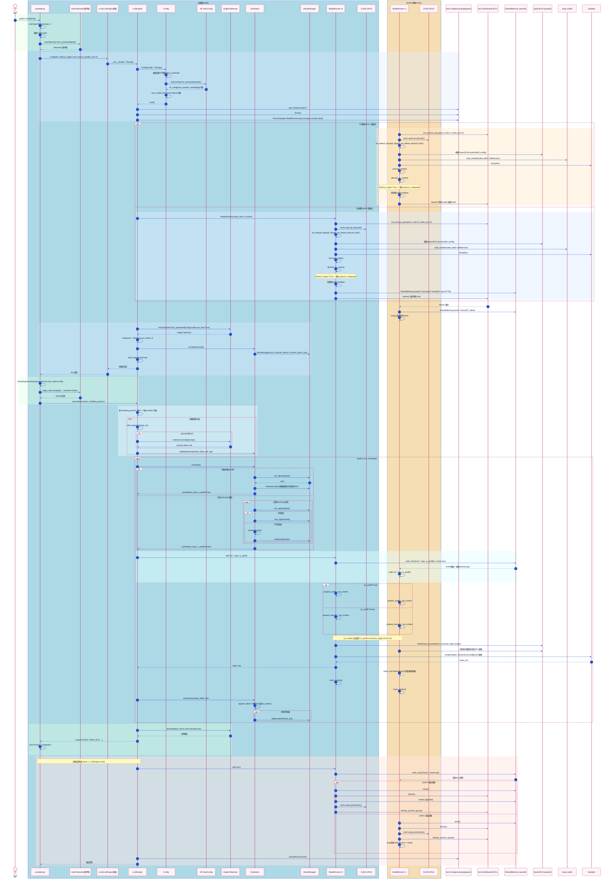
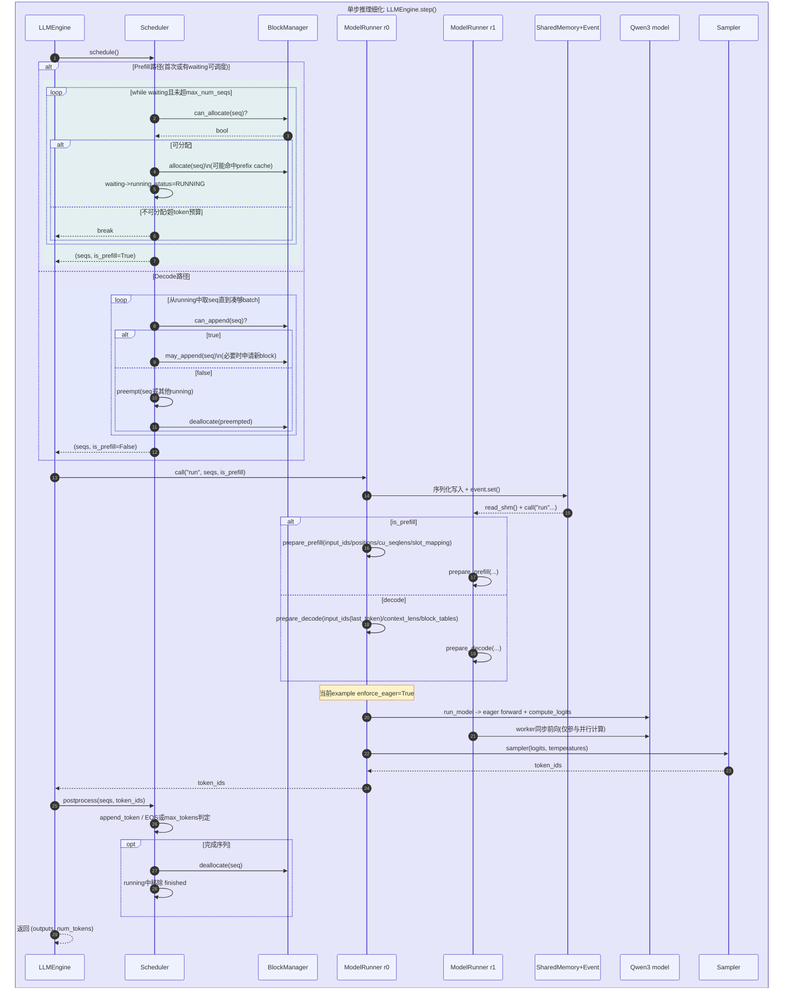
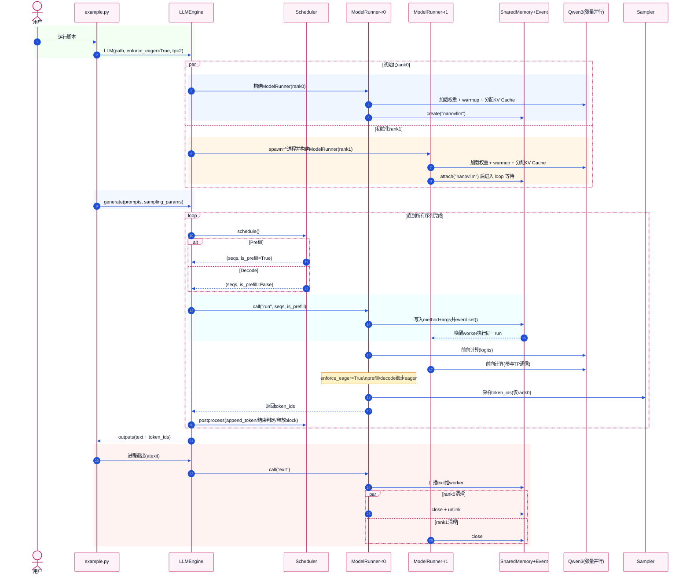
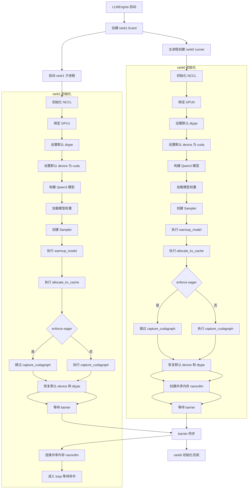
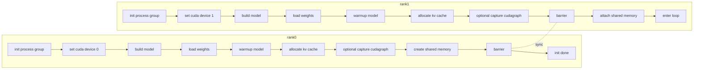
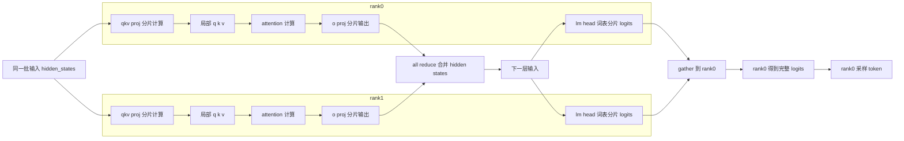
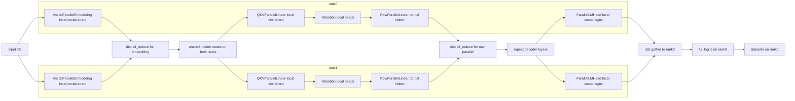
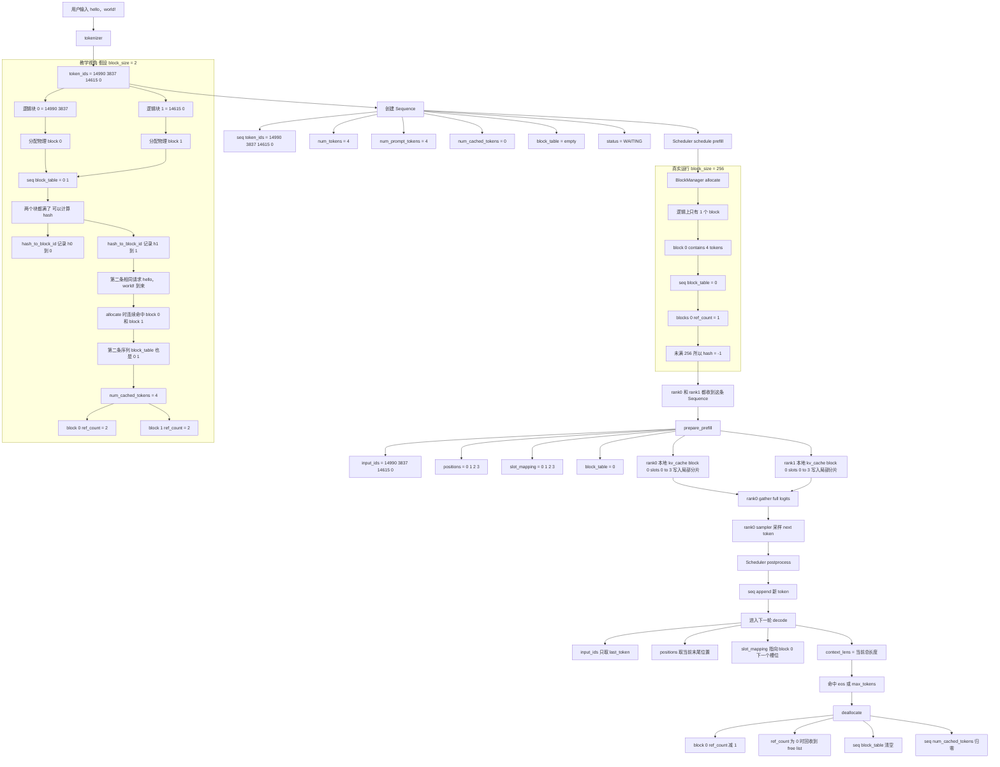

# Model runner sequence splitting
_Exported on 3/11/2026 at 16:26:33 GMT+8 from Cursor (2.5.26)_

---

**User**

@nanovllm/engine/model_runner.py:96-97 这里为什么要分成多个 seq

---

**Cursor**

我先看一下 `nanovllm/engine/model_runner.py` 里这两行附近的上下文，确认这里创建多个 `seq` 的具体目的，再给你一个针对这段实现的解释。

我已经定位到这段在 `warmup_model()` 里，接下来再看一下 `Sequence` 的结构和后续内存计算逻辑，确认“多条 seq”在 warmup 里影响的是算子形状、峰值显存还是 KV 预算。

这里分成多个 `seq`，核心是为了 **warmup 时模拟真实的“批处理上限”**，而不是只测一条请求。

- 在 `warmup_model()` 里，`num_seqs` 是这样算的：`min(max_num_batched_tokens // max_model_len, max_num_seqs)`，表示“在每条序列都到 `max_model_len` 时，最多能并发多少条”。
- 然后用这些序列执行一次 `self.run(seqs, True)`，让 prefill 路径按接近上限的 batch 形状跑一遍。
- 后面 `allocate_kv_cache()` 会读取 warmup 的峰值显存（`allocated_bytes.all.peak`）来反推可分配的 KV cache 块数。  
  如果只 warmup 1 条 `seq`，峰值通常偏低，KV cache 可能被分配得过大，实跑容易 OOM。

所以“拆成多个 `seq`”不是功能需求，而是为了：
1) 遵守单条 `max_model_len` 限制，  
2) 同时尽量打满 `max_num_batched_tokens`，  
3) 更准确估计峰值显存。  

默认配置下（`16384 // 4096`）通常就是 4 条。

---

**User**

举个例子，默认配置下怎么理解

---

**Cursor**

可以按默认值代入一遍：

- `max_num_batched_tokens = 16384`
- `max_model_len = 4096`
- `max_num_seqs = 512`

先算：
- `max_num_batched_tokens // max_model_len = 16384 // 4096 = 4`
- `num_seqs = min(4, 512) = 4`

所以 warmup 会构造：
- 4 条 `Sequence`
- 每条长度都是 `4096`（全是占位 token `0`）

等价于一次 prefill 处理总 token 数：
- `4 * 4096 = 16384`（正好打满 batch token 上限）

---

直觉上可以理解成：  
“不是拿一条超长请求试机器，而是拿 **4 条满长请求并发** 试一次最重场景。”

这样做的作用是：
- 让 warmup 的显存峰值更接近真实高负载；
- 后续 `allocate_kv_cache()` 用这个峰值去算 KV cache 容量时更保守、更准确；
- 避免 warmup 太轻导致 KV 分配过大，实跑高并发时 OOM。

---

**User**

目的是不是为了测试最大tokens推理时所需的内存。为什么要测试4条并发，而不是一条

---

**Cursor**

对，目的是这个方向：**在合法配置下，尽量跑到最重的 prefill 形状，测峰值显存**，用于后续 KV cache 容量估算。  

为什么是 4 条而不是 1 条，关键有两点：

- `max_model_len=4096`：单条序列最长只能 4096，**1 条 16384 token 不合法**。
- `max_num_batched_tokens=16384`：一次 batch 允许的总 token 上限是 16384。要把它打满，只能用 `16384/4096=4` 条满长序列并发。

所以这里的 4 条并发本质是：  
**在“单条不超过 4096”的前提下，把总 token 压到 16384 的上限。**

如果只测 1 条（长度 4096）：
- warmup 只用了 1/4 的 token 预算，
- 峰值显存会偏低，
- 后面 `allocate_kv_cache()` 可能算出过大的 KV cache，实跑高并发时更容易 OOM。

一句话：不是为了“并发本身”，而是为了在每条长度受限时，**把总负载打到上限**。

---

**User**

max_num_batched_tokens=16384 就是说一次推理只能有这么多tokens吗，超出了怎么处理

---

**Cursor**

我先快速看下调度/入队代码里对 `max_num_batched_tokens` 的约束逻辑，确认“超出后是截断、拆批还是延后执行”，再给你准确结论。

我找到了调度处的硬限制实现，再看一下 `llm_engine` 输入校验，确认超长/超量时是抛错还是排队。

对，这个参数更准确地说是 **“单次调度（主要是 prefill）的 batch token 上限”**，不是“整个请求生命周期总共只能处理 16384 个 token”。

- **含义**：在 `schedule()` 的 prefill 阶段，会累计本轮要跑的序列长度，超过 `max_num_batched_tokens` 就不再往当前 batch 塞新序列。
- **超出时（多请求场景）**：不会截断；是**拆成多轮**。当前轮放得下的先跑，剩下的留在 `waiting`，下一轮再调度。
- **decode 阶段**：每条序列每步只喂 1 个 token，主要受 `max_num_seqs` 和 KV block 可用性约束，不按 prefill 那种“总 prompt token”累加方式限制。

举个默认配置例子（4096/16384）：
- 如果有 6 条 prompt，每条 4096：
  - 第 1 轮 prefill：先跑 4 条（总 16384）
  - 第 2 轮 prefill：再跑剩下 2 条（总 8192）

---

需要注意一个实现细节：  
当前代码里**没有显式自动截断超长单条 prompt**。如果单条请求本身就异常大（超过系统可接受范围），不会被优雅切块处理，可能在后续调度里卡住/断言失败。实际使用时通常应在上层把输入长度限制到 `max_model_len` 内。

---

**User**

max_num_batched_tokens 这个和 /toolchain/LLM/Qwen3-0.6B-hf/config.json 有关联吗

---

**Cursor**

我先看一下模型的 `config.json` 里有哪些长度相关字段（比如 `max_position_embeddings`），再对照 `max_num_batched_tokens` 在代码里的用法，给你一个明确结论。

有**间接关联**，但不是同一个参数来源。

- `max_num_batched_tokens` 是引擎参数（`nanovllm/config.py` 里默认 16384），不是从模型 `config.json` 直接读取的。
- 模型 `config.json` 里相关的是 `max_position_embeddings`（你这个 Qwen3-0.6B 是 40960），它会约束 `max_model_len`。
- 在代码里：`max_model_len = min(用户设置, hf_config.max_position_embeddings)`，并且要求 `max_num_batched_tokens >= max_model_len`。

所以关系是：

`config.json(max_position_embeddings)` → 影响可用的 `max_model_len` 上限 → 间接影响你能否设置当前 `max_num_batched_tokens`（以及 warmup 时的并发估算）。

结合你现在默认值：
- `max_position_embeddings=40960`
- `max_model_len=4096`
- `max_num_batched_tokens=16384`

这里 `max_model_len` 没被模型上限卡住，因此 `max_num_batched_tokens` 基本按引擎默认独立生效。

---

**User**

还是没有理解。为什么要并发4，为什么不跑1

---

**Cursor**

关键点就一句：**这 4 不是“必须这样推理”，而是 warmup 在模拟“你配置允许的最重一批”**。  

你现在默认配置是：

- 单条上限：`max_model_len = 4096`
- 单批总量上限：`max_num_batched_tokens = 16384`

所以最重合法批次是：

- `16384 / 4096 = 4` 条满长序列

---

如果 warmup 只跑 1 条，会有什么问题？

- 只测到“轻负载”峰值显存；
- 后面 KV cache 会按这个偏低峰值去分配，可能分太大；
- 真到 4 条并发 prefill 时，临时激活显存 + KV 显存叠加，更容易 OOM。

所以跑 4 条是为了**把显存估计做保守、贴近最坏情况**。  

---

再强调一次：  
- **实际在线推理可以是 1 条、2 条、4 条都行**（调度器按队列凑批）。  
- 这里的 4 只是 warmup 的“压力测试批大小”。  

如果你的业务永远只跑单路，可以把 `max_num_batched_tokens` 调成 `4096`，那 warmup 就会变成 1 条。

---

**User**

并发的天花板就是 @nanovllm/engine/model_runner.py:96 这个算出来的吗，不管是prefill 还是后续的推理。如果输入的token是5000，那就是2并发，如果是9000那就是3并发，以此类推，默认最大4，每个并发最大支持token4096

---

**Cursor**

不是，你这个理解里有一半对、一半不对。

- `model_runner.py` 里这句只用于 **warmup 压测**，不是运行时调度上限本身。
- 真正 prefill 能并发多少，是 `scheduler.py` 动态决定的，条件是：
  - `num_seqs < max_num_seqs`
  - `num_batched_tokens + len(seq) <= max_num_batched_tokens`
  - KV block 还能分配（`can_allocate`）

所以：

- **默认“最大 4 并发”只在每条都接近 4096 token 时成立**（`16384 / 4096 = 4`）。
- 如果每条更短，并发可以大于 4（例如 2048 token 理论可到 8，1024 可到 16），但还会被 `max_num_seqs` 和 KV 内存限制。
- decode 阶段不是按 `max_num_batched_tokens / 输入长度` 这个公式算，它主要受 `max_num_seqs` 和 KV append 能力约束。

你举的 `5000`、`9000` 这两个例子还有个前提问题：

- 当前默认 `max_model_len=4096`，按设计单条不该超过这个长度。
- 也就是说，`5000/9000` 这种单条输入应当先被上层截断或拒绝（这个仓库里目前没看到很严格的入口校验）。  

一句话版：  
`@model_runner.py` 那个 `num_seqs` 是 warmup 的“模拟最重 batch”，不是全流程固定并发天花板。

---

**User**

如果输入5000，将会怎么处理

---

**Cursor**

我去确认一下 `sampling_params` 默认值和 decode 的图捕获路径，判断输入 5000 时到底是“继续跑”还是“在某一步报错”。

按你现在这套默认参数（`max_model_len=4096`, `max_num_batched_tokens=16384`, `enforce_eager=False`），输入 5000 时会这样：

- **不会被自动截断**：`LLMEngine.add_request()` 没有对 `max_model_len` 做拦截。
- **会先进入 prefill**：`Scheduler` 只看是否超过 `max_num_batched_tokens`，5000 < 16384，所以可被调度执行。
- **风险在 decode 阶段**：`ModelRunner` 的 CUDA Graph 预分配 `block_tables` 是按 `max_model_len` 算的（4096 -> 16 blocks），而 5000 token 需要 20 blocks，后续 decode 很可能在 `graph_vars["block_tables"]` 赋值时报维度不匹配错误。

所以结论是：**5000 不会被“优雅处理”为截断或拒绝，通常会在后续 decode 触发运行时错误（默认非 eager）**。

补充：
- 如果改成 `enforce_eager=True`，这条 5000 有机会继续跑（直到模型自身位置上限，比如 Qwen3 的 `max_position_embeddings`）。
- 更稳妥的做法是：在入口把 prompt 长度限制到 `max_model_len` 内（或同步把 `max_model_len` 调大并重新评估显存）。

---

**User**

这里的拆分成4条seq和多卡有联系吗。是不是单卡里面拆分成4条并行。

---

**Cursor**

我先快速核对一下并行实现（是不是张量并行 TP），这样能准确回答“4 条 seq 和多卡是否相关”。

这两个维度是**正交**的，不是一回事：

- `model_runner.py` 里算出的 `4`（`num_seqs`）是 **batch 里有几条序列**，用于 warmup 压测。
- 多卡（`tensor_parallel_size`）是 **模型权重按通道/头切到多张卡**，不是把一条请求切成 4 段。

你这句“是不是单卡里面拆分成4条并行”可以这样理解：

- **是**：单卡下会把 4 条独立 `seq` 作为一个 batch 一起算（batch 并行）。
- **不是**：不是把“同一条输入”拆成 4 份。

多卡时（TP）会变成：

- 仍然是同一个 batch（比如 4 条 `seq`）；
- 每张卡算自己那份权重分片；
- 通过 `all_reduce/all_gather` 合并结果。  
  （在 `nanovllm/layers/linear.py`、`nanovllm/layers/embed_head.py` 里能看到通信）

所以结论：

- `4 条 seq` 主要由 `max_num_batched_tokens` 和 `max_model_len` 决定；
- 不是由“几张卡”直接决定；
- 多卡影响的是“每条 seq 的计算怎么分到卡上”，不是“seq 条数本身”。

---

**User**

enforce_eager = True 是什么模式，有什么意义

---

**Cursor**

我先把 `enforce_eager` 在仓库里的所有分支点过一遍，再结合你当前文件解释它具体改变了哪条执行路径。

`enforce_eager=True` 就是**强制用 PyTorch 的 eager 执行**（每次都正常前向，不走 CUDA Graph replay）。

在你这个仓库里，它的实际效果是：

- `prefill` 本来就 always eager（无论 True/False 都一样）。
- 主要影响 `decode`：
  - `False`：会走 `capture_cudagraph()` 预捕获的图（`bs<=512` 时），然后 replay。
  - `True`：decode 也直接 `self.model(...)`，不使用图。

意义（取舍）：

- **优点**：兼容性更好、排错更容易、不会踩 CUDA Graph 的静态形状限制。
- **缺点**：通常 decode 吞吐会低一些（少了 graph 带来的 kernel launch 优化）。

结合你前面问的超长输入场景：  
`enforce_eager=True` 往往能绕开这份代码里与 CUDA Graph 相关的 shape 问题（比如 block table 静态尺寸），但并不等于“没有任何长度上限”，仍受 `max_model_len`/显存等约束。

---

**User**

@nanovllm/layers/sampler.py:5-16 源码详解，是不是只实现了贪婪采样

---

**Cursor**

我先把 `sampler.py` 全文看一遍，再按每行解释它在做什么，并明确它是不是“贪婪采样”。

这段**不是贪婪采样**，而是“带 temperature 的随机采样（categorical sampling）”。

```10:15:nanovllm/layers/sampler.py
@torch.compile
def forward(self, logits: torch.Tensor, temperatures: torch.Tensor):
    logits = logits.float().div_(temperatures.unsqueeze(dim=1))
    probs = torch.softmax(logits, dim=-1)
    sample_tokens = probs.div_(torch.empty_like(probs).exponential_(1).clamp_min_(1e-10)).argmax(dim=-1)
    return sample_tokens
```

逐行看：

- `@torch.compile`  
  把采样函数编译优化，主要是提速，不改变算法语义。

- `logits.float().div_(temperatures.unsqueeze(dim=1))`  
  对每个样本做温度缩放：`logits / T`。  
  - `T` 小：分布更尖锐，更“接近贪婪”  
  - `T` 大：分布更平滑，更随机

- `softmax`  
  把缩放后的 logits 转成概率分布 `probs`。

- `probs / Exp(1)` 再 `argmax`  
  这是 **Gumbel/Exponential trick** 的一种实现，等价于按 `probs` 做一次离散随机采样。  
  所以这里有随机性，不是单纯取最大概率。

---

你问“是不是只实现了贪婪采样”——结论：

- **不是贪婪**（greedy 应该是直接 `argmax(logits)`，无随机噪声）。
- 当前实现是**仅支持 temperature 的全词表随机采样**。
- 还**没有** top-k、top-p、repetition penalty、beam search 等策略。

另外 `SamplingParams` 里还限制了 `temperature > 1e-10`，所以也不支持 `temperature=0` 的严格 greedy。

---

**User**

@nanovllm/engine/model_runner.py:100-118 源码详解

---

**Cursor**

我补充看一下 `attention` 层如何读写 `k_cache/v_cache`，这样能把这段 KV 分配公式和实际使用对上。

这段 `allocate_kv_cache()` 可以理解成三步：**算预算 -> 算块数 -> 绑定到每层 Attention**。

```100:118:nanovllm/engine/model_runner.py
def allocate_kv_cache(self):
    config = self.config
    hf_config = config.hf_config
    free, total = torch.cuda.mem_get_info()
    used = total - free
    peak = torch.cuda.memory_stats()["allocated_bytes.all.peak"]
    current = torch.cuda.memory_stats()["allocated_bytes.all.current"]
    num_kv_heads = hf_config.num_key_value_heads // self.world_size
    head_dim = getattr(hf_config, "head_dim", hf_config.hidden_size // hf_config.num_attention_heads)
    block_bytes = 2 * hf_config.num_hidden_layers * self.block_size * num_kv_heads * head_dim * hf_config.torch_dtype.itemsize
    config.num_kvcache_blocks = int(total * config.gpu_memory_utilization - used - peak + current) // block_bytes
    assert config.num_kvcache_blocks > 0
    self.kv_cache = torch.empty(2, hf_config.num_hidden_layers, config.num_kvcache_blocks, self.block_size, num_kv_heads, head_dim)
    layer_id = 0
    for module in self.model.modules():
        if hasattr(module, "k_cache") and hasattr(module, "v_cache"):
            module.k_cache = self.kv_cache[0, layer_id]
            module.v_cache = self.kv_cache[1, layer_id]
            layer_id += 1
```

### 逐段解释

- `free, total` / `used`
  - 读取当前 GPU 总显存和空闲显存，`used = total - free`。

- `peak` / `current`
  - 读取 PyTorch 分配器统计。
  - `peak` 是 warmup 后记录到的历史峰值，`current` 是当前已分配。
  - `peak - current` 可理解为“推理临时激活在峰值时额外吃掉的那部分”。

- `num_kv_heads` / `head_dim`
  - 每张卡实际负责的 KV 头数：`num_key_value_heads // world_size`（TP 切分后每卡更少）。
  - `head_dim` 优先用配置里的 `head_dim`，否则回退 `hidden_size / num_attention_heads`。

- `block_bytes`
  - 计算**一个 KV block 在单卡上占多少字节**：
  - `2(K+V) * 层数 * block_size * 每卡kv头数 * head_dim * dtype字节数`

- `num_kvcache_blocks`
  - 可分配块数公式本质是：
  - `可用预算 = total * gpu_memory_utilization - used - (peak - current)`
  - `块数 = 可用预算 // block_bytes`
  - 这样做的目的：给运行时临时显存留余量，避免把 KV cache 分太满导致 OOM。

- `self.kv_cache = torch.empty(...)`
  - 真正申请大张量，形状是：
  - `[2, num_layers, num_blocks, block_size, num_kv_heads, head_dim]`
  - 第 0 维 `2` 分别对应 K 和 V。

- 遍历 `self.model.modules()` 绑定 `k_cache/v_cache`
  - 找到有 `k_cache` / `v_cache` 属性的模块（Attention 子模块）。
  - 按层把对应切片挂进去，后续注意力里就直接往这块共享缓存写。
  - 你在 `nanovllm/layers/attention.py` 里看到的 `store_kvcache(...)` 就是在用这里绑定的缓存。

### 一句话总结
这段代码是在“**按当前显存余量和 warmup 峰值，动态算出能放多少 KV block，然后把它分配并接到每一层 Attention 上**”。

---

**User**

self.block_size 是怎么来的，为什么是256的倍数。

---

**Cursor**

我先把 `block_size` 的来源和在注意力后端里的约束位置查全，再给你一个“代码层 + 原理层”的解释。

`self.block_size` 的来源很直接：

- 在 `ModelRunner.__init__` 里：`self.block_size = config.kvcache_block_size`
- `config.kvcache_block_size` 定义在 `nanovllm/config.py`，默认值是 `256`
- 同一个值也会传给 `BlockManager`，并用于 `kv_cache` 张量形状

为什么要求“256 的倍数”：

- `nanovllm/config.py` 里有硬校验：`assert self.kvcache_block_size % 256 == 0`
- 这个约束主要是为了兼容 paged KV cache 的 FlashAttention 内核：`flash_attn_with_kvcache` 文档里明确写了 `page_block_size must be a multiple of 256`（你这里在 `nanovllm/layers/attention.py` 就是用这个接口做 decode）

另外一个实用提醒（这个仓库当前实现）：

- `Sequence` 里 `block_size` 是写死 `256`（`nanovllm/engine/sequence.py`）
- 所以即使配置允许 `512/768...`，当前代码很多地方仍默认按 `256` 在算，改大可能出现不一致  
- 也就是说：**现在实际上最稳妥就是用 256**。

---

**User**

block size 含义是什么，物理意义，举个例子。

---

**Cursor**

可以把 `block size` 理解成 **KV Cache 的“页大小”**：  
**1 个 block 里放多少个 token 的 K/V。**

在这个项目里：

- 参数来源是 `Config.kvcache_block_size`（默认 256）
- `ModelRunner` 用它分配 `self.kv_cache`
- `Sequence.block_table` 记录“这条序列的第 i 个逻辑块映射到哪个物理 block”

---

**物理意义（最关键）**：它决定了 KV 缓存的内存分配粒度。

- 分配不是按“1 token”分，而是按“1 block”分
- 地址计算也是按 block 来：`block_id * block_size + block内偏移`
- 所以它像操作系统里的“页大小（page size）”

---

举个直观例子（`block_size=256`）：

- 一条序列长度 600 token
- 会占 `ceil(600 / 256) = 3` 个 block
  - block0: token 0~255
  - block1: token 256~511
  - block2: token 512~599（后面 156 个槽暂时空着）

如果继续生成：
- 到 token 767 前都还在第 3 个 block
- 再多一个（到 768 之后）才会申请新 block

---

再给个“显存量级”例子（Qwen3-0.6B，bf16，TP=2 时）：

- 每个 block 大约 `14,680,064 bytes`（约 14MB / 卡）
- 所以 `block_size` 变大，**每次申请的最小显存块也更大**

---

为什么这很重要：

- 小 block：碎片少（尾部浪费少），但管理开销更高
- 大 block：管理开销低，但尾部浪费更明显
- 这个仓库要求是 256 的倍数，主要是为了兼容 paged KV 的 FlashAttention 内核约束。

---

**User**

@nanovllm/engine/model_runner.py:46-47 配置共享内存和dist.barrier 先后顺序有要求吗

---

**Cursor**

我看一下你当前文件这段初始化和退出逻辑的完整顺序，再给你结论（哪些顺序必须固定、哪些可以替代）。

有要求，而且你这段写法的顺序是对的。  

在 `model_runner.py` 这个实现里，正确时序是：

- `rank0`：先 `SharedMemory(create=True)` 创建共享内存，再 `dist.barrier()`
- 其他 `rank`：先 `dist.barrier()` 等待，再 `SharedMemory(name=...)` 连接

原因：

- `barrier` 的作用是“所有进程在同一阶段汇合”。
- 如果非 0 rank 在创建前就去 `SharedMemory(name=...)`，可能直接找不到（竞态）。
- 如果 `rank0` 把 `barrier` 放到创建前，也会有“barrier 放行后其他进程先连、但还没创建”的窗口。

所以在你这段代码里，`create -> barrier -> attach` 这个顺序就是为了解决初始化竞态。

另外退出时的 `close -> barrier -> unlink` 也是同理：  
先让所有 rank 关闭，再由 `rank0` `unlink`，避免名称提前删除导致其他进程后续访问异常。

---

**User**

@example.py:1-45 给出时序图 越详细越好，mermaid格式。带有颜色。

---

**Cursor**

我先补齐 `LLM` 入口类和调用链（`nanovllm/__init__`、`llm.py`）的细节，再给你一份可直接粘贴渲染的高细节彩色 Mermaid 时序图。

下面给你两张**带颜色**、可直接粘贴的 Mermaid 时序图：

- 图1：`example.py` 从启动到退出的**全生命周期**
- 图2：`LLMEngine.step()` 的**单步细化（prefill/decode）**

> 说明：图里按你当前 `example.py` 配置建模（`tensor_parallel_size=2`、`enforce_eager=True`）。





如果你希望，我还可以再给你一版“**只保留关键路径、适合放文档首页**”的精简彩色图（同样 Mermaid）。

---

**User**

需要。

---

**Cursor**

下面给你一版**文档友好的精简彩色时序图**（关键路径）：



如果你要，我可以再给一版“**只画 `Scheduler.schedule()`（prefill/decode分支）**”的极简图，适合放在 `scheduler.py` 注释里。

---

**User**

怎么理解

---

**Cursor**

可以把这张图理解成：**KV Cache 的“页式内存 + 内容寻址去重”**。

### 一句话版
`Sequence` 不直接持有 KV 数据，只持有 `block_table`（逻辑块 -> 物理块ID）；  
`BlockManager` 用 `hash_to_block_id` 找“同内容块”，命中就复用并 `ref_count+1`，没命中就分配新块。

---

### 对照图里的元素

- `Sequence 1/2/3`
  - 每条请求的 `block_table` 记录它用了哪些物理 block。
  - 比如 `[0,2]` 表示：第0个逻辑块用物理 `Block 0`，第1个逻辑块用物理 `Block 2`。
  - 物理 ID 不连续很正常（内存池复用导致）。

- `BlockManager Memory Pool`
  - 真正放 KV 的地方（Block 0/1/2...）。
  - 每个 block 有：
    - `hash`：该块内容（+前缀）哈希
    - `ref_count`：有多少序列在引用它

- `hash_to_block_id`
  - 哈希索引表：`hash -> block_id`
  - 用来快速判断“这段前缀块是不是已经算过”。

---

### “前缀共享”怎么发生（代码逻辑）

1. 调度 prefill 时，按块遍历序列内容。  
2. 对完整块计算哈希，去 `hash_to_block_id` 查。  
3. 命中且内容一致：复用已有 block，`ref_count += 1`。  
4. 未命中：从空闲池拿新 block。  
5. 一旦某个块 miss，后续块也当新内容处理（所以叫**前缀**缓存，不是任意子串缓存）。

---

### 图中示例含义

- `Sequence 1` 和 `Sequence 2` 都是 `[0,2]`  
  -> 共享了同一段前缀 KV，`Block 0`、`Block 2` 的 `ref_count=2`。  
- `Sequence 3` 是 `[1]`  
  -> 用了不同内容的块 `Block 1`，不共享前两者前缀。

---

### 为什么这样设计

- **省算力**：命中的前缀 token 不再重复 prefill。  
- **省显存**：同样前缀只存一份 KV。  
- **可回收**：序列结束时 `ref_count--`，减到 0 自动回到 free pool。  

如果你愿意，我可以再给你画一张“`allocate()` 逐行对应这张图”的小流程图（专门对应 `scheduler -> block_manager.allocate -> model_runner.prepare_prefill`）。

---

**User**

@nanovllm/engine/llm_engine.py:1-94 源码详解

---

**Cursor**

`nanovllm/engine/llm_engine.py` 这份代码是**引擎编排层**：  
上接用户 API（`LLM.generate`），下接调度器（`Scheduler`）和执行器（`ModelRunner`），负责把“多请求文本生成”跑起来。

下面按方法拆解。

---

## 1) 文件整体职责

- `LLMEngine` 不做具体算子计算，它负责：
  - 初始化配置、Tokenizer、调度器、模型执行进程
  - 接收请求并入队
  - 反复调度 prefill/decode
  - 收集完成序列并解码成文本返回

---

## 2) `__init__`：初始化流程（最关键）

```17:34:nanovllm/engine/llm_engine.py
def __init__(self, model, **kwargs):
    config_fields = {field.name for field in fields(Config)}
    config_kwargs = {k: v for k, v in kwargs.items() if k in config_fields}
    config = Config(model, **config_kwargs)
    self.ps = []
    self.events = []
    ctx = mp.get_context("spawn")
    for i in range(1, config.tensor_parallel_size):
        event = ctx.Event()
        process = ctx.Process(target=ModelRunner, args=(config, i, event))
        process.start()
        self.ps.append(process)
        self.events.append(event)
    self.model_runner = ModelRunner(config, 0, self.events)
    self.tokenizer = AutoTokenizer.from_pretrained(config.model, use_fast=True)
    config.eos = self.tokenizer.eos_token_id
    self.scheduler = Scheduler(config)
    atexit.register(self.exit)
```

### 逐点解释

- 只接收 `Config` 支持的参数（其余 `kwargs` 被忽略）。
- 用 `spawn` 启动多进程（更安全，避免 `fork` 带来的 CUDA 上下文问题）。
- `tensor_parallel_size > 1` 时：
  - 为 `rank=1...N-1` 启动 worker 进程，目标函数是 `ModelRunner(config, rank, event)`。
  - 主进程自己创建 `rank=0` 的 `ModelRunner`。
- 然后初始化 tokenizer，并把 `eos_token_id` 回填到 `config.eos`（给调度器结束条件用）。
- 最后创建 `Scheduler(config)`，并注册 `atexit`，保证进程退出时会清理资源。

### 一个容易忽略的点
`Scheduler` 依赖 `config.num_kvcache_blocks`，而这个值是在 `ModelRunner` 初始化过程中算出来的（warmup+显存估算）。  
所以这里先建 `ModelRunner`，再建 `Scheduler`，顺序是有意的。

---

## 3) `add_request`：把请求变成 `Sequence`

- 输入可以是 `str` 或 `list[int]`：
  - `str` -> `tokenizer.encode`
  - 已经是 token id 列表则直接用
- 封装成 `Sequence(prompt, sampling_params)` 后放进调度器等待队列。

这一步只做入队，不执行模型。

---

## 4) `step`：一次调度 + 一次执行 + 一次后处理

```48:54:nanovllm/engine/llm_engine.py
def step(self):
    seqs, is_prefill = self.scheduler.schedule()
    token_ids = self.model_runner.call("run", seqs, is_prefill)
    self.scheduler.postprocess(seqs, token_ids)
    outputs = [(seq.seq_id, seq.completion_token_ids) for seq in seqs if seq.is_finished]
    num_tokens = sum(len(seq) for seq in seqs) if is_prefill else -len(seqs)
    return outputs, num_tokens
```

### 关键含义

- `schedule()` 决定本轮跑哪些序列，以及是 prefill 还是 decode。
- `model_runner.call("run", ...)`：
  - 单卡：本地直接执行。
  - 多卡：`rank0` 通过共享内存+事件通知 worker，同步执行同一调用。
- `postprocess()`：
  - 给每条序列 append 新 token
  - 判断 EOS 或 `max_tokens` 完成
  - 完成后释放对应 KV block
- `num_tokens` 的符号是刻意设计：
  - prefill 用正数（总 token 数）
  - decode 用负数（本轮序列数）
  - 方便上层 `generate()` 用一套逻辑分别算吞吐。

---

## 5) `generate`：完整推理主循环

流程是：

1. 可选创建 `tqdm` 进度条  
2. 若只给一个 `SamplingParams`，复制成与 prompts 等长  
3. 全部请求先 `add_request` 入队  
4. while 未完成：
   - `step()`
   - 更新 prefill/decode 吞吐
   - 收集本轮完成序列
5. 按 `seq_id` 排序恢复原请求顺序
6. `tokenizer.decode` 生成文本并返回

---

## 6) 这份实现的设计亮点

- **解耦清晰**：`LLMEngine` 编排，`Scheduler` 决策，`ModelRunner` 执行。
- **支持 TP 多进程**：主从 rank 协同运行，但 API 保持简洁。
- **统一 prefill/decode 循环**：通过 `schedule()` 自动切换阶段。
- **输出顺序可控**：用 `seq_id` 回排，确保返回顺序稳定。

---

## 7) 你读代码时可重点注意的边界点

- `zip(prompts, sampling_params)` 会按较短长度截断（长度不一致时静默丢尾项）。
- 入口层这里没有强校验“prompt 长度 <= max_model_len”。
- `LLM` 是 `LLMEngine` 的空子类（`pass`），所以你平时用的 `LLM` 行为全部来自这个文件。

---

如果你要，我可以下一步把这份文件再拆成“**调用栈视角**”（从 `generate()` 一路跟到 `Scheduler.schedule()` 和 `ModelRunner.run()`），给你一张对照表：每一步输入/输出张量或对象是什么。

---

**User**

需要

---

**Cursor**

好，下面给你一版 **“调用栈 + I/O 对照”**，从 `generate()` 一路到模型执行，专门帮助你串起来看。

---

## 主调用栈（从上到下）

1. `LLM.generate(...)`（其实是 `LLMEngine.generate`）
2. `LLMEngine.add_request(...)`（循环入队）
3. `while not is_finished():`
4. `LLMEngine.step()`
5. `Scheduler.schedule()` -> 得到 `(seqs, is_prefill)`
6. `ModelRunner.call("run", seqs, is_prefill)`
7. `ModelRunner.run(...)`
8. `prepare_prefill(...)` 或 `prepare_decode(...)`
9. `run_model(...)` -> `self.model(...)` -> `compute_logits(...)`
10. `Sampler(...)` -> 采样 `token_ids`
11. 回到 `Scheduler.postprocess(...)` 更新序列状态
12. 若完成，`generate()` 里收集并 decode

---

## 每层输入/输出（类型+语义）

### 1) `generate(prompts, sampling_params)`
- **输入**
  - `prompts: list[str] | list[list[int]]`
  - `sampling_params: SamplingParams | list[SamplingParams]`
- **输出**
  - `list[{"text": str, "token_ids": list[int]}]`
- **作用**
  - 驱动整个调度循环，直到所有请求完成

---

### 2) `add_request(prompt, sp)`
- **输入**
  - `prompt: str | list[int]`
  - `sp: SamplingParams`
- **输出**
  - 无（副作用：入队）
- **作用**
  - 把 prompt 变成 `Sequence` 丢到 `Scheduler.waiting`

---

### 3) `step()`
- **输入**
  - 无（读取调度器内部队列）
- **输出**
  - `outputs: list[(seq_id, completion_token_ids)]`
  - `num_tokens: int`  
    - prefill: 正数（本轮处理 token 总量）  
    - decode: 负数（本轮序列数）
- **作用**
  - 一轮完整的 “调度 -> 执行 -> 后处理”

---

### 4) `Scheduler.schedule()`
- **输入**
  - `waiting/running` 队列状态 + block 可用状态
- **输出**
  - `seqs: list[Sequence]`
  - `is_prefill: bool`
- **作用**
  - 决定本轮跑 prefill 还是 decode，以及跑哪些序列

---

### 5) `ModelRunner.call("run", seqs, is_prefill)`
- **输入**
  - 方法名 + 参数
- **输出**
  - `token_ids`（只有 rank0 有）
- **作用**
  - 单卡直接调用；多卡时 rank0 先写共享内存通知 worker 同步执行

---

### 6) `ModelRunner.run(seqs, is_prefill)`
- **输入**
  - `seqs`（本轮 batch）
  - `is_prefill`
- **输出**
  - `token_ids: list[int]`（每条序列一个新 token）
- **作用**
  - 准备输入张量/上下文 -> 模型前向 -> 采样

---

### 7) `prepare_prefill(seqs)`（prefill）
- **输入**
  - 多条序列的 prompt（含可能的 prefix cache 状态）
- **输出**
  - `input_ids: Tensor[int64]`（扁平化）
  - `positions: Tensor[int64]`
  - 并通过 `set_context(...)` 写入：
    - `cu_seqlens_q/k`, `max_seqlen_q/k`
    - `slot_mapping`
    - `block_tables`（prefix cache 时）
- **作用**
  - 构建变长 prefill 所需的全部上下文

---

### 8) `prepare_decode(seqs)`（decode）
- **输入**
  - running 中序列
- **输出**
  - `input_ids: Tensor[int64]`（每条只取 last_token）
  - `positions: Tensor[int64]`（当前位置）
  - `set_context(...)` 写入：
    - `slot_mapping`, `context_lens`, `block_tables`
- **作用**
  - 构建 1-step decode 所需上下文

---

### 9) `run_model(input_ids, positions, is_prefill)`
- **输入**
  - 模型输入 token + position
- **输出**
  - `logits: Tensor`（通常 shape ~ `[N, vocab]`）
- **作用**
  - prefill 或 eager：直接前向  
  - 非 eager decode 且 bs<=512：走 CUDA Graph replay

---

### 10) `Sampler.forward(logits, temperatures)`
- **输入**
  - `logits`
  - `temperatures: Tensor[bs]`
- **输出**
  - `sample_tokens: Tensor[bs]`
- **作用**
  - 温度缩放 + softmax + 随机采样，得到每条序列下一个 token

---

### 11) `Scheduler.postprocess(seqs, token_ids)`
- **输入**
  - 本轮序列 + 新 token
- **输出**
  - 无（副作用更新状态）
- **作用**
  - `append_token`
  - 命中 EOS 或到 `max_tokens` -> 标记 finished 并释放 blocks

---

## 两阶段如何切换（你最该抓住的一点）

- **prefill**：先把 waiting 的序列尽量装进 batch（受 `max_num_batched_tokens` 等限制）
- **decode**：waiting 为空或 prefill 装不进时，轮询 running 做逐 token 生成
- 每个 `step()` 只跑一轮，`generate()` 循环推进直到所有序列 finished

---

## 你可以这样 mentally debug

遇到异常时按这 4 个点定位最快：

1. `schedule()` 选了哪些 `seqs`、`is_prefill` 是啥  
2. `prepare_*` 产出的 `input_ids/positions/context` 是否匹配  
3. `run_model` 走了 eager 还是 graph 分支  
4. `postprocess` 是否正确结束序列并释放 block

---

如果你愿意，我下一条可以直接给你一份 **“单步 step() 的真实数据样例表”**（比如 2 条请求，演示 prefill 一轮 + decode 两轮，每轮 `seq.len / block_table / token_ids` 如何变化）。

---

**User**

@example.py:20 配置了多进程，为什么 @\home\lebhoryi\.cursor\projects\home-lebhoryi-share-2026Q1-nano-vllm\terminals\3.txt:748-753 只输出了一半

---

**Cursor**

我先检查一下终端完整输出尾部，确认是“真的被截断”还是你截取的行范围只覆盖了前半段，再给你准确原因。

核心原因不是“多进程”，而是**停止条件触发了**。

- 你在 `example.py` 里设置了 `max_tokens=256`。  
```22:22:example.py
    sampling_params = SamplingParams(temperature=0.6, max_tokens=256)
```
- 引擎在 `postprocess` 里只要满足“到 EOS 或已生成到 `max_tokens`”就结束该序列。  
```65:69:nanovllm/engine/scheduler.py
    def postprocess(self, seqs: list[Sequence], token_ids: list[int]) -> list[bool]:
        for seq, token_id in zip(seqs, token_ids):
            seq.append_token(token_id)
            if (not seq.ignore_eos and token_id == self.eos) or seq.num_completion_tokens == seq.max_tokens:
                seq.status = SequenceStatus.FINISHED
```

所以你看到“只输出一半”，本质是：  
模型还在 `<think>` 里，但已经打满 256 个新 token，被强制截断了。

---

`tensor_parallel_size=2`（多进程/多卡）只影响**计算并行与速度**，不影响“单条回复最多生成多少 token”。

如果想看到完整回答，直接把 `max_tokens` 调大（比如 `1024` 或 `2048`）再试。

---

**User**

@example.py:22 改的是这里的 max_tokens 吗

---

**Cursor**

对，就是这里。

你把 `example.py` 的这行改大：

- `SamplingParams(..., max_tokens=1024)`（或更大）

它控制的是**每条请求最多生成多少新 token**（completion 长度上限），不是 prompt 长度。  
所以“输出被截断”优先看这个参数。

---

**User**

@\home\lebhoryi\.cursor\projects\home-lebhoryi-share-2026Q1-nano-vllm\terminals\2.txt:352-365 报错了

---

**Cursor**

我先把这次运行前后的完整终端上下文和当前配置值（尤其 `max_model_len / max_num_batched_tokens / gpu_memory_utilization / tensor_parallel_size`）核对一下，定位是“显存预算为负”还是“warmup 峰值异常”。

我已经确认这次其实叠加了两个问题（worker 显存预算断言 + 残留共享内存名冲突）。我再快速读一下当前各卡空闲显存，给你一个可执行的最短排障顺序。

---

**User**

@nanovllm/engine/model_runner.py:1-258 源码详解

---

**Cursor**

`nanovllm/engine/model_runner.py` 是这套引擎里**最核心的执行器**。  
如果说：

- `LLMEngine` 负责“编排”
- `Scheduler` 负责“决定这一轮跑谁”
- 那 `ModelRunner` 就负责“**真正把这一轮 batch 喂给模型并产出 token**”

它同时还承担了几件事：

- 初始化 TP 多进程环境
- 加载模型权重
- warmup 测峰值显存
- 分配 KV Cache
- 准备 prefill/decode 两种输入
- 执行 eager 或 CUDA Graph 前向
- rank0 采样新 token
- rank0 和其他 rank 之间通过共享内存分发调用

下面按“**生命周期 + 方法**”来拆。

## 1) 文件整体职责

这份文件可以分成 5 个模块：

1. **初始化模块**
   - `__init__`
   - `warmup_model`
   - `allocate_kv_cache`
   - `capture_cudagraph`

2. **多进程通信模块**
   - `loop`
   - `read_shm`
   - `write_shm`
   - `call`
   - `exit`

3. **输入整理模块**
   - `prepare_block_tables`
   - `prepare_prefill`
   - `prepare_decode`
   - `prepare_sample`

4. **执行模块**
   - `run_model`
   - `run`

5. **状态上下文模块**
   - 借助 `set_context/get_context/reset_context`
   - 把 attention 需要的 `slot_mapping / block_tables / cu_seqlens` 塞进全局上下文

---

## 2) 整体生命周期

可以把 `ModelRunner` 的一生看成：

1. 初始化分布式进程组 + 绑定 GPU
2. 构建模型并加载权重
3. warmup 跑一轮最重 prefill，测显存峰值
4. 按剩余显存分配 KV Cache
5. 如果 `enforce_eager=False`，再捕获 CUDA Graph
6. 如果是 `rank0`：
   - 创建共享内存
   - 接受上层 `call("run", ...)`
7. 如果是非 0 rank：
   - 连接共享内存
   - 进入 `loop()` 等待 rank0 下发命令
8. 运行时不断处理 `run/exit`
9. 退出时关闭共享内存、销毁进程组

---

## 3) `__init__`：初始化总入口

```17:48:nanovllm/engine/model_runner.py
def __init__(self, config: Config, rank: int, event: Event | list[Event]):
    self.config = config
    hf_config = config.hf_config
    self.block_size = config.kvcache_block_size
    self.enforce_eager = config.enforce_eager
    self.world_size = config.tensor_parallel_size
    self.rank = rank
    self.event = event

    dist.init_process_group("nccl", "tcp://localhost:2333", world_size=self.world_size, rank=rank)
    torch.cuda.set_device(rank)
    default_dtype = torch.get_default_dtype()
    torch.set_default_dtype(hf_config.torch_dtype)
    torch.set_default_device("cuda")
    self.model = Qwen3ForCausalLM(hf_config)
    load_model(self.model, config.model)
    self.sampler = Sampler()
    self.warmup_model()
    self.allocate_kv_cache()
    if not self.enforce_eager:
        self.capture_cudagraph()
```

### 这里做了什么

- 读取配置并保存几个关键字段：
  - `block_size`
  - `enforce_eager`
  - `world_size`
  - `rank`

- 初始化 NCCL 分布式环境
  - `rank` 就对应 GPU 编号
  - `torch.cuda.set_device(rank)` 让每个进程绑到自己的卡

- 把默认 device 临时切到 GPU，默认 dtype 切到模型 dtype
  - 这样后面构建模型时参数直接建在 GPU 上

- 构造 `Qwen3ForCausalLM`
- 加载权重
- 初始化采样器
- warmup
- 分配 KV cache
- 如有需要捕获 CUDA Graph

### 后半段：共享内存初始化

```41:48:nanovllm/engine/model_runner.py
if self.world_size > 1:
    if rank == 0:
        self.shm = SharedMemory(name="nanovllm", create=True, size=2**20)
        dist.barrier()
    else:
        dist.barrier()
        self.shm = SharedMemory(name="nanovllm")
        self.loop()
```

这里是 **rank0 主控 / worker 被控** 模式：

- `rank0` 创建共享内存
- 所有 worker 等 barrier
- barrier 过后 worker 再 attach
- 然后 worker 进入 `loop()`，后续不再返回上层

你前面问过这个顺序，答案就是：  
**必须先 create，再 barrier，再 attach**，否则 worker 可能抢先连接失败。

---

## 4) `exit`：退出清理

```50:59:nanovllm/engine/model_runner.py
def exit(self):
    if self.world_size > 1:
        self.shm.close()
        dist.barrier()
        if self.rank == 0:
            self.shm.unlink()
    if not self.enforce_eager:
        del self.graphs, self.graph_pool
    torch.cuda.synchronize()
    dist.destroy_process_group()
```

### 含义

- 多进程时：
  - 先 `close`
  - 所有 rank `barrier`
  - 最后只有 `rank0` `unlink`
- 删除 CUDA Graph 相关资源
- `cuda.synchronize()`
- 销毁进程组

这个顺序和初始化一样，是为了避免资源竞态和残留。

---

## 5) `loop / read_shm / write_shm / call`：rank0 控制其他 rank

这几个方法组合起来，就是一个简易 RPC。

### `write_shm`
- 只有 `rank0` 能调用
- 把 `[method_name, *args]` 用 `pickle` 序列化
- 写进共享内存
- `event.set()` 唤醒 worker

### `read_shm`
- 只有 worker 调用
- `event.wait()` 阻塞
- 从共享内存读 payload
- 反序列化拿到方法和参数

### `loop`
- worker 一直循环：
  - 读命令
  - `self.call(method_name, *args)`
  - 如果命令是 `exit`，跳出

### `call`
```85:89:nanovllm/engine/model_runner.py
def call(self, method_name, *args):
    if self.world_size > 1 and self.rank == 0:
        self.write_shm(method_name, *args)
    method = getattr(self, method_name, None)
    return method(*args)
```

作用是：

- rank0 先广播方法给其他 rank
- 然后本地自己也执行同一个方法
- 实现“所有 rank 同步执行同一调用”

所以 `LLMEngine` 只需要跟 `rank0` 对话，`rank0` 会把 `run/exit` 分发给其他卡。

---

## 6) `warmup_model`：先跑一轮最重 prefill

```91:98:nanovllm/engine/model_runner.py
def warmup_model(self):
    torch.cuda.empty_cache()
    torch.cuda.reset_peak_memory_stats()
    max_num_batched_tokens, max_model_len = self.config.max_num_batched_tokens, self.config.max_model_len
    num_seqs = min(max_num_batched_tokens // max_model_len, self.config.max_num_seqs)
    seqs = [Sequence([0] * max_model_len) for _ in range(num_seqs)]
    self.run(seqs, True)
    torch.cuda.empty_cache()
```

### 为什么这样做

目的不是生成有意义结果，而是：

- 在合法配置下构造“最重一批”
- 跑一次 prefill
- 测出峰值显存
- 为后面的 KV Cache 容量估算提供依据

### 为什么是多个 `seq`
你前面问过这个问题，这里再总结一下：

- `max_model_len` 是单条序列上限
- `max_num_batched_tokens` 是单批 token 上限
- 所以需要：
  - 每条都按 `max_model_len`
  - 并发条数按 `max_num_batched_tokens // max_model_len`
- 这样能模拟最大合法 prefill 压力

默认配置下：
- `16384 // 4096 = 4`
- 所以 warmup 会构造 4 条长 4096 的序列

---

## 7) `allocate_kv_cache`：按显存预算分配 KV

这是这份文件里最重要的方法之一。

```100:124:nanovllm/engine/model_runner.py
def allocate_kv_cache(self):
    config = self.config
    hf_config = config.hf_config
    free, total = torch.cuda.mem_get_info()
    used = total - free
    peak = torch.cuda.memory_stats()["allocated_bytes.all.peak"]
    current = torch.cuda.memory_stats()["allocated_bytes.all.current"]
    num_kv_heads = hf_config.num_key_value_heads // self.world_size
    head_dim = getattr(hf_config, "head_dim", hf_config.hidden_size // hf_config.num_attention_heads)
    block_bytes = 2 * hf_config.num_hidden_layers * self.block_size * num_kv_heads * head_dim * hf_config.torch_dtype.itemsize
    config.num_kvcache_blocks = int(total * config.gpu_memory_utilization - used - peak + current) // block_bytes
    assert config.num_kvcache_blocks > 0
    self.kv_cache = torch.empty(2, hf_config.num_hidden_layers, config.num_kvcache_blocks, self.block_size, num_kv_heads, head_dim)
```

### 公式怎么理解

先看一个 block 占多少显存：

- `2`：K 和 V 两份
- `num_hidden_layers`：每层都要有一份
- `block_size`：每个 block 能容纳多少 token
- `num_kv_heads`
- `head_dim`
- `dtype.itemsize`

所以：

`block_bytes = 2 * 层数 * block_size * kv_heads_per_rank * head_dim * dtype字节数`

然后可用预算近似为：

`total * gpu_memory_utilization - used - (peak - current)`

意思是：

- 总显存只允许用到 `gpu_memory_utilization`
- 减去当前已占
- 再减去 warmup 观测到的“前向临时峰值”

剩下的钱才给 KV Cache。

### 为什么要 `assert > 0`
如果这里断言失败，通常意味着：

- 当前卡空闲显存太少
- warmup 峰值太高
- 模型太大 / TP 数太小 / 另一张卡已经被占用
- 结果导致连 1 个 block 都分配不出来

你刚刚碰到的报错就是这个位置。

### 绑定到每层 Attention

后半段：

- 遍历所有 module
- 找到有 `k_cache / v_cache` 属性的 attention 模块
- 把对应层的 cache 切片挂进去

这样 attention 里写 KV 时，不需要再单独找外部缓存，直接写 `module.k_cache` / `module.v_cache`。

---

## 8) `prepare_block_tables`：把每条序列的逻辑块表拼成张量

```126:130:nanovllm/engine/model_runner.py
def prepare_block_tables(self, seqs: list[Sequence]):
    max_len = max(len(seq.block_table) for seq in seqs)
    block_tables = [seq.block_table + [-1] * (max_len - len(seq.block_table)) for seq in seqs]
    block_tables = torch.tensor(block_tables, dtype=torch.int32, pin_memory=True).cuda(non_blocking=True)
    return block_tables
```

### 它的作用

每条序列的 `block_table` 长度可能不同，因为序列长度不同。  
attention 内核需要规则张量，所以这里：

- 先找最长块表长度
- 短的右侧补 `-1`
- 拼成 `[bs, max_num_blocks]` 的 `int32` Tensor

这个张量在 decode 和 prefix cache 场景下都会用到。

---

## 9) `prepare_prefill`：把一批序列整理成 varlen attention 输入

这是 prefill 的核心准备逻辑。

### 它输出什么

显式返回：
- `input_ids`
- `positions`

隐式写入上下文：
- `cu_seqlens_q`
- `cu_seqlens_k`
- `max_seqlen_q`
- `max_seqlen_k`
- `slot_mapping`
- `block_tables`

### 关键思路

prefill 是“变长 batch”：

- 不同请求长度不同
- 不能简单堆成 `[bs, seqlen]`
- 所以把所有 token **扁平化**
- 再用 `cu_seqlens_*` 指出每条序列在扁平数组里的起止位置

### 每个字段的物理意义

- `input_ids`
  - 所有待计算 token 扁平拼接

- `positions`
  - 这些 token 的位置编号

- `cu_seqlens_q`
  - 每条序列 query 部分在扁平张量里的边界

- `cu_seqlens_k`
  - 每条序列 key/value 部分边界

- `max_seqlen_q / max_seqlen_k`
  - 本 batch 最大长度，给 flash-attn 用

- `slot_mapping`
  - 本轮新 token 应该写入 KV Cache 的“物理槽位”
  - 它的本质是“token -> KV cache 物理地址映射”

- `block_tables`
  - 只有 prefix cache 场景需要
  - 当 `k` 比 `q` 长时，说明前缀 KV 已经在 cache 中

### 一个关键判断

```154:161:nanovllm/engine/model_runner.py
if cu_seqlens_k[-1] > cu_seqlens_q[-1]:
    block_tables = self.prepare_block_tables(seqs)
```

这表示：

- 如果 K 总长度大于 Q 总长度
- 说明有部分 K 不是本轮新算的，而是来自已缓存前缀
- 于是要传 `block_tables` 给 attention，从 KV Cache 里取旧 K/V

---

## 10) `prepare_decode`：decode 每条只处理最后一个 token

decode 阶段和 prefill 最大不同点是：

- 每条序列本轮只处理 1 个 token

所以它构造的是：

- `input_ids`: 每条序列的 `last_token`
- `positions`: `len(seq)-1`
- `context_lens`: 当前上下文总长度
- `slot_mapping`: 这个新 token 应该落到哪个 KV 物理槽位
- `block_tables`: 这条序列有哪些 blocks

这个场景天然适合 CUDA Graph，因为张量形状更稳定。

---

## 11) `prepare_sample`：按 batch 收集温度

很简单：

- 遍历 `seqs`
- 取每条序列的 `temperature`
- 拼成 GPU Tensor

为什么需要每条一个温度？  
因为这个实现支持 batch 内不同请求有不同采样参数。

---

## 12) `run_model`：决定走 eager 还是 graph

```195:212:nanovllm/engine/model_runner.py
def run_model(self, input_ids, positions, is_prefill):
    if is_prefill or self.enforce_eager or input_ids.size(0) > 512:
        return self.model.compute_logits(self.model(input_ids, positions))
    else:
        ...
        graph.replay()
        return self.model.compute_logits(graph_vars["outputs"][:bs])
```

### 分支逻辑

走 eager 的条件：

- `is_prefill`
- 或 `enforce_eager=True`
- 或 `bs > 512`

否则走 CUDA Graph replay。

### 为什么 prefill 总是 eager
因为 prefill 形状变化太大：

- token 总数变动大
- `cu_seqlens` 和 block_tables 形状不稳定
- 不适合固定图捕获

### graph 分支做了什么

- 找一个不小于当前 `bs` 的已捕获 graph
- 把 `input_ids / positions / slot_mapping / context_lens / block_tables` 写入预分配缓冲区
- `graph.replay()`
- 从 `graph_vars["outputs"][:bs]` 取结果再算 logits

这就是 CUDA Graph 的典型用法：  
**提前捕获固定形状计算图，运行时只改输入 buffer，再 replay。**

---

## 13) `run`：执行入口

```214:220:nanovllm/engine/model_runner.py
def run(self, seqs: list[Sequence], is_prefill: bool) -> list[int]:
    input_ids, positions = self.prepare_prefill(seqs) if is_prefill else self.prepare_decode(seqs)
    temperatures = self.prepare_sample(seqs) if self.rank == 0 else None
    logits = self.run_model(input_ids, positions, is_prefill)
    token_ids = self.sampler(logits, temperatures).tolist() if self.rank == 0 else None
    reset_context()
    return token_ids
```

### 它是整份文件最关键的“单轮执行入口”

顺序很清晰：

1. 根据 prefill/decode 准备输入
2. rank0 准备温度张量
3. 跑模型得到 logits
4. 只有 rank0 采样 token
5. 重置上下文
6. 返回 token ids

### 为什么只有 rank0 采样
因为：

- worker rank 只是并行参与计算
- 真正需要把 token 返回给调度器的只有主 rank
- 这也符合前面 `LLMEngine -> rank0 -> worker` 的主从模式

---

## 14) `capture_cudagraph`：提前为 decode 捕获多个 batch size 的图

这个方法只在 `enforce_eager=False` 时运行。

### 它做了什么

先预分配固定 shape 的缓冲区：

- `input_ids`
- `positions`
- `slot_mapping`
- `context_lens`
- `block_tables`
- `outputs`

然后定义一组 batch size：

- `[1, 2, 4, 8] + 16 起步按 16 递增`

然后倒序逐个 `bs`：

1. 设定 context
2. 用该 `bs` 先 warmup 一次
3. `with torch.cuda.graph(...)` 捕获
4. 把 graph 存到 `self.graphs[bs]`

最后把所有共享输入输出 buffer 存进 `self.graph_vars`。

### 为什么要预捕获多个 `bs`
因为 decode 阶段 batch size 不是恒定的。  
所以需要针对常见 batch size 预捕获多张图，运行时按当前 `bs` 选最小可用图。

---

## 15) 这份文件里最重要的几个“设计思想”

### 1. rank0 是控制面，所有 rank 都是计算面
- rank0 接受上层调用
- worker 不直接对上层暴露接口
- 通过共享内存同步命令

### 2. prefill 和 decode 走两套准备逻辑
- prefill：变长、扁平化、`cu_seqlens`
- decode：每条一个 token、上下文长度 + block tables

### 3. warmup 先测峰值显存，再算 KV 容量
- 不是静态拍脑袋分配 KV Cache
- 而是依据当前模型和显卡状态动态算

### 4. CUDA Graph 只优化 decode
- prefill 太动态
- decode 更规则，更适合图回放

### 5. KV Cache 是 paged 的
- 按 block 管理，不是按 token 零散分配
- `slot_mapping` / `block_tables` 是连接逻辑序列和物理 cache 的关键

---

## 16) 你读这份文件时，最值得重点看的变量

- `self.block_size`
  - 单个 KV block 能容纳多少 token

- `self.kv_cache`
  - 真正的物理 KV 存储

- `slot_mapping`
  - 本轮新 token 写到 KV 的哪个槽位

- `block_tables`
  - 每条序列用到了哪些物理 blocks

- `cu_seqlens_q / cu_seqlens_k`
  - varlen attention 的边界索引

- `self.graphs / self.graph_vars`
  - CUDA Graph 捕获后的图和输入输出缓冲区

- `self.shm / self.event`
  - rank0 和 worker 的跨进程通信介质

---

## 17) 这份代码的几处实现假设/注意点

- `SharedMemory(name="nanovllm")` 是固定名字
  - 上次异常退出会残留 `/dev/shm/nanovllm`
  - 下次启动可能 `FileExistsError`

- `allocate_kv_cache()` 依赖每张卡当时空闲显存
  - 某张卡被别的进程占用太多就会 `num_kvcache_blocks <= 0`

- `Sequence.block_size` 在别处是写死 `256`
  - 目前整个仓库实际上默认围绕 `256` 设计

- 超过 `max_model_len` 的输入没有在这里做强入口校验
  - 后续可能在 decode/graph 处出问题

---

## 18) 一句话总结整份文件

`ModelRunner` 就是：  
**“每个 rank 上的模型执行进程，负责把调度好的序列整理成 attention 所需格式，驱动模型前向，把 K/V 写进 paged KV cache，并在主 rank 上采样出下一个 token。”**

如果你愿意，我下一条可以继续给你一份：

- **`ModelRunner.run()` 的逐变量样例推演**
- 用 2 条短序列演示 `prepare_prefill -> slot_mapping -> run_model -> token_ids` 全过程

---

**User**

@nanovllm/engine/model_runner.py:1-258 源码详解

---

**Cursor**

## 总体定位

`ModelRunner` 是 `nano-vllm` 里真正“**在某张 GPU 上执行模型**”的那层。  
它不是对外 API，而是 `LLMEngine` 背后的执行器。你可以把它理解成：

- `LLMEngine`：负责接请求、调度、收结果
- `Scheduler`：决定这轮跑哪些 `Sequence`
- `ModelRunner`：把这些序列整理成张量，驱动模型前向，写 KV Cache，并在 `rank0` 上采样出下一个 token

如果开了 `tensor_parallel_size=2`，那就会有两个 `ModelRunner`：

- `rank0`：主控 + 本地执行
- `rank1`：worker，只负责同步执行，不直接返回结果给上层

---

## 这份文件在做什么

它主要负责 5 件事：

1. 初始化分布式环境、模型和权重
2. warmup 测显存峰值，并据此分配 KV Cache
3. 用共享内存在 `rank0` 和其他 `rank` 之间广播方法调用
4. 为 prefill / decode 两种阶段准备不同格式的输入
5. 执行 eager 或 CUDA Graph 前向，并在 `rank0` 上采样 token

---

## 先看主骨架

下面这一段就是 `ModelRunner` 的生命周期入口：

```17:48:nanovllm/engine/model_runner.py
def __init__(self, config: Config, rank: int, event: Event | list[Event]):
    self.config = config
    hf_config = config.hf_config
    self.block_size = config.kvcache_block_size
    self.enforce_eager = config.enforce_eager
    self.world_size = config.tensor_parallel_size
    self.rank = rank
    self.event = event

    dist.init_process_group("nccl", "tcp://localhost:2333", world_size=self.world_size, rank=rank)
    torch.cuda.set_device(rank)
    default_dtype = torch.get_default_dtype()
    torch.set_default_dtype(hf_config.torch_dtype)
    torch.set_default_device("cuda")
    self.model = Qwen3ForCausalLM(hf_config)
    load_model(self.model, config.model)
    self.sampler = Sampler()
    self.warmup_model()
    self.allocate_kv_cache()
    if not self.enforce_eager:
        self.capture_cudagraph()
    torch.set_default_device("cpu")
    torch.set_default_dtype(default_dtype)

    if self.world_size > 1:
        if rank == 0:
            self.shm = SharedMemory(name="nanovllm", create=True, size=2**20)
            dist.barrier()
        else:
            dist.barrier()
            self.shm = SharedMemory(name="nanovllm")
            self.loop()
```

这段可以拆成两半看：

- 前半段：初始化 GPU / 模型 / KV Cache / CUDA Graph
- 后半段：如果是多卡，初始化共享内存通信
  - `rank0` 创建共享内存
  - worker 等待后 attach
  - worker 进入 `loop()` 常驻等待命令

---

## 1. 初始化阶段

### `dist.init_process_group(...)`
给当前进程分配一个 TP `rank`，让多个 `ModelRunner` 能一起做张量并行。

### `torch.cuda.set_device(rank)`
约定 `rank0 -> cuda:0`，`rank1 -> cuda:1`。  
所以一个 `ModelRunner` 对应一张卡。

### `torch.set_default_dtype(...)` / `torch.set_default_device("cuda")`
这一步很重要。它让后面 `Qwen3ForCausalLM(hf_config)` 在构造参数时：

- 默认 dtype 就是模型 dtype，比如 `bfloat16`
- 默认 device 就是当前 rank 对应的 GPU

### `self.model = Qwen3ForCausalLM(hf_config)`
构建模型结构，不是加载权重。

### `load_model(self.model, config.model)`
把 safetensors 权重加载进去。  
如果是 TP，`load_model` 内部会只加载当前 rank 负责的那部分分片。

### `self.sampler = Sampler()`
采样器本身没有参数，但统一放在 runner 里，由 `rank0` 使用。

---

## 2. warmup：先跑一轮最重的 prefill

```91:98:nanovllm/engine/model_runner.py
def warmup_model(self):
    torch.cuda.empty_cache()
    torch.cuda.reset_peak_memory_stats()
    max_num_batched_tokens, max_model_len = self.config.max_num_batched_tokens, self.config.max_model_len
    num_seqs = min(max_num_batched_tokens // max_model_len, self.config.max_num_seqs)
    seqs = [Sequence([0] * max_model_len) for _ in range(num_seqs)]
    self.run(seqs, True)
    torch.cuda.empty_cache()
```

这段的目的不是生成结果，而是 **测本卡在“最重 prefill 批次”下的峰值显存**。

### 为什么构造多个 `Sequence`
你前面已经问过这个点，这里再浓缩一次：

- 单条序列最长只能到 `max_model_len`
- 单批 token 总量上限是 `max_num_batched_tokens`
- 所以 warmup 会构造：
  - 每条长度 = `max_model_len`
  - 条数 = `max_num_batched_tokens // max_model_len`

默认配置下通常是：

- `max_model_len = 4096`
- `max_num_batched_tokens = 16384`
- 所以 `num_seqs = 4`

也就是 warmup 会用 4 条 4096 长度的假序列做一次 prefill。

### 一个细节
这里的 `seqs` 没有 `block_table`，所以 warmup 不会真的往 KV Cache 写数据。  
因为此时 KV Cache 还没分配，它只是为了让前向图和激活显存先跑起来，测峰值。

---

## 3. `allocate_kv_cache()`：动态计算能放多少 KV 块

这是你最近报错最多的地方。

```100:118:nanovllm/engine/model_runner.py
def allocate_kv_cache(self):
    config = self.config
    hf_config = config.hf_config
    free, total = torch.cuda.mem_get_info()
    used = total - free
    peak = torch.cuda.memory_stats()["allocated_bytes.all.peak"]
    current = torch.cuda.memory_stats()["allocated_bytes.all.current"]
    num_kv_heads = hf_config.num_key_value_heads // self.world_size
    head_dim = getattr(hf_config, "head_dim", hf_config.hidden_size // hf_config.num_attention_heads)
    block_bytes = 2 * hf_config.num_hidden_layers * self.block_size * num_kv_heads * head_dim * hf_config.torch_dtype.itemsize
    config.num_kvcache_blocks = int(total * config.gpu_memory_utilization - used - peak + current) // block_bytes
    assert config.num_kvcache_blocks > 0
    self.kv_cache = torch.empty(2, hf_config.num_hidden_layers, config.num_kvcache_blocks, self.block_size, num_kv_heads, head_dim)
    layer_id = 0
    for module in self.model.modules():
        if hasattr(module, "k_cache") and hasattr(module, "v_cache"):
            module.k_cache = self.kv_cache[0, layer_id]
            module.v_cache = self.kv_cache[1, layer_id]
            layer_id += 1
```

### 这段的核心思路
先测当前卡还能拿出多少预算，再把预算换算成“能分配多少个 KV block”。

### 关键变量含义

- `free, total`
  - 当前 GPU 空闲 / 总显存

- `peak`
  - warmup 期间 PyTorch 观测到的峰值显存

- `current`
  - 当前时刻已经占住的 PyTorch 显存

- `num_kv_heads`
  - 当前 rank 实际负责的 KV heads 数量
  - TP 下会除以 `world_size`

- `block_bytes`
  - 一个 KV block 在单卡上要占多少字节

### 公式在干什么
这句最关键：

- `total * gpu_memory_utilization`
  - 只用到总显存的一定比例，比如 0.9

- 再减去 `used`
  - 当前系统已经用了的显存

- 再减去 `peak - current`
  - warmup 时前向临时激活额外吃掉的那部分

最后剩下的钱，除以 `block_bytes`，得到 `num_kvcache_blocks`。

### 为什么会 `assert config.num_kvcache_blocks > 0`
这表示：**这张卡连 1 个 KV block 都分不出来了**。

你终端里出现这个断言时，本质上就是：

- 这张卡的空闲显存太少
- 或 warmup 的峰值太高
- 或模型太大 / TP 切分后某张卡依然顶不住

你那次实际就是 `GPU1` 剩余显存远少于 `GPU0`，导致 worker 初始化失败。

### 后半段绑定到 attention
`self.kv_cache` 是一个大张量，形状大意是：

- `2`：K / V
- `num_layers`
- `num_kvcache_blocks`
- `block_size`
- `num_kv_heads`
- `head_dim`

然后逐层把这一层的 `k_cache / v_cache` 切片挂到每个 attention 模块上。  
后续 attention 就直接写入这里。

---

## 4. 共享内存通信：让 `rank0` 控制所有 rank

这部分是多卡模式下的“简易 RPC”。

### `write_shm()`
只有 `rank0` 会调用：

- 把 `[method_name, *args]` pickle
- 写到共享内存
- `event.set()` 唤醒 worker

### `read_shm()`
worker 做的事：

- 阻塞等待 `event`
- 从共享内存中读出命令和参数
- 反序列化

### `call()`
```85:89:nanovllm/engine/model_runner.py
def call(self, method_name, *args):
    if self.world_size > 1 and self.rank == 0:
        self.write_shm(method_name, *args)
    method = getattr(self, method_name, None)
    return method(*args)
```

它的作用是：

- `rank0` 先把调用广播给其他 rank
- 然后自己本地也执行同一方法
- 这样所有 rank 同步跑 `run(...)` 或 `exit()`

### `loop()`
worker 进程启动后就卡在这里：

- 读命令
- 执行命令
- 直到收到 `exit`

所以从外部看，`LLMEngine` 实际只和 `rank0` 交互，但 `rank0` 会带着其他 rank 一起执行。

---

## 5. `prepare_block_tables()`：把不等长块表补齐成矩阵

```126:130:nanovllm/engine/model_runner.py
def prepare_block_tables(self, seqs: list[Sequence]):
    max_len = max(len(seq.block_table) for seq in seqs)
    block_tables = [seq.block_table + [-1] * (max_len - len(seq.block_table)) for seq in seqs]
    block_tables = torch.tensor(block_tables, dtype=torch.int32, pin_memory=True).cuda(non_blocking=True)
    return block_tables
```

每条序列的 `block_table` 长度可能不同，因为序列长度不同。  
但 attention kernel 需要规则张量，所以这里统一：

- 找最大长度
- 短的补 `-1`
- 最终得到 `[bs, max_num_blocks]`

这个张量在 decode 和 prefix cache 场景下都会用。

---

## 6. `prepare_prefill()`：构造 prefill 的变长输入

这段是 prefill 的关键。

### 它做的事情
把一个 batch 里的多条序列，转换成 attention 需要的扁平变长格式：

- `input_ids`
- `positions`
- `cu_seqlens_q`
- `cu_seqlens_k`
- `max_seqlen_q`
- `max_seqlen_k`
- `slot_mapping`
- `block_tables`

### 每个变量的物理意义

- `input_ids`
  - 本轮真正要算的 token，所有序列扁平拼接

- `positions`
  - 对应位置编码索引

- `cu_seqlens_q`
  - 每条序列 query 在扁平张量中的边界

- `cu_seqlens_k`
  - 每条序列 key/value 在扁平张量中的边界

- `slot_mapping`
  - 新 token 的 K/V 应该写到 KV Cache 的哪些物理槽位

- `block_tables`
  - 如果有 prefix cache，要告诉 attention 从哪些物理块中读旧 KV

### 为什么要扁平化
因为 prefill 时每条序列长度不一样，不能直接拼 `[bs, seqlen]`。  
所以这里使用的是 varlen attention 风格输入：

- 所有 token 展平成一维 batch
- 用 `cu_seqlens_*` 划分每条序列边界

### 关键逻辑：只处理“未缓存部分”
这句很关键：

- `input_ids.extend(seq[seq.num_cached_tokens:])`

意思是：

- 如果某些前缀块已经命中 prefix cache
- 那些 token 本轮不用再算
- 只把未缓存的尾部 token 放进 `input_ids`

### `slot_mapping` 的意义
如果某条序列本轮要把若干新 token 写入 cache，那么每个 token 都要知道自己落在哪个物理位置。  
这里通过：

- `block_id * block_size + block内offset`

把逻辑位置转换成物理槽位。

### 为什么 warmup 时 `slot_mapping` 为空
因为 warmup 序列还没有 `block_table`，这里只是压一次前向显存，不写 KV。

---

## 7. `prepare_decode()`：构造 decode 的一步输入

decode 和 prefill 的最大差别是：

- 每条序列本轮只输入 1 个 token，也就是 `last_token`

所以这里构造的是：

- `input_ids`
  - 每条序列一个 `last_token`

- `positions`
  - 这个 token 的位置：`len(seq) - 1`

- `context_lens`
  - 当前上下文长度

- `slot_mapping`
  - 这个 token 的 K/V 要写入哪个物理位置

- `block_tables`
  - 这条序列已经占用了哪些物理块

### 这里的 `slot_mapping` 为什么是最后一个槽
因为 decode 这一步就是在为“当前最后这个 token”计算 K/V。  
所以它正好对应当前序列末尾的物理位置。

---

## 8. `prepare_sample()`：给每条序列收集 temperature

很简单：

- 从每个 `Sequence` 拿 `temperature`
- 拼成 GPU Tensor

之所以 batch 内每条都保留一份，是因为不同请求允许不同采样温度。

---

## 9. `run_model()`：决定走 eager 还是 CUDA Graph

```195:212:nanovllm/engine/model_runner.py
def run_model(self, input_ids: torch.Tensor, positions: torch.Tensor, is_prefill: bool):
    if is_prefill or self.enforce_eager or input_ids.size(0) > 512:
        return self.model.compute_logits(self.model(input_ids, positions))
    else:
        bs = input_ids.size(0)
        context = get_context()
        graph = self.graphs[next(x for x in self.graph_bs if x >= bs)]
        graph_vars = self.graph_vars
        graph_vars["input_ids"][:bs] = input_ids
        graph_vars["positions"][:bs] = positions
        graph_vars["slot_mapping"].fill_(-1)
        graph_vars["slot_mapping"][:bs] = context.slot_mapping
        graph_vars["context_lens"].zero_()
        graph_vars["context_lens"][:bs] = context.context_lens
        graph_vars["block_tables"][:bs, :context.block_tables.size(1)] = context.block_tables
        graph.replay()
        return self.model.compute_logits(graph_vars["outputs"][:bs])
```

### 什么时候走 eager
满足任意一个条件：

- `is_prefill`
- `enforce_eager=True`
- `input_ids.size(0) > 512`

所以你现在 `example.py` 里设了 `enforce_eager=True`，那 decode 也不会走 graph。

### 为什么 prefill 不走 graph
因为 prefill 张量形状太动态：

- token 总数不固定
- `cu_seqlens` 不固定
- `block_tables` 宽度不固定

不适合静态图捕获。

### graph 分支在做什么
如果是 decode 且允许 graph：

1. 按 batch size 选一张预捕获好的图
2. 把当前 batch 数据写到 `graph_vars` 预分配缓冲区
3. `graph.replay()`
4. 取输出再算 logits

这本质上是“固定图 + 动态填输入 buffer”。

---

## 10. `run()`：单轮执行入口

```214:220:nanovllm/engine/model_runner.py
def run(self, seqs: list[Sequence], is_prefill: bool) -> list[int]:
    input_ids, positions = self.prepare_prefill(seqs) if is_prefill else self.prepare_decode(seqs)
    temperatures = self.prepare_sample(seqs) if self.rank == 0 else None
    logits = self.run_model(input_ids, positions, is_prefill)
    token_ids = self.sampler(logits, temperatures).tolist() if self.rank == 0 else None
    reset_context()
    return token_ids
```

这是这份文件最核心的一步，顺序非常清楚：

1. 根据 prefill / decode 构造输入
2. 只有 `rank0` 准备采样温度
3. 运行模型得到 logits
4. 只有 `rank0` 采样 token
5. 清掉全局 context
6. 返回 token

### 为什么只有 `rank0` 返回 token
因为 worker 只是帮忙算，不负责对外产出结果。  
上层真正拿到返回值的是 `rank0`。

---

## 11. `capture_cudagraph()`：提前为 decode 捕获图

这个方法只在 `enforce_eager=False` 时用。

### 思路
预先按多个 batch size 捕获 decode 前向图：

- `1, 2, 4, 8`
- 然后 `16, 32, 48, ...`

这样运行时如果当前 decode batch size 是 `bs`，就找一个最接近、但不小于它的图去 replay。

### 为什么只捕获 decode 图
因为 decode 形状比较稳定：

- 每条序列本轮只有 1 个 token
- 输入张量形状主要跟 batch size 有关

而 prefill 太动态，不适合。

### `graph_vars`
这是所有 graph 共享的输入输出 buffer：

- `input_ids`
- `positions`
- `slot_mapping`
- `context_lens`
- `block_tables`
- `outputs`

运行时只需要把当前数据拷进去，再 `graph.replay()`。

---

## 12. 这份文件里几个最关键的数据结构

### `self.kv_cache`
真正存 K/V 的大张量。  
attention 层会直接把新 token 的 K/V 写到这里。

### `slot_mapping`
“当前这批新 token 应该写到 KV Cache 哪些物理位置”。

### `block_tables`
“每条序列的逻辑块 -> 物理块”的映射。

### `cu_seqlens_q / cu_seqlens_k`
prefill 的变长边界信息。

### `self.graphs`
按 batch size 存储的 CUDA Graph。

### `self.shm`
rank0 和 worker 通信的共享内存对象。

---

## 13. 结合你最近遇到的问题，这个文件有几个重要前提

### 1. 所有 TP rank 的空闲显存最好接近
`allocate_kv_cache()` 是每个 rank 本地自己算的。  
如果 `GPU0` 很空、`GPU1` 很满，就可能出现：

- `rank0` 能跑过
- `rank1` 在 `assert config.num_kvcache_blocks > 0` 直接失败

你最近报错就是这个情况。

### 2. `/nanovllm` 共享内存名是固定的
如果上次异常退出没正常 `unlink()`，下一次启动可能报：

- `FileExistsError: '/nanovllm'`

### 3. `init_process_group` 用的是固定地址
`tcp://localhost:2333` 写死了。  
如果你同时跑多个实例，也可能冲突。

### 4. decode graph 的 block table 大小受 `max_model_len` 限制
如果输入超出 `max_model_len`，graph 路径可能发生维度不匹配。

---

## 14. 一句话总结整份文件

`ModelRunner` 就是：

**“单个 TP rank 上的模型执行器：初始化模型和显存资源，接收 `rank0` 广播的执行命令，把 batch 序列整理成 prefill/decode 所需张量，执行前向，把 K/V 写入 paged KV cache，并在 `rank0` 上采样出下一个 token。”**

如果你愿意，我下一步可以继续给你一版更直观的内容：

1. `ModelRunner.run()` 的逐变量样例推演  
2. 用 2 条短序列手工演示 `prepare_prefill` 和 `prepare_decode` 的张量长什么样

---

**User**

@nanovllm/engine/model_runner.py:15-47 假设tensor_parallel_size=2，并行数2，给出model runner 初始化时序图，mermaid 格式

---

**Cursor**

```mermaid
%%{init: {'theme': 'base', 'themeVariables': {
  'primaryColor': '#E8F4FF',
  'primaryBorderColor': '#2563EB',
  'primaryTextColor': '#0F172A',
  'lineColor': '#334155',
  'signalColor': '#1D4ED8',
  'signalTextColor': '#0F172A',
  'noteBkgColor': '#FEF3C7',
  'noteBorderColor': '#D97706',
  'actorBkg': '#FDF2F8',
  'actorBorder': '#BE185D',
  'activationBkgColor': '#DBEAFE',
  'activationBorderColor': '#1D4ED8'
}}}%%
sequenceDiagram
autonumber
participant ENG as LLMEngine
participant MP as multiprocessing.spawn
participant E0 as Event[list on rank0]
participant E1 as Event[worker rank1]
participant R0 as ModelRunner(rank0)
participant R1 as ModelRunner(rank1)
participant NCCL as dist.init_process_group
participant GPU0 as cuda:0
participant GPU1 as cuda:1
participant MOD0 as Qwen3ForCausalLM@rank0
participant MOD1 as Qwen3ForCausalLM@rank1
participant LD as load_model
participant WU0 as warmup_model(rank0)
participant WU1 as warmup_model(rank1)
participant KV0 as allocate_kv_cache(rank0)
participant KV1 as allocate_kv_cache(rank1)
participant CG0 as capture_cudagraph(rank0)
participant CG1 as capture_cudagraph(rank1)
participant SHM as SharedMemory(/nanovllm)
participant BAR as dist.barrier
participant LOOP as worker loop()

rect rgba(220,235,255,0.35)
ENG->>MP: get_context("spawn")
ENG->>MP: 创建 Event 给 rank1
MP-->>ENG: E1
ENG->>MP: start Process(target=ModelRunner, args=(config, 1, E1))
ENG->>R0: ModelRunner(config, rank=0, event=[E1])
end

par rank1 子进程初始化
  rect rgba(255,235,205,0.45)
  MP->>R1: ModelRunner(config, rank=1, event=E1)
  R1->>NCCL: init_process_group("nccl", tcp://localhost:2333, world_size=2, rank=1)
  R1->>GPU1: torch.cuda.set_device(1)
  R1->>R1: 保存 default_dtype
  R1->>R1: set_default_dtype(hf_config.torch_dtype)
  R1->>R1: set_default_device("cuda")
  R1->>MOD1: Qwen3ForCausalLM(hf_config)
  R1->>LD: load_model(MOD1, config.model)
  R1->>R1: self.sampler = Sampler()
  R1->>WU1: warmup_model()
  WU1-->>R1: 完成warmup，记录peak memory
  R1->>KV1: allocate_kv_cache()
  KV1-->>R1: 分配并绑定每层k_cache/v_cache
  alt enforce_eager = False
    R1->>CG1: capture_cudagraph()
    CG1-->>R1: 保存 graphs / graph_vars
  else enforce_eager = True
    Note over R1: 跳过 CUDA Graph 捕获
  end
  R1->>R1: set_default_device("cpu")
  R1->>R1: restore default_dtype
  R1->>BAR: barrier() 等待 rank0 创建共享内存
  BAR-->>R1: barrier 通过
  R1->>SHM: SharedMemory(name="nanovllm")
  R1->>LOOP: loop()
  LOOP-->>R1: 常驻等待 rank0 下发命令
  end
and rank0 主进程初始化
  rect rgba(219,234,254,0.45)
  R0->>NCCL: init_process_group("nccl", tcp://localhost:2333, world_size=2, rank=0)
  R0->>GPU0: torch.cuda.set_device(0)
  R0->>R0: 保存 default_dtype
  R0->>R0: set_default_dtype(hf_config.torch_dtype)
  R0->>R0: set_default_device("cuda")
  R0->>MOD0: Qwen3ForCausalLM(hf_config)
  R0->>LD: load_model(MOD0, config.model)
  R0->>R0: self.sampler = Sampler()
  R0->>WU0: warmup_model()
  WU0-->>R0: 完成warmup，记录peak memory
  R0->>KV0: allocate_kv_cache()
  KV0-->>R0: 分配并绑定每层k_cache/v_cache
  alt enforce_eager = False
    R0->>CG0: capture_cudagraph()
    CG0-->>R0: 保存 graphs / graph_vars
  else enforce_eager = True
    Note over R0: 跳过 CUDA Graph 捕获
  end
  R0->>R0: set_default_device("cpu")
  R0->>R0: restore default_dtype
  R0->>SHM: SharedMemory(name="nanovllm", create=True, size=2**20)
  R0->>BAR: barrier() 放行 worker attach SHM
  BAR-->>R0: barrier 完成
  end
end

R0-->>ENG: rank0 ModelRunner 初始化完成
Note over ENG,R0: 后续上层只直接调用 rank0.call(...)
Note over R1,SHM: rank1 不返回上层，常驻 loop() 等待 run/exit
```

---

**User**

语法有问题。不支持小括号冒号

---

**Cursor**

可以，下面给你一版**去掉小括号和冒号**的 Mermaid 时序图，尽量用最保守的语法。

```mermaid
sequenceDiagram
    autonumber

    participant ENG as LLMEngine
    participant MP as Multiprocessing
    participant R0 as ModelRunner rank0
    participant R1 as ModelRunner rank1
    participant NCCL as NCCL Group
    participant G0 as GPU0
    participant G1 as GPU1
    participant M0 as Model rank0
    participant M1 as Model rank1
    participant LD as load_model
    participant W0 as warmup rank0
    participant W1 as warmup rank1
    participant K0 as kv cache rank0
    participant K1 as kv cache rank1
    participant C0 as cuda graph rank0
    participant C1 as cuda graph rank1
    participant SHM as SharedMemory
    participant BAR as Barrier
    participant LOOP as WorkerLoop

    ENG->>MP: spawn worker rank1
    ENG->>R0: create runner rank0

    par worker rank1 init
        MP->>R1: start runner rank1
        R1->>NCCL: init process group
        R1->>G1: set device 1
        R1->>R1: save default dtype
        R1->>R1: set default dtype
        R1->>R1: set default device cuda
        R1->>M1: build qwen3 model
        R1->>LD: load weights
        R1->>R1: create sampler
        R1->>W1: warmup model
        W1-->>R1: peak memory ready
        R1->>K1: allocate kv cache
        K1-->>R1: bind k cache and v cache
        alt eager disabled
            R1->>C1: capture cuda graph
            C1-->>R1: graph ready
        else eager enabled
            R1->>R1: skip cuda graph
        end
        R1->>R1: set default device cpu
        R1->>R1: restore default dtype
        R1->>BAR: wait barrier
        BAR-->>R1: barrier passed
        R1->>SHM: attach shared memory
        R1->>LOOP: enter worker loop
    and rank0 init
        R0->>NCCL: init process group
        R0->>G0: set device 0
        R0->>R0: save default dtype
        R0->>R0: set default dtype
        R0->>R0: set default device cuda
        R0->>M0: build qwen3 model
        R0->>LD: load weights
        R0->>R0: create sampler
        R0->>W0: warmup model
        W0-->>R0: peak memory ready
        R0->>K0: allocate kv cache
        K0-->>R0: bind k cache and v cache
        alt eager disabled
            R0->>C0: capture cuda graph
            C0-->>R0: graph ready
        else eager enabled
            R0->>R0: skip cuda graph
        end
        R0->>R0: set default device cpu
        R0->>R0: restore default dtype
        R0->>SHM: create shared memory
        R0->>BAR: release barrier
        BAR-->>R0: barrier done
    end

    R0-->>ENG: runner rank0 ready
    Note over ENG,R0: upper layer only calls rank0
    Note over R1,LOOP: worker waits for run and exit
```

如果你要，我可以继续给你一版：

- **更短的极简版**
- 或者 **带中文参与者名的版本**  
都可以继续整理成你当前 Mermaid 渲染器更容易接受的语法。

---

**User**

语法有问题，不支持冒号

---

**Cursor**

如果你的 Mermaid 渲染器**不支持 `sequenceDiagram` 里的冒号语法**，那就改成这个**无冒号兼容版**。  
下面这版用 `flowchart` 表达初始化时序，适合你当前场景。

```mermaid
flowchart TD

    S[LLMEngine 启动]
    S --> E[创建 rank1 Event]
    E --> W[启动 rank1 子进程]
    E --> M[主进程创建 rank0 runner]

    subgraph R0[rank0 主进程]
        A1[初始化 NCCL]
        A2[绑定 GPU0]
        A3[设置默认 dtype 和 device]
        A4[构建 Qwen3 模型结构]
        A5[加载模型权重]
        A6[创建 Sampler]
        A7[执行 warmup_model]
        A8[执行 allocate_kv_cache]
        A9{是否启用 eager}
        A10[跳过 cudagraph]
        A11[执行 capture_cudagraph]
        A12[恢复默认 device 和 dtype]
        A13[创建共享内存 nanovllm]
        A14[到达 barrier]

        A1 --> A2 --> A3 --> A4 --> A5 --> A6 --> A7 --> A8 --> A9
        A9 -->|是| A10 --> A12 --> A13 --> A14
        A9 -->|否| A11 --> A12 --> A13 --> A14
    end

    subgraph R1[rank1 子进程]
        B1[初始化 NCCL]
        B2[绑定 GPU1]
        B3[设置默认 dtype 和 device]
        B4[构建 Qwen3 模型结构]
        B5[加载模型权重]
        B6[创建 Sampler]
        B7[执行 warmup_model]
        B8[执行 allocate_kv_cache]
        B9{是否启用 eager}
        B10[跳过 cudagraph]
        B11[执行 capture_cudagraph]
        B12[恢复默认 device 和 dtype]
        B13[等待 barrier]
        B14[连接共享内存 nanovllm]
        B15[进入 loop 等待 run 和 exit]

        B1 --> B2 --> B3 --> B4 --> B5 --> B6 --> B7 --> B8 --> B9
        B9 -->|是| B10 --> B12 --> B13
        B9 -->|否| B11 --> B12 --> B13
    end

    M --> A1
    W --> B1

    A14 --> SYNC[barrier 同步]
    B13 --> SYNC

    SYNC --> A15[rank0 初始化完成]
    SYNC --> B14 --> B15

    classDef main fill=#dbeafe,stroke=#2563eb,color=#0f172a
    classDef worker fill=#ffedd5,stroke=#ea580c,color=#0f172a
    classDef sync fill=#fef3c7,stroke=#d97706,color=#0f172a

    class A1,A2,A3,A4,A5,A6,A7,A8,A9,A10,A11,A12,A13,A14,A15 main
    class B1,B2,B3,B4,B5,B6,B7,B8,B9,B10,B11,B12,B13,B14,B15 worker
    class SYNC sync
```

如果你要，我可以继续给你一版**更像真正时序图的横向版本**，也是无冒号写法。

报错点很明确，是 `classDef` 的写法不对，不是流程主体有问题。

Mermaid 的样式必须写成这样：

```mermaid
classDef main fill:#dbeafe,stroke:#2563eb,color:#0f172a;
```

不能写成：

```mermaid
classDef main fill=#dbeafe,stroke=#2563eb,color=#0f172a
```

如果你现在先想**稳妥渲染成功**，建议先去掉所有 `classDef`，用下面这版无样式图。



如果你还想要**带颜色且能过语法**的版本，我可以在这张图的基础上再给你一版修正后的 `classDef` 样式版。

---

**User**

就rank0 和 rank1 ，画出简洁版的时序图。仅针对modelrunner的初始化。

---

**Cursor**

可以，下面给你一版**只保留 `rank0` 和 `rank1`、只关注 `ModelRunner` 初始化**的简洁版时序图。为了兼容性，我用 `flowchart` 来表达时序先后。



如果你想要**真正上下交互箭头**的版本，我也可以再给你一版更像时序图的极简 `sequenceDiagram`，只保留 6 到 8 行。

---

**User**

@nanovllm/engine/llm_engine.py:24-31 这里是不是主进程执行rank0，modelrunner初始化。多进程异步执行rank1，modelrunner 初始化

---

**Cursor**

对，你可以这样理解，**基本就是这个意思**：

- 主进程先用 `spawn` 启动子进程，子进程里执行 `ModelRunner(config, 1, event)`，也就是 `rank1` 的初始化。
- 然后主进程自己继续往下走，执行 `ModelRunner(config, 0, self.events)`，也就是 `rank0` 的初始化。

所以从效果上看是：

- **主进程** 负责 `rank0`
- **子进程** 负责 `rank1`
- 两边的 `ModelRunner` 初始化是**并行推进**的，不是串行等一个完全结束再启动另一个

但要注意一个细节：

- `process.start()` 之后，`rank1` 只是“开始异步启动”
- 不代表它已经初始化完成
- 后面真正靠 `dist.barrier()` 和共享内存创建顺序来对齐两个 rank 的状态

所以更精确地说：

- `llm_engine.py` 这里启动了 `rank1` 子进程初始化
- 主进程随后同步开始 `rank0` 初始化
- 两个 `ModelRunner` 会并发初始化，并在 `barrier` 处汇合

---

**User**

@nanovllm/engine/model_runner.py:34-35 是不是可以这么理解。rank0 执行一半权重模型，rank1 执行另一半权重模型，在某个阶段合并，获取最终输出。最终在这里执行了rank0和rank1的峰值推理，获取到了kv cache计算峰值。

---

**Cursor**

我先把张量并行里“到底是切层还是切权重”的关键位置对一下，再精确回答你这句理解里哪些对、哪些需要修正。

可以这么理解，但要改得更精确一点。

**对的部分：**
- `rank0` 和 `rank1` 确实是在各自 GPU 上**并行执行同一轮前向**。
- 它们各自只持有**一部分权重分片**，不是每张卡一份完整权重。
- warmup 的时候，两边都会跑同样的 dummy batch，用来估计显存峰值。

**需要修正的部分：**
- 不是“`rank0` 跑前半个模型，`rank1` 跑后半个模型”。
- 更准确地说，是**每一层内部的权重被切开**，两个 rank 一起算同一层，然后在若干点做通信合并。

也就是：

- 不是按“层”切模型
- 而是按“张量维度 / heads / vocab / linear weight”做 **tensor parallel**

例如这些地方都能看出来：
- `QKVParallelLinear` 把 QKV 投影按头/输出维切分
- `RowParallelLinear` 做完局部线性层后 `all_reduce`
- `VocabParallelEmbedding` 和 `ParallelLMHead` 按词表切分，最后再 `all_reduce` 或 `gather`

你可以把它想成：

1. `rank0` 和 `rank1` 拿到**同一批输入 token**
2. 每层里各自只算自己那份权重分片
3. 在需要的时候通信：
   - 中间 hidden state 常见是 `all_reduce`
   - 最终 logits 在 `lm_head` 这里由 `rank0` 收集成完整词表输出
4. 所以最终对上层可见的采样结果只由 `rank0` 产生

---

关于你说的 `warmup_model()` 和 `allocate_kv_cache()`，理解也基本对，但要补一句：

- 这里**不是把 rank0 和 rank1 的峰值“合并成一个总峰值”**
- 而是**每个 rank 在自己的 GPU 上各自 warmup，测自己这张卡的本地峰值**
- 然后每个 rank 再按**自己卡上的剩余显存**去算自己的 `num_kvcache_blocks`

也就是说，KV cache 预算是**按卡独立计算**的，不是全局统一求和后再分。

一句话总结：

- 你可以理解成“`rank0` 和 `rank1` 分别持有半份左右的权重分片，协同完成同一次前向”
- 但不能理解成“一个跑前半个网络，一个跑后半个网络”
- `warmup_model()` 的作用是让**每张卡各自**测一次峰值显存，好给**各自的 KV cache** 定预算

如果你愿意，我可以继续给你画一张非常直观的图：

- **单层 tensor parallel 是怎么在 `rank0` / `rank1` 之间切分并合并的**  
只画 `qkv_proj -> attention -> o_proj -> lm_head` 这几个关键点。

---

**User**

需要

---

**Cursor**

下面给你一张**单层 Tensor Parallel 简图**，只画你现在最关心的 `rank0` / `rank1` 在一层里怎么分工。



## 怎么理解这张图

### 1. 输入是同一份
- `rank0` 和 `rank1` 看到的是**同一批 token 对应的 hidden_states**
- 不是一人半句输入

### 2. `qkv_proj` 是分片算的
- 每个 rank 只持有自己那部分 QKV 投影权重
- 所以各自算出自己负责的 `q/k/v`

### 3. attention 也是局部 heads 上做
- `q/k/v` 被按 heads 切开后，每张卡只算自己的 head 子集
- 所以 `rank0` 和 `rank1` 分别算局部 attention 输出

### 4. `o_proj` 后要合并
- `o_proj` 是 `RowParallelLinear`
- 每张卡先算自己那部分，再 `all_reduce`
- 合并后，两张卡都得到同样的完整 hidden states，继续喂下一层

所以这里不是：
- `rank0` 算前几层
- `rank1` 算后几层

而是：
- **同一层的同一步，两个 rank 同时算各自分片，再通信合并**

### 5. 最后 `lm_head` 也是分词表切的
- 每张卡只算自己负责的词表片段 logits
- 然后把各自 logits 收集到 `rank0`
- `rank0` 拼成完整词表 logits
- 最终只在 `rank0` 上采样

---

## 和 `warmup_model()` 的关系

你前面问的 warmup，在这个 TP 视角下就是：

- `rank0` 和 `rank1` 都各自跑同一轮 dummy batch
- 各自算自己分片的前向
- 中途照常做 `all_reduce/gather`
- 最终每张卡都测到“自己这张卡”的峰值显存
- 然后每张卡再独立计算本地可分配的 KV Cache 大小

所以 warmup 不是测“全局总显存峰值”，而是测：

- `GPU0` 的峰值
- `GPU1` 的峰值

分别用于各卡自己的 KV budget。

如果你愿意，我下一条可以继续给你一张更贴代码的图，直接对应：

- `QKVParallelLinear`
- `RowParallelLinear`
- `ParallelLMHead`
- `dist.all_reduce`
- `dist.gather`

也就是“**源码符号对照图**”。

---

**User**

需要，并且加上VocabParallelEmbedding中的all_reduce

---

**Cursor**

下面这版继续用**最保守的 `flowchart` 语法**，并且把 `VocabParallelEmbedding` 里的 `all_reduce` 明确画进去了。



怎么理解这张图：

- `VocabParallelEmbedding` 不是把 embedding 直接按维度拼起来，而是每个 rank 只查自己负责的词表分片，非本分片位置变成 0，然后 `dist all_reduce`，这样两个 rank 都得到**相同的完整 hidden states**。
- 每一层 decoder 里，`QKVParallelLinear` 和 `RowParallelLinear` 都是在**同一层内做张量并行**，不是 `rank0` 跑前几层、`rank1` 跑后几层。
- 最后的 `ParallelLMHead` 是按词表切分 logits，之后通过 `dist gather` 收到 `rank0`，再由 `rank0` 做采样。

如果你要，我可以下一条再给你一版**完全对应源码符号名**的超短对照表，把这张图和 `qwen3.py`、`linear.py`、`embed_head.py` 一一对应起来。

---

**User**

怎么调试并行代码。现在直接卡住了。

---

**Cursor**

我先看一下当前终端里这次“卡住”停在什么阶段，再给你一套针对这个仓库的并行调试方法，不然容易泛泛而谈。

调这类并行代码，先不要靠断点硬停，先让它 **fail fast**。  
你这份代码里最容易“看起来卡住”的点就 4 个：`dist.barrier()`、`event.wait()`、`dist.all_reduce/gather`、以及某个 rank 提前异常退出后另一个 rank 还在等。

## 先看你这份仓库最可能卡哪里

- `model_runner.py` 里的 `dist.barrier()`
  - 如果 `rank1` 在 `warmup_model()` 或 `allocate_kv_cache()` 里先报错退出，`rank0` 往往会表现成“卡死在 barrier”。
- `model_runner.py` 里的 `read_shm()` 调用 `event.wait()`
  - 如果 `rank0` 没有成功走到 `write_shm()`，worker 会一直等。
- `linear.py` 和 `embed_head.py` 里的 `dist.all_reduce` / `dist.gather`
  - 只要两个 rank 进入这些 collective 的次数不同，或者张量 shape 不一致，就会挂住。
- `spawn` 子进程调试
  - Cursor / debugpy 默认经常只挂住主进程，`rank1` 子进程断点不一定会进，看起来就像“没反应”。

## 我建议你按这个顺序调

### 1. 先让错误别无限等待
给 `init_process_group` 加超时，这是最有价值的一步。

```python
from datetime import timedelta

dist.init_process_group(
    "nccl",
    "tcp://localhost:2333",
    world_size=self.world_size,
    rank=rank,
    timeout=timedelta(seconds=60),
)
```

这样 `barrier` 或 `all_reduce` 不会一直挂，会直接抛 timeout。

同时启动时加这些环境变量：

```bash
TORCH_DISTRIBUTED_DEBUG=DETAIL \
NCCL_DEBUG=INFO \
TORCH_NCCL_BLOCKING_WAIT=1 \
CUDA_LAUNCH_BLOCKING=1 \
python -u example.py
```

含义是：

- `TORCH_DISTRIBUTED_DEBUG=DETAIL`：打印分布式调用信息
- `NCCL_DEBUG=INFO`：看 NCCL 初始化和通信
- `TORCH_NCCL_BLOCKING_WAIT=1`：collective 卡住时尽快报错
- `CUDA_LAUNCH_BLOCKING=1`：把异步 CUDA 错误变成同步报错
- `python -u`：日志实时刷新

### 2. 每个阻塞点前后都打 rank 日志
不要只打 `print("rank")`，要打“前后各一条”。

推荐先加一个函数：

```python
import os
import time

def rlog(rank, msg):
    print(f"[{time.strftime('%H:%M:%S')}] pid={os.getpid()} rank={rank} {msg}", flush=True)
```

然后重点加在这些位置：

- `ModelRunner.__init__` 开头
- `init_process_group` 前后
- `warmup_model` 前后
- `allocate_kv_cache` 前后
- `capture_cudagraph` 前后
- `SharedMemory` create / attach 前后
- `dist.barrier` 前后
- `read_shm` 里的 `event.wait` 前后
- `write_shm` 里 `event.set` 前
- `linear.py` 的 `dist.all_reduce` 前后
- `embed_head.py` 的 `dist.all_reduce`、`dist.gather` 前后

如果日志停在：

- `before barrier`，没有 `after barrier`
  - 说明另一个 rank 没走到同一个 barrier
- `before all_reduce`，没有 `after all_reduce`
  - 说明 collective 次数或 shape 不一致
- `before event.wait`，没有后续
  - 说明 `rank0` 没有 `event.set`

## 3. 先把复杂度降到最低再查
并行调试时，先把所有“非必要优化”关掉。

建议临时用这组配置：

- `tensor_parallel_size=2`
- `enforce_eager=True`
- `max_model_len=128`
- `max_num_batched_tokens=128`
- `gpu_memory_utilization=0.3`
- `use_tqdm=False`

另外建议临时关掉 `Sampler` 里的 `@torch.compile`。  
因为 `torch.compile` 会再派生 worker，日志和进程树会更乱。

如果还要继续简化，可以先把 `NANOVLLM_ATTENTION_BACKEND=sdpa`，先不要引入 flash-attn 的额外变量。

## 4. 用“分阶段启用”定位
不要一上来全链路调。

推荐这样分 4 步：

1. 先只验证 `rank0` / `rank1` 都能完成 `init_process_group`
2. 再验证都能完成 `load_model`
3. 再验证都能完成 `warmup_model` 和 `allocate_kv_cache`
4. 最后才验证一次真正的 `run`

也就是说，先证明“初始化不死锁”，再证明“前向不死锁”。

## 5. 这个仓库里最常见的假卡死
你前面那次日志其实已经暴露过一个典型情况：

- `rank1` 在 `allocate_kv_cache()` 里 `assert config.num_kvcache_blocks > 0`
- 但 `rank0` 继续往后跑，最后在同步点等待
- 表面看像“卡住”，实际是一个 rank 已经死了

所以调试时，第一件事不是盯主进程，而是确认：

- 两个 rank 都还活着
- 两个 rank 都在推进
- 两个 rank 的最后一条日志停在哪里

## 6. IDE 断点调试要注意 `spawn`
如果你现在是在 Cursor 里点“调试”，那一个大坑是：

- 主进程会被调试器接管
- `spawn` 出来的 `rank1` 子进程不一定自动附加断点

所以你会看到：

- `rank0` 像是停住
- 但 `rank1` 实际已经在别的进程里跑飞或报错了

更稳的方法有两个：

### 方案 A
让调试器附加子进程  
如果你用的是 debugpy / VSCode 风格配置，打开 `subProcess`。

### 方案 B
在 `ModelRunner` 里按 rank 手动等调试器

```python
import os
import debugpy

if os.getenv("WAIT_DEBUGPY") == "1":
    port = 5678 + rank
    debugpy.listen(("0.0.0.0", port))
    print(f"rank {rank} waiting debugger on {port}", flush=True)
    debugpy.wait_for_client()
```

这样你可以分别 attach `rank0` 和 `rank1`。

## 7. 我最推荐你立刻做的两处改动
如果你想最快定位，不用大改：

1. 给 `dist.init_process_group` 加 `timeout`
2. 给所有阻塞点加 `before / after` 的 `rlog(..., flush=True)`

光这两步，基本就能把“卡住”变成“明确知道卡在哪”。

## 8. 如果你愿意，我可以直接帮你改
我可以直接给你把下面这些调试增强加进仓库：

- `ModelRunner` 和 TP 层统一 `rank` 日志
- `init_process_group(timeout=...)`
- `worker_main` 包装函数，把子进程异常打印得更完整
- 临时关闭 `torch.compile`
- 在 `all_reduce/gather/barrier/event.wait` 前后自动打点

这样你再跑一次，就能直接知道死在哪一步。

---

**User**

这边是什么意思

---

**Cursor**

这张图的意思是：**你现在停住的是主进程，不是所有并行进程都停住了。**

## 对应关系

结合你这份代码：

```24:31:nanovllm/engine/llm_engine.py
for i in range(1, config.tensor_parallel_size):
    event = ctx.Event()
    process = ctx.Process(target=ModelRunner, args=(config, i, event))
    process.start()
...
self.model_runner = ModelRunner(config, 0, self.events)
```

在 `tensor_parallel_size=2` 时，调试器里大致对应成：

- `python exampl...`
  - 这是**主进程**，也就是跑 `example.py` 的那个进程
- `MainThread`
  - 主进程的主线程
  - 这里大概率就是你现在的 `rank0`
- `Thread-6 (_read_thread)`
  - 这是主进程里的**辅助线程**
  - 不是 `rank1`
  - 通常是 Python / debugpy / multiprocessing 的内部读线程，不是你模型并行的计算线程
- `Subprocess 2226...`
  - 这是 `spawn` 出来的**子进程**
  - 在你这个项目里，基本可以理解成 `rank1`

## `PAUSED` 和 `RUNNING` 分别表示什么

- `PAUSED ON BREAKPOINT`
  - 这个进程命中了断点，当前已经暂停
- `RUNNING`
  - 这个进程还在继续跑，没有停在断点上

所以你这张图的直白解释就是：

- **主进程 rank0 已经停在断点**
- **子进程 rank1 还在继续运行**

## 为什么并行程序看起来就“卡住了”

因为你的代码里有很多同步点：

- `dist.barrier()`
- `dist.all_reduce()`
- `dist.gather()`
- `event.wait()`

如果：

- `rank0` 停在断点
- `rank1` 继续往前跑

那 `rank1` 很快就会在某个同步点等 `rank0`，于是你就会感觉“整个程序卡住”。

但这不一定是真死锁，很多时候只是：

- 一个进程被你断点暂停了
- 另一个进程在等它

## 这张图里最容易误解的一点

`Thread-6 (_read_thread)` **不是第二张卡，也不是第二个 rank**。  
你这个仓库的并行主要是**多进程**，不是多线程。

所以你调试时要看的是：

- 主进程 `python exampl...`
- 子进程 `Subprocess 2226...`

而不是 `MainThread` 和 `Thread-6` 这两个线程去对应 `rank0/rank1`。

## 你现在该怎么用这个界面

- 想看 `rank0` 在哪
  - 选 `python exampl... -> MainThread`
- 想看 `rank1` 在哪
  - 点 `Subprocess 2226...`
  - 如果需要，手动暂停它
- 如果主进程停着、子进程还在跑
  - 这在分布式代码里很常见
  - 子进程后面大概率会阻塞在 collective 或共享内存等待上

## 一句话总结

这张图表示：

- **主进程已经被断点暂停**
- **子进程还在运行**
- 在你的 TP=2 代码里，基本就是 **`rank0` 停了，`rank1` 还在跑**

如果你愿意，我可以下一步直接告诉你：  
**在 Cursor 里怎么同时看 `rank0` 和 `rank1` 的调用栈，判断到底卡在 `barrier`、`all_reduce` 还是 `event.wait`。**

---

**User**

@nanovllm/engine/scheduler.py:1-72 源码详解

---

**Cursor**

## 整体作用

`Scheduler` 是这套引擎的**调度器**。它不做模型计算，只做三件事：

- 管理请求队列状态
- 决定这一轮是走 `prefill` 还是 `decode`
- 和 `BlockManager` 配合，分配 / 回收 KV Cache block

你可以把它理解成“**请求生命周期管理器 + KV block 调度器**”。

---

## 核心状态

- `waiting`
  - 还没真正开始跑的请求队列
  - 新请求 `add()` 进来以后都先在这里

- `running`
  - 已经拿到 block、正在生成中的请求队列

- `block_manager`
  - 真正管理物理 KV blocks
  - `Scheduler` 自己不碰底层块，只是调用：
  - `can_allocate / allocate / can_append / may_append / deallocate`

---

## 主逻辑 `schedule()`

这段是整个文件最核心的部分：

```24:58:nanovllm/engine/scheduler.py
def schedule(self) -> tuple[list[Sequence], bool]:
    # prefill
    scheduled_seqs = []
    num_seqs = 0
    num_batched_tokens = 0
    while self.waiting and num_seqs < self.max_num_seqs:
        seq = self.waiting[0]
        if num_batched_tokens + len(seq) > self.max_num_batched_tokens or not self.block_manager.can_allocate(seq):
            break
        num_seqs += 1
        self.block_manager.allocate(seq)
        num_batched_tokens += len(seq) - seq.num_cached_tokens
        seq.status = SequenceStatus.RUNNING
        self.waiting.popleft()
        self.running.append(seq)
        scheduled_seqs.append(seq)
    if scheduled_seqs:
        return scheduled_seqs, True

    # decode
    while self.running and num_seqs < self.max_num_seqs:
        seq = self.running.popleft()
        while not self.block_manager.can_append(seq):
            if self.running:
                self.preempt(self.running.pop())
            else:
                self.preempt(seq)
                break
        else:
            num_seqs += 1
            self.block_manager.may_append(seq)
            scheduled_seqs.append(seq)
    assert scheduled_seqs
    self.running.extendleft(reversed(scheduled_seqs))
    return scheduled_seqs, False
```

### 先说返回值

`schedule()` 返回：

- `scheduled_seqs`
  - 这一轮要送去 `ModelRunner` 执行的序列列表
- `is_prefill`
  - `True` 表示这轮是 prefill
  - `False` 表示这轮是 decode

---

## 第一阶段：prefill 调度

### 逻辑顺序

`prefill` 分支会一直从 `waiting` 头部取请求，直到满足任一条件就停：

- `waiting` 为空
- 已达到 `max_num_seqs`
- 加上当前请求后会超过 `max_num_batched_tokens`
- `BlockManager` 判断块不够，不能为该序列分配

### 关键点 1：严格按队头处理

这句很关键：

- `seq = self.waiting[0]`

它只看队头，不会跳过一个“大请求”去挑后面的小请求。  
所以这个调度器是**FIFO 倾向**的，不是最优装箱。

也就是说，如果队头请求太大塞不进去，哪怕后面有更小的请求能塞，也会先停下来。

### 关键点 2：`allocate()` 不只是分块，还可能命中前缀缓存

这句：

- `self.block_manager.allocate(seq)`

做的事情其实不少：

- 给序列建立 `block_table`
- 如果 prefix cache 命中，还会更新 `seq.num_cached_tokens`

所以后面这一句很有意义：

- `num_batched_tokens += len(seq) - seq.num_cached_tokens`

它不是简单地按 `len(seq)` 记账，而是按**本轮真正需要计算的 token 数**记账。

如果前缀已经缓存了一部分，那么本轮 prefill 的真实计算量会更小。

### 关键点 3：序列状态变化

一旦被选中进入 prefill：

- `WAITING -> RUNNING`
- 从 `waiting` 队列弹出
- 追加进 `running`
- 也加进本轮的 `scheduled_seqs`

### 关键点 4：prefill 有更高优先级

只要这一轮 prefill 选中了至少一条请求：

- 直接 `return scheduled_seqs, True`

也就是说，**prefill 优先于 decode**。  
只有“本轮一个 waiting 请求都没法安排”时，才会进入 decode 分支。

---

## 第二阶段：decode 调度

如果 prefill 没选出任何请求，就转到 decode。

### decode 的核心思想

- 从 `running` 里挑一些序列
- 给它们安排“下一步生成”
- 如果 block 不够，就抢占别的序列，腾出块来

### 为什么 decode 不再看 `max_num_batched_tokens`

decode 阶段每条序列这轮只处理 1 个 token，  
所以这里主要限制的是：

- `max_num_seqs`
- 以及 KV block 是否还能继续 append

因此 decode 不像 prefill 那样按 prompt token 总量计费。

### `can_append(seq)` 是在问什么

它本质是在问：

- 这条序列如果继续往后生成，当前 block_table 是否还能承接
- 如果需要开新 block，free block 够不够

### 抢占逻辑 `preempt`

如果当前 `seq` 不能 append：

- 若 `running` 里还有别的序列
  - 就把 `running` 尾部的一个序列抢占掉
- 若只剩当前这条
  - 就把它自己抢占掉

这里的策略很朴素：

- 当前从左边取序列来尝试调度
- 不够资源时，从右边弹一个已有 running 请求去让路

所以它有点像：

- 队首优先继续跑
- 队尾更容易被牺牲

### `may_append(seq)` 的作用

如果能继续生成：

- `self.block_manager.may_append(seq)`

它会提前把 block 元数据准备好。  
比如：

- 如果当前 last token 已经是新 block 的起点，需要先挂一个新 block
- 如果刚好把一个 block 填满，需要更新该 block 的 hash

所以 `decode` 调度不只是“选谁跑”，还会顺带更新 block 状态。

### `extendleft(reversed(...))` 这一句很巧

```57:57:nanovllm/engine/scheduler.py
self.running.extendleft(reversed(scheduled_seqs))
```

decode 时前面做了：

- `seq = self.running.popleft()`

也就是说，选中谁，就先把谁从 `running` 里拿出来。  
最后需要把本轮继续 running 的这些序列再放回去。

这里用 `extendleft(reversed(...))` 是为了：

- 放回队头
- 且尽量保持原来的相对顺序

这是个很细但很重要的顺序修复。

### `assert scheduled_seqs`

这句表示调度器有个强假设：

- **只要系统还没结束，这一轮必须至少调度出一条序列**

如果这里断言失败，通常说明：

- 输入长度或配置不满足隐含前提
- 或 block 资源状态进入了一个代码作者没打算处理的异常分支

---

## `preempt()`：把正在跑的序列打回等待队列

```60:63:nanovllm/engine/scheduler.py
def preempt(self, seq: Sequence):
    seq.status = SequenceStatus.WAITING
    self.block_manager.deallocate(seq)
    self.waiting.appendleft(seq)
```

它做了三件事：

1. 状态改回 `WAITING`
2. 回收这条序列当前占的 block
3. 放回 `waiting` 队头

### 为什么放到队头
因为被抢占的请求通常希望尽快恢复，不然会一直被饿死。  
所以这里用的是 `appendleft`，给它更高的重新调度优先级。

---

## `postprocess()`：模型跑完一轮之后更新状态

```65:71:nanovllm/engine/scheduler.py
def postprocess(self, seqs: list[Sequence], token_ids: list[int]) -> list[bool]:
    for seq, token_id in zip(seqs, token_ids):
        seq.append_token(token_id)
        if (not seq.ignore_eos and token_id == self.eos) or seq.num_completion_tokens == seq.max_tokens:
            seq.status = SequenceStatus.FINISHED
            self.block_manager.deallocate(seq)
            self.running.remove(seq)
```

### 这一步做什么

一轮模型执行结束后，对每条序列：

- 把新 token 接到 `seq.token_ids` 尾部
- 判断是否应该结束
- 如果结束，就释放 KV blocks，并从 `running` 移除

### 两个结束条件

- 命中 EOS，且 `ignore_eos=False`
- 或者已经生成到 `max_tokens`

所以你前面遇到“只生成一半”的问题，就是这里由 `max_tokens` 触发结束。

---

## 一个完整生命周期怎么走

一条请求从进来到结束，通常会经历：

1. `add()`  
   - 进入 `waiting`

2. `schedule()` 的 prefill 分支选中  
   - `allocate()`
   - 状态变成 `RUNNING`
   - 进入 `running`

3. 模型跑完 prefill，`postprocess()` 追加第一个生成 token

4. 后续多轮 `schedule()` 走 decode  
   - `can_append / may_append`
   - 每轮生成 1 个 token
   - `postprocess()` 不断 append

5. 命中 EOS 或 `max_tokens`
   - 状态改成 `FINISHED`
   - `deallocate()`
   - 从 `running` 删掉

---

## 这个调度器的设计特点

### 1. `prefill` 优先
有 waiting 请求能进 batch，就优先做 prefill。  
这有利于尽快把新请求“拉起来”，但也可能让老请求的 decode 延后。

### 2. FIFO 倾向明显
prefill 只看队头，不做 look-ahead。  
好处是简单、可预测；代价是可能有 head-of-line blocking。

### 3. decode 阶段允许抢占
如果块不够，不是直接报错，而是先把别的 running 请求打回 waiting。

### 4. 强依赖 `BlockManager`
这份代码本身很短，但真正复杂度被下沉到了 `BlockManager`：

- prefix cache 命中
- block 分配和回收
- append 时块状态切换

---

## 读这份文件时最值得抓住的 3 句

如果你只想抓主线，就记住这三句：

- `prefill` 是“从 `waiting` 拉请求进 `running`，并分配 block”
- `decode` 是“从 `running` 选请求继续生成，必要时抢占别人腾 block”
- `postprocess` 是“把新 token 写回序列，判断结束并回收 block”

如果你愿意，我下一步可以继续给你讲 `BlockManager.allocate()`，因为这个文件真正难点其实都埋在它后面。

---

**User**

@nanovllm/engine/scheduler.py:83 怎么理解，为什么要反转

---

**Cursor**

这里的关键不是 “LIFO 队列”，而是 **`deque.extendleft()` 本身会把传入序列的顺序反过来**，所以要先 `reversed()` 一下，把顺序纠正回来。

### 先看前面发生了什么

在 decode 调度里，前面是这样取序列的：

```python
seq = self.running.popleft()
...
scheduled_seqs.append(seq)
```

也就是说：

- `running` 左边的序列先被取出来
- 按取出的先后顺序，放进 `scheduled_seqs`

如果原来：

- `running = [A, B, C, D]`

本轮选中了前 3 个：

- `scheduled_seqs = [A, B, C]`
- `running` 暂时剩下 `[D]`

---

### 如果直接写 `extendleft(scheduled_seqs)`

注意 `deque.extendleft([A, B, C])` 的效果不是：

- `[A, B, C, D]`

而是：

- `[C, B, A, D]`

因为它等价于：

1. 左插入 `A` -> `[A, D]`
2. 再左插入 `B` -> `[B, A, D]`
3. 再左插入 `C` -> `[C, B, A, D]`

所以顺序被反转了。

---

### 为什么要 `reversed(scheduled_seqs)`

如果写：

```python
self.running.extendleft(reversed(scheduled_seqs))
```

那就是先传入：

- `[C, B, A]`

然后 `extendleft` 左插入后最终结果变成：

- `[A, B, C, D]`

也就是把原来被 `popleft()` 取出去的那些序列，**按原顺序放回到队头**。

---

### 为什么要放回去

因为这些 `scheduled_seqs` 只是“本轮被选中去 decode”的序列，  
它们并没有结束，下一轮还属于 `running`。

所以 decode 调度流程其实是：

1. 从 `running` 队头拿一些序列出来检查
2. 能继续跑的放进 `scheduled_seqs`
3. 本轮结束后，再把它们塞回 `running` 前面
4. 并且尽量保持原相对顺序不变

---

### 一句话总结

这句代码的目的就是：

**把本轮从 `running` 队头取出来的序列，再按原顺序放回队头。**

所以：

- `extendleft` 是为了放回左边
- `reversed` 是为了抵消 `extendleft` 自带的反转效果

如果你愿意，我可以接着把 `decode` 这一段从 `popleft -> can_append -> may_append -> extendleft` 画成一个小流程图。

---

**User**

@nanovllm/engine/block_manager.py:1-113 源码详解

---

**Cursor**

这份 `BlockManager` 的职责可以一句话概括为：

**它不保存真正的 KV 张量，只管理“KV block 的元数据和分配关系”。**

真正的 GPU 上 K/V 数据是在 `ModelRunner.allocate_kv_cache()` 里分配的；`BlockManager` 这里只维护：

- 哪些 block 空闲、哪些在使用
- 每条 `Sequence` 的 `block_table`
- 哪些前缀 block 可以复用
- block 的引用计数 `ref_count`

---

## 整体结构

### `Block`
一个 `Block` 代表一个**物理块**，字段含义是：

- `block_id`
  - 物理块编号
- `ref_count`
  - 有多少条序列正在引用这个块
- `hash`
  - 这个块对应的“前缀哈希”
- `token_ids`
  - 这个块里的 token 内容元数据

注意这里的 `token_ids` 只是为了做前缀缓存校验，**不是实际的 KV 向量**。

### `BlockManager`
它维护 4 份核心状态：

- `blocks`
  - 所有 block 对象
- `hash_to_block_id`
  - 前缀哈希到 block_id 的映射
- `free_block_ids`
  - 当前空闲 block 队列
- `used_block_ids`
  - 当前正在使用的 block 集合

---

## `compute_hash()` 的意义

这一步是整个前缀缓存的关键。

```python
def compute_hash(token_ids, prefix=-1):
    ...
    if prefix != -1:
        h.update(prefix.to_bytes(8, "little"))
    h.update(np.array(token_ids).tobytes())
```

它不是只对“当前块内容”做哈希，而是：

**当前块内容 + 前一个块的哈希**

所以这里算出来的其实是“**到当前块为止的整段前缀哈希**”。

这意味着：

- 即使两个块内容一样
- 只要它们前面的前缀不同
- 哈希也不同
- 就不会被当成同一个 prefix cache 命中

这正是“前缀缓存”而不是“任意块缓存”的核心。

---

## `_allocate_block()` 和 `_deallocate_block()`

### `_allocate_block(block_id)`
做三件事：

- 断言该块当前没被用
- `reset()`，把 `ref_count` 设成 1，并清掉旧元数据
- 从 `free_block_ids` 删掉，加入 `used_block_ids`

### `_deallocate_block(block_id)`
做两件事：

- 从 `used_block_ids` 移除
- 放回 `free_block_ids`

注意一个细节：

- `_deallocate_block()` **不会清空** `hash_to_block_id`
- 也不会主动删旧哈希键

所以这个实现依赖后面的 `token_ids` 二次校验来避免误命中。  
也就是说：**哈希表允许旧映射残留，但真正命中还要再比一次内容。**

---

## `can_allocate()` 很简单，但偏保守

```python
def can_allocate(self, seq):
    return len(self.free_block_ids) >= seq.num_blocks
```

它的意思是：

- 这条序列总共需要 `seq.num_blocks` 个逻辑块
- 当前空闲块数够不够

但它其实是个**保守判断**，因为它没有把 prefix cache 命中考虑进去。  
也就是说：

- 某些前缀块其实可以复用
- 真正需要新分配的块可能更少
- 但这里仍然按 `seq.num_blocks` 全算

好处是简单，坏处是可能低估可调度能力。

---

## `allocate()` 是整份文件的核心

`allocate(seq)` 做的是：

**给一条新序列建立 `block_table`，并尽可能复用已有前缀块。**

### 过程拆开看

1. 断言这条序列之前还没分配过
   - `assert not seq.block_table`

2. 初始化
   - `h = -1`
   - `cache_miss = False`

3. 按逻辑块遍历整条序列
   - `token_ids = seq.block(i)`

4. 只对**完整块**计算哈希
   - 如果最后一个块不满 `block_size`
   - 直接设 `h = -1`
   - 说明当前实现**只缓存完整块**

5. 查哈希表
   - `block_id = self.hash_to_block_id.get(h, -1)`

6. 判断是否命中
   - 找不到 block，或者找到但 `token_ids` 不一致
   - 都算 miss

7. 如果已经 miss
   - 从空闲队列取一个新 block
   - `_allocate_block(block_id)`

8. 如果命中
   - `seq.num_cached_tokens += self.block_size`
   - 如果这个 block 正在被别人用
     - `ref_count += 1`
   - 如果这个 block 现在是空闲的
     - 重新 `_allocate_block(block_id)` 激活它

9. 如果这是完整块
   - `block.update(h, token_ids)`
   - `hash_to_block_id[h] = block_id`

10. 把这个物理块编号写进 `seq.block_table`

---

## 为什么 `cache_miss` 一旦变成 `True` 就一路保持

这是一个很重要的设计点。

一旦某个块 miss，后面的块就都走“新分配”路径。  
原因是这个系统做的是**前缀缓存**：

- 只有前面每个块都连续命中
- 才说明“这条序列前缀真的和别人一样”
- 一旦中间某块不同，后面就不能再当成同一前缀继续复用

所以它不是在找“零散的相同块”，而是在找“连续公共前缀”。

---

## 一个例子最容易理解

假设 `block_size = 4`

### 序列 A
`[10, 11, 12, 13, 14, 15]`

它会被分成：

- 块0 = `[10,11,12,13]`，完整块，可哈希
- 块1 = `[14,15]`，尾部不完整，不参与缓存

假设分配后：

- `block_table = [0, 1]`

### 序列 B
`[10, 11, 12, 13, 20]`

分配时：

- 第一个块 `[10,11,12,13]`
  - 哈希命中 A 的块0
  - 所以直接复用 `block 0`
  - `seq.num_cached_tokens += 4`
- 第二个块 `[20]`
  - 不完整块
  - 新分配一个 block

结果可能是：

- `block_table = [0, 2]`

这就是 prefix cache 的效果：

- 前 4 个 token 直接复用
- 只计算尾部新 token

---

## `deallocate()` 的作用

```python
def deallocate(self, seq):
    for block_id in reversed(seq.block_table):
        ...
        block.ref_count -= 1
        if block.ref_count == 0:
            self._deallocate_block(block_id)
    seq.num_cached_tokens = 0
    seq.block_table.clear()
```

它做了两件事：

1. 对这条序列用过的所有 block 扣引用计数
2. 哪个 block 的 `ref_count` 变成 0，就真正回收到空闲池

最后再把这条 `Sequence` 自己的元数据清掉：

- `num_cached_tokens = 0`
- `block_table = []`

### 为什么用 `reversed`
这里倒序释放主要是顺手按“尾块到头块”处理，语义上更自然。  
对当前实现来说，正序或倒序都能工作，但倒序更符合“从尾部回收”的直觉。

---

## `can_append()` 很容易看懵，其实很巧

```python
def can_append(self, seq):
    return len(self.free_block_ids) >= (len(seq) % self.block_size == 1)
```

这里右边的：

- `(len(seq) % self.block_size == 1)`

是一个布尔值，在 Python 里会被当成：

- `True -> 1`
- `False -> 0`

所以这句真正的意思是：

- 如果当前序列长度满足“新 token 会落在**新块的第一个位置**”
  - 那就需要 1 个空闲块
- 否则
  - 不需要新块

### 为什么是 `== 1`
这是 decode 场景的时间点决定的。

在 decode 调度时，`seq` 里已经包含了“上一步刚采样出来但还没写入 KV 的 last_token”。  
如果这时：

- `len(seq) % block_size == 1`

说明这个 `last_token` 是一个新块里的**第一个 token**，所以在真正 decode 之前必须先挂一个新 block。

---

## `may_append()` 是 decode 阶段的块状态更新

它分 3 种情况。

### 情况 1：`len(seq) % block_size == 1`
说明当前 token 是一个新块的第一个 token。

它会：

- 断言前一个块已经是完整哈希块
- 从空闲池拿一个新 block
- 把这个新 block_id 追加到 `seq.block_table`

也就是：**先给新块占位**。

---

### 情况 2：`len(seq) % block_size == 0`
说明当前最后一个块**刚刚被填满**。

它会：

- 断言这个块之前还是未完成块，`hash == -1`
- 取出这个刚填满块的 token_ids
- 用前一个块的 hash 作为 prefix
- 计算完整前缀哈希
- `update()`
- 写入 `hash_to_block_id`

也就是：**把一个刚写满的块正式转成可缓存块**。

---

### 情况 3：其他情况
说明当前最后一个块还是一个普通的“进行中部分块”。

这时候不用新开块，也不用 finalize，只要断言：

- `last_block.hash == -1`

也就是它还只是个未完成块。

---

## `may_append()` 用例子最清楚

还是假设 `block_size = 4`

### 序列长度 = 5
说明第 5 个 token 是新块第一个 token：

- 需要先分配一个新 block
- `block_table.append(new_block_id)`

### 序列长度 = 6 或 7
还在这个新块中间：

- 什么都不做
- 只保持它是一个未完成块

### 序列长度 = 8
说明这个块刚好填满：

- 计算它的 prefix hash
- 加入 `hash_to_block_id`
- 以后别的序列就可以复用它

---

## 和别的文件怎么配合

这份文件本身只做**元数据管理**，跟其他模块的分工是：

- `Scheduler`
  - 调它的 `can_allocate / allocate / can_append / may_append / deallocate`

- `ModelRunner`
  - 真正分配 GPU 上的大块 `kv_cache`

- `Attention`
  - 根据 `slot_mapping` 和 `block_table`
  - 真正把 K/V 写入物理 cache，或者从 cache 读出来

所以 `BlockManager` 管的是：

- “块号”
- “引用关系”
- “哈希关系”

不是实际张量内容。

---

## 一句话总结

`BlockManager` 实现的是一个：

**基于 block 的 paged KV cache 元数据管理器 + 基于前缀哈希的内容寻址前缀缓存系统。**

它的核心思想就是：

- 序列按块管理
- 完整块可哈希
- 连续前缀可复用
- 通过 `ref_count` 支持多序列共享同一个 prefix block
- decode 时按块边界决定是否新开块、是否把块转成可缓存块

如果你愿意，我下一步可以接着给你讲 `allocate()` 和 `may_append()` 的**手工推演版**，用一条序列从 `prefill -> decode -> 回收` 画成表格。

---

**User**

通过一个例子，来说明，token_ids, block size, block table,  blocks, rank,.
从下到上，的数据结构，怎么传递，生命周期。
假设我输入的是“hello，world!"

---

**Cursor**

我先补一下你当前 `Sequence` 和 `BlockManager` 的最新实现，确保下面这个“`hello, world!` 生命周期”例子和你现在本地代码一致。

我先用你当前这套 Qwen3 tokenizer 把 `hello，world!` 实际切一下 token，后面就能用“真实 token_ids + 简化 block_size”把整条生命周期讲清楚。

可以。这个例子里，最重要的是把 **“逻辑元数据在主进程”** 和 **“真实 KV 数据在各个 rank 的 GPU 上”** 分开看。

我先给你一个真实前提。我刚用你本地的 Qwen3 tokenizer 实测了一下：

- 输入文本：`hello，world!`
- `token_ids`：`[14990, 3837, 14615, 0]`

其中：
- `14990` 对应 `hello`
- `3837` 对应全角逗号 `，`
- `14615` 对应 `world`
- `0` 对应 `!`

## 从下到上看，5 层数据结构

### 1. 最底层：每个 `rank` 自己 GPU 上的 `kv_cache`
这个在 `ModelRunner.allocate_kv_cache()` 里分配。

每个 rank 都有一份本地 KV 张量，但只保存**自己负责的分片**。  
如果 `tensor_parallel_size=2`，那就是：

- `rank0` GPU 上有本地 KV shard
- `rank1` GPU 上也有本地 KV shard

它们用的是**同一套 block_id**，但里面存的是各自的局部 heads / 局部权重结果。

你可以把它理解成：

- `block 0` 这个编号，在 `rank0` 和 `rank1` 上都存在
- 但两边存的是这个 block 的**不同分片**

### 2. 再上一层：`Block`
这个在 `BlockManager` 里，只是**元数据**，不是真 KV 向量。

每个 `Block` 只有这些信息：

- `block_id`
- `ref_count`
- `hash`
- `token_ids`

注意：这里的 `token_ids` 只是为了做 prefix cache 校验，不是注意力里的 K/V。

### 3. 再上一层：`Sequence.block_table`
这是最关键的桥梁。

它表示：

- 这条请求的第 0 个逻辑块，对应哪个物理 `block_id`
- 第 1 个逻辑块，对应哪个物理 `block_id`
- ...

例如：

- `block_table = [0]`
  - 表示这条序列目前只占用了物理块 0
- `block_table = [0, 3]`
  - 表示前 256 个 token 在块 0
  - 后面的 token 在块 3

### 4. 再上一层：`Sequence`
这是一条请求的运行时状态，主要包含：

- `token_ids`
- `last_token`
- `num_tokens`
- `num_prompt_tokens`
- `num_cached_tokens`
- `block_table`
- `status`

### 5. 最上层：`Scheduler` 和 `LLMEngine`
- `LLMEngine`
  - 接收请求
  - 驱动一轮一轮 `step()`
- `Scheduler`
  - 决定这轮是 prefill 还是 decode
  - 调 `BlockManager.allocate()` / `may_append()` / `deallocate()`

---

## 先说一个关键现实：这个例子在真实配置下只占 1 个 block

你现在真实代码里：

- `block_size = 256`

而 `hello，world!` 只有 4 个 token，所以：

- `num_blocks = ceil(4 / 256) = 1`

也就是说，这个 prompt 在真实运行里只会占用：

- 1 个逻辑块
- 1 个物理块

所以它能很好说明生命周期，但**看不出多块切分的复杂情况**。  
后面我会再补一个“教学版 block_size=2”的小例子。

---

## 这条请求的完整生命周期

下面按时间顺序走一遍。

### 0. 用户输入
用户给 `LLM.generate()`：

- 文本：`hello，world!`

### 1. `LLMEngine.add_request()` 创建 `Sequence`
主进程里先做 tokenization，然后构造：

- `seq.token_ids = [14990, 3837, 14615, 0]`
- `seq.last_token = 0`
- `seq.num_tokens = 4`
- `seq.num_prompt_tokens = 4`
- `seq.num_cached_tokens = 0`
- `seq.block_table = []`
- `seq.status = WAITING`

这时候还没有分配任何 block。

---

### 2. `Scheduler.schedule()` 进入 prefill
因为这是新请求，所以先走 prefill。

`Scheduler` 会调用：

- `BlockManager.can_allocate(seq)`
- `BlockManager.allocate(seq)`

对于这条序列：

- `seq.num_blocks = 1`

所以它需要 1 个 block。

---

### 3. `BlockManager.allocate(seq)` 给它建 `block_table`
现在开始出现你关心的 `block_size / block / block_table`。

这条请求只有 4 个 token，而 `block_size = 256`，所以：

- 逻辑块 0 = `[14990, 3837, 14615, 0]`

因为它不是完整块，长度 `< 256`，所以当前实现里：

- **不会计算 prefix hash**
- `h = -1`
- 也不会写 `hash_to_block_id`

于是会直接从空闲池拿一个新块，比如：

- `block_id = 0`

这时主进程里的状态变成：

- `seq.block_table = [0]`
- `seq.num_cached_tokens = 0`
- `blocks[0].ref_count = 1`
- `blocks[0].hash = -1`
- `blocks[0].token_ids = []`

这里有个容易忽略的点：

**因为这个块不满 256，当前实现不会把它注册成可复用前缀块。**

也就是说，对 `hello，world!` 这种短 prompt：

- 虽然用了 block 0
- 但它现在还不是 prefix cache 可命中的块

---

### 4. 主进程把这条序列发给各个 rank
接下来 `LLMEngine.step()` 会调用：

- `rank0.model_runner.call("run", [seq], True)`

如果 `tensor_parallel_size=2`：

- `rank0` 会把 `[seq], is_prefill=True` 写入共享内存
- `rank1` 从共享内存读出来

这里有个非常重要的细节：

#### 第一次 prefill 传的是完整 `token_ids`
因为此时：

- `seq.num_completion_tokens == 0`

所以 `Sequence.__getstate__()` 会把**完整 prompt token_ids** 一起序列化给 worker。

也就是说：

- 主进程 rank0 保留完整 `Sequence`
- worker rank1 收到的是“瘦身版对象”，但第一次 prefill 仍然带完整 prompt

---

### 5. `ModelRunner.prepare_prefill()` 在两个 rank 上各自执行
这一步在 `rank0` 和 `rank1` 都会跑，而且输入逻辑上相同。

对于这条序列，会构造出：

- `input_ids = [14990, 3837, 14615, 0]`
- `positions = [0, 1, 2, 3]`
- `cu_seqlens_q = [0, 4]`
- `cu_seqlens_k = [0, 4]`

因为 `seq.block_table = [0]`，还会算出：

- `slot_mapping = [0, 1, 2, 3]`

这表示：

- 这 4 个 token 的 K/V
- 要写到物理块 `0`
- 里的第 `0,1,2,3` 号槽位

这一步还会判断是否是 prefix cache 场景。  
这里：

- `cu_seqlens_k[-1] == cu_seqlens_q[-1] == 4`

所以：

- `block_tables = None`

也就是说，这次 prefill 不是“读旧前缀 KV”，而是纯新算。

---

### 6. 两个 rank 真正开始前向
现在进入你关心的 `rank` 角色。

#### 相同点
`rank0` 和 `rank1` 都拿到：

- 同样的 `input_ids`
- 同样的 `positions`
- 同样的 `slot_mapping`
- 同样的 `block_table = [0]`

#### 不同点
它们各自模型里只有**自己的权重分片**，所以各自只算自己那份。

大致过程是：

- `VocabParallelEmbedding`
  - 两边各查自己负责的词表分片
  - 然后 `all_reduce`
- 每层里的 `QKVParallelLinear`
  - 各自算局部 qkv
- `Attention`
  - 各自算自己那部分 heads
- `RowParallelLinear`
  - 局部结果再 `all_reduce`
- `ParallelLMHead`
  - 各自算局部词表 logits
  - 最后 `gather` 到 `rank0`

所以：

- `rank0` 和 `rank1` 不是前半层 / 后半层分工
- 而是**同一层内的张量分片并行**

---

### 7. K/V 被写入各自本地 GPU 的 `kv_cache`
这一步是“从逻辑 block_id 到实际 GPU 内存”的关键。

在每个 rank 上，attention 都会根据：

- `slot_mapping = [0,1,2,3]`

把 4 个 token 的 K/V 写到自己本地的 KV shard 里：

- `block_id = 0`
- 槽位 `0:4`

所以此时：

- `rank0` 的 `kv_cache` 里，block 0 的前 4 个位置有数据
- `rank1` 的 `kv_cache` 里，block 0 的前 4 个位置也有数据

但两边保存的是**不同分片**，拼起来才是完整模型的 KV。

---

### 8. 只有 `rank0` 做采样
模型前向结束后：

- `rank1` 不返回 token
- `rank0` 拿到完整 logits
- `rank0` 调 `Sampler` 采样出一个新 token

假设采样结果是：

- `next_token = 42`

这只是举例。

---

### 9. `Scheduler.postprocess()` 把新 token 追加回主进程里的 `Sequence`
注意这一步只发生在主进程的那份 `Sequence` 上。

于是：

- `seq.token_ids = [14990, 3837, 14615, 0, 42]`
- `seq.last_token = 42`
- `seq.num_tokens = 5`
- `seq.block_table` 仍然是 `[0]`
- `seq.status = RUNNING`

现在请求已经从“只有 prompt”变成“prompt + 1 个生成 token”。

---

### 10. 后续 decode 阶段
下一轮就不再走 prefill，而是走 decode。

这时 `prepare_decode()` 在两个 rank 上会构造：

- `input_ids = [42]`
- `positions = [4]`
- `context_lens = [5]`
- `block_tables = [[0]]`
- `slot_mapping = [4]`

这表示：

- 这次只拿最后一个 token `42` 继续前向
- 它的 K/V 要写到 block 0 的第 4 号槽位

所以 decode 阶段，每一轮只推进 1 个 token。

---

## 一个很重要的“传输瘦身”细节

进入 decode 以后，再把 `Sequence` 从 `rank0` 发给 `rank1` 时，就**不再传完整 `token_ids`** 了。

因为这时：

- `num_completion_tokens > 0`

于是 `Sequence.__getstate__()` 只会发：

- `num_tokens`
- `num_prompt_tokens`
- `num_cached_tokens`
- `block_table`
- `last_token`

不会再传完整 `token_ids`。

这就是为什么我前面一直说：

- 主进程那份 `Sequence` 是完整的
- worker 收到的是“瘦身版 Sequence”

因为 worker 在 decode 阶段其实只需要：

- `last_token`
- 序列长度
- `block_table`

它不需要完整历史 token 列表。

---

## 什么时候会从 `block_table = [0]` 变成多个块

对这条请求来说，真实 `block_size = 256`，所以：

- 前 256 个 token 都还在 block 0
- 只有当序列长度继续增长到跨过 256，才会出现第二个块

例如，当总长度增长到 257 时，才会变成：

- `block_table = [0, 1]`

也就是：

- 前 256 个 token 在块 0
- 第 257 个 token 开始落到块 1

所以对 `hello，world!` 这种短文本，真实运行里一开始你只能看到：

- `block_table = [0]`

---

## 生命周期结束时会发生什么

当命中：

- EOS
- 或 `max_tokens`

时，`Scheduler.postprocess()` 会把这条序列标记完成，并调用：

- `BlockManager.deallocate(seq)`

于是：

- `block 0` 的 `ref_count -= 1`
- 如果减到 0，就放回 `free_block_ids`
- `seq.block_table.clear()`
- `seq.num_cached_tokens = 0`

注意：

- 这里只是**逻辑回收**
- GPU 上旧 KV 数据一般不会立刻清零
- 只是以后这个 block_id 可以被别的序列覆盖重用

---

## 为什么这个例子看不到 prefix cache 的精彩部分

因为当前实现只会对**完整块**做 `compute_hash()`。

而 `hello，world!` 只有 4 个 token，小于 `block_size=256`，所以：

- 这个块不会被注册进 `hash_to_block_id`
- 它不能作为 prefix cache 被后续请求复用

这点非常重要，也是这份代码的一个实现特征。

---

## 教学版小例子：如果把 `block_size` 想象成 2

为了让你看懂 `block_table / blocks / prefix cache`，可以临时脑补：

- `token_ids = [14990, 3837, 14615, 0]`
- `block_size = 2`

那这条序列会被切成两个逻辑块：

- 逻辑块 0 = `[14990, 3837]`
- 逻辑块 1 = `[14615, 0]`

第一次请求分配后可能是：

- `block_table = [0, 1]`

而且因为这两个块都满了，所以：

- `blocks[0].hash = h0`
- `blocks[1].hash = h1`
- `hash_to_block_id[h0] = 0`
- `hash_to_block_id[h1] = 1`

如果第二条请求又是同样的 `hello，world!`，那它就会直接命中：

- `block_table = [0, 1]`
- `num_cached_tokens = 4`
- `blocks[0].ref_count = 2`
- `blocks[1].ref_count = 2`

这就是 prefix cache 最直观的样子。

---

## 最后用一句话串起来

这条 `hello，world!` 请求的生命周期就是：

**文本 -> `token_ids` -> `Sequence` -> `Scheduler` 调 `BlockManager.allocate()` 得到 `block_table` -> `ModelRunner` 在 `rank0/rank1` 上根据 `block_table + slot_mapping` 把 K/V 写进各自本地 GPU 的 `kv_cache` -> `rank0` 采样出新 token -> 回写到主进程 `Sequence` -> 循环 decode -> 结束后回收 blocks。**

如果你愿意，我下一步可以直接给你画一张这个例子的“**数据流图**”，只画：

- `token_ids`
- `Sequence`
- `block_table`
- `block 0`
- `rank0 kv_cache`
- `rank1 kv_cache`
- `decode` 一轮之后怎么变化

用你现在最容易渲染成功的 `flowchart` 语法。

---

**User**

需要

---

**Cursor**

下面给你一张**只针对 `hello，world!` 这个例子**的数据流图，使用 `flowchart`，不带复杂语法。

为了让图看得懂，我分成两段：

- 上半段：真实运行视角，`block_size = 256`
- 下半段：教学视角，假设 `block_size = 2`，方便看出多块和缓存复用



## 怎么看这张图

### 真实运行视角
对你现在这份代码，`hello，world!` 只有 4 个 token，而 `block_size = 256`：

- 所以只会落到一个 block
- `block_table = [0]`
- 因为这个 block 不满 256，所以不会进入 prefix cache 哈希表

所以这个例子能看懂：
- `Sequence`
- `block_table`
- `rank0/rank1`
- `kv_cache` 写入
- `decode` 生命周期

但**看不出 prefix cache 复用**

---

### 教学视角
如果脑补 `block_size = 2`：

- `hello，world!` 就会切成两个完整块
- 完整块就能计算 `hash`
- 第二条相同请求就能复用前缀块

这能帮助你理解：
- `hash_to_block_id`
- `ref_count`
- `num_cached_tokens`
- 前缀缓存命中

---

## 一句话把整个例子再串一次

- 文本先变成 `token_ids`
- `token_ids` 被封装成 `Sequence`
- `Scheduler` 调 `BlockManager.allocate()` 给 `Sequence` 建 `block_table`
- `ModelRunner` 根据 `block_table` 和 `slot_mapping` 把 K/V 写到各 rank 本地 `kv_cache`
- `rank0` 收集 logits 并采样
- 新 token 回写到主进程里的 `Sequence`
- 反复 decode
- 最后回收 blocks

如果你愿意，我下一步可以再给你一版：

- **完全按你当前真实配置**
- **把 `hello，world!` prefill 一轮 + decode 一轮**
- 用表格列出每一步 `seq.token_ids / block_table / slot_mapping / context_lens` 的具体值。

